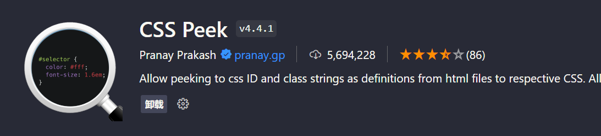
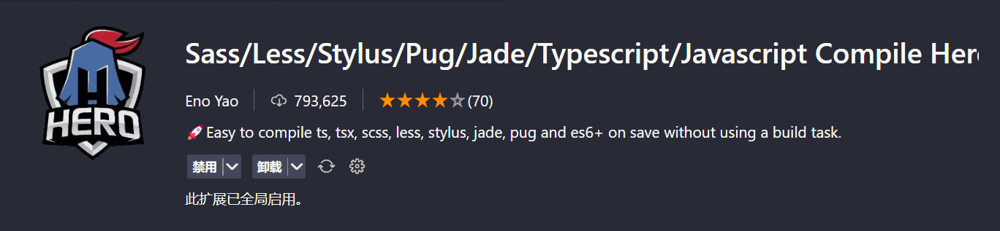

# CSS

> 📌CSS VScode插件

## Color Highlight &#x20;

> 颜色可以直接在代码编写中凸显出来

## CSS Peek

> 树状结构看CSS结构

## Live Sass Compiler&#x20;

> 自动编译sass

## px to rem & rpx & vw (cssrem)&#x20;

> REM适配，自动转换单位

## Sass/Less/Stylus/Pug/Jade/Typescript/Javascript Compile Hero&#x20;

> 关于sass一个插件

## Stylelint&#x20;

> CSS/SASS代码检查

参考文章：[https://blog.csdn.net/pukun888/article/details/125887787](https://blog.csdn.net/pukun888/article/details/125887787 "https://blog.csdn.net/pukun888/article/details/125887787")

