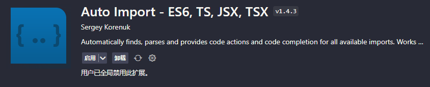
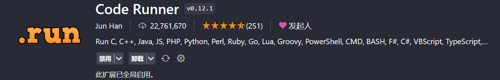
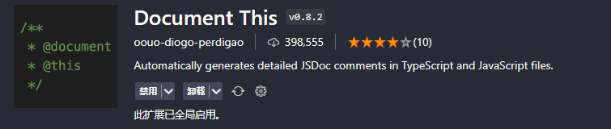
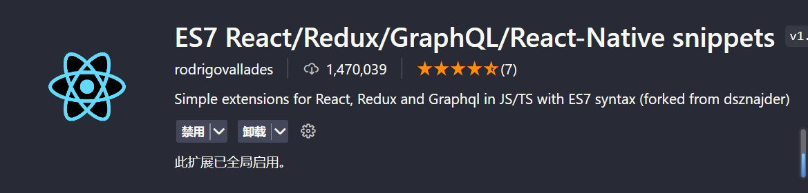
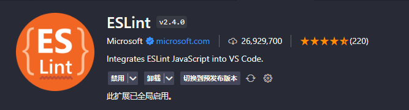

<!--
 * @Author: zxk zhaoxinkun1124@gmail.com
 * @Date: 2024-05-07 13:52:47
 * @LastEditors: zxk zhaoxinkun1124@gmail.com
 * @LastEditTime: 2024-05-07 13:55:22
 * @FilePath: \VitePress\Docs\编程软件\VScode\JavaScript.md
 * @Description: 
 * 
 * Copyright (c) 2024 by ${git_name_email}, All Rights Reserved. 
-->
# JavaScript

> 📌JavaScript VScode插件

## Auto Import - ES6、TS、[JSX](https://so.csdn.net/so/search?q=JSX\&spm=1001.2101.3001.7020 "JSX")、TSX&#x20;

> 自动导入模块

## Code Runner &#x20;

> 运行部分代码

## Code Spell Checker&#x20;

> 检查代码错误

## Document This

> JS文档注释

`Ctrl+Alt+D`

## ES7 React/Redux/GraphQL/React-Native snippets&#x20;

> ES7 React/Redux/GraphQL/React-Native代码片段

## JavaScript (ES6) code snippets&#x20;

> ES6代码片段

## FnMap

> 📌函数地图，很直观的看到函数的结构，以及树状展示文件中所有的函数

## ESLint

> 强大的代码语法检查

## Import Cost

> 显示模块包大小

## Regex Previewer正则预览

> **在并排文档中显示当前正则表达式的匹配项。Ctrl+Alt+M这可以用( )打开/关闭⌥⌘M。可以通过状态栏条目添加全局和多行选项以使用并排文档进行评估。**

