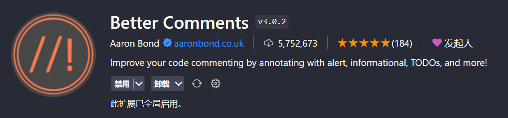
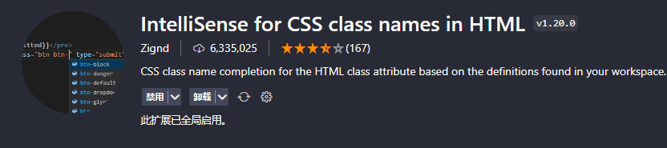
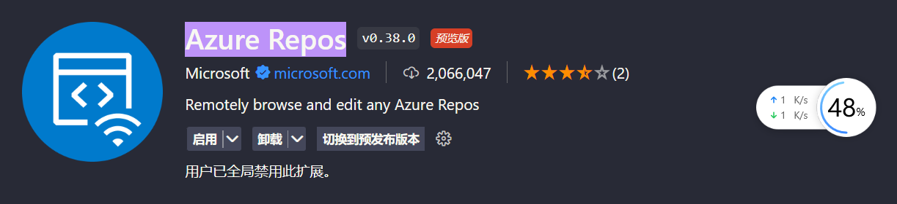
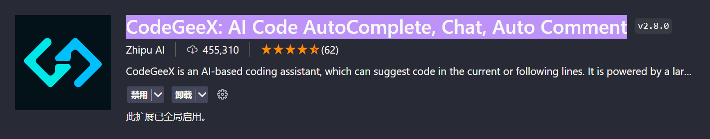
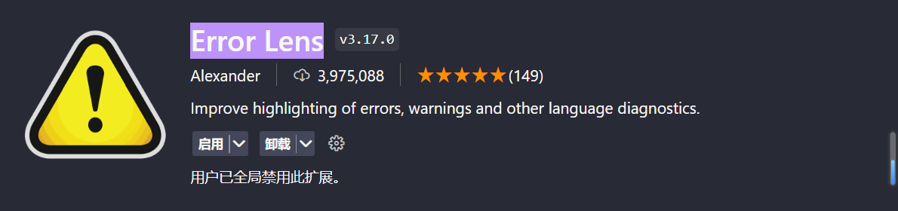

# 公共插件

## Auto Close Tag

> &#x20;自动补全结束标签

## Auto Rename Tag

> 前后标签一起更新

## Better Comments&#x20;

> 📌注释着色器，可以配置注释的颜色

## Chinese

> 简体中文

## CodeSnap

> 代码截图

## Docx/ODT Viewer&#x20;

> &#x20;直接看word

## Image preview

> &#x20;代码中预览本地图片

## IntelliSense for CSS class names in HTML&#x20;

> 补全类名

## IntelliCode&#x20;

> 代码学习，然后给你建议

## Live Server

> 微服务器

## Markdown All in One&#x20;

> 关于markdown

## Markdown Preview Github Styling&#x20;

> 预览markdown

## markdownlint&#x20;

> 检查markdown格式

## open in browser

> 打开本机浏览器预览

## Open In Default Browser

> 默认浏览器预览

## Path Intellisense

> 文件路径补全

## Prettier - Code formatter

> 代码自动格式化

## Project Manager

> 项目管理器

## Formatting Toggle&#x20;

> 自动格式化的开启关闭

## TONGYI Lingma&#x20;

> 通义灵码，阿里出品

## vscode-pdf

> 查看PDf

## Waka Time

> 代码时间追踪

> 画流程图插件

## github

> 源码GitHub Repositories

## koroFileHeader&#x20;

> 支持更多类型的头部文档注释

## Azure Repos&#x20;

> CI/CD插件

## CodeGeeX: AI Code AutoComplete, Chat, Auto Comment&#x20;

> AI代码

## Error Lens&#x20;

> AI代码，小灯泡提醒

## ejs Snippets&#x20;

> 代码片段

