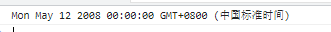

# Date

<!-- ## 目录

- [获取日期](#获取日期)
  - [API](#API)
  - [本地转化](#本地转化)
  - [函数封装](#函数封装)
- [设置日期](#设置日期)
  - [API](#API)
  - [直接设置法 未设置就是零](#直接设置法-未设置就是零)
  - [复杂设置法 未设置就是当前时间](#复杂设置法-未设置就是当前时间)
- [日期转换](#日期转换)
  - [toISOString()](#toISOString)
  - [toJSON()](#toJSON)
  - [转时间戳](#转时间戳) -->

## 获取日期

万物开头第一句，创建时间对象

`var date = new Date();`

### API

`Date` 对象是 JavaScript 中用于处理日期和时间的内置对象之一。它提供了多个 API 来获取日期和时间的各个部分。以下是一些常用的 `Date` 对象的 API：

1. `getFullYear()`：获取年份，返回四位数的年份。
   ```javascript
   var date = new Date();
   var year = date.getFullYear();
   console.log(year); // 2023
   ```
2. `getMonth()`：获取月份，返回从 0 到 11 的值，其中 0 表示一月，11 表示十二月。
   ```javascript
   var date = new Date();
   var month = date.getMonth();
   console.log(month); // 6 (表示七月)
   ```
3. `getDate()`：获取日期，返回月份中的某一天（1-31）。
   ```javascript
   var date = new Date();
   var day = date.getDate();
   console.log(day); // 9
   ```
4. `getDay()`：获取星期几，返回一个从 0 到 6 的值，其中 0 表示星期日，1 表示星期一，以此类推。
   ```javascript
   var date = new Date();
   var weekday = date.getDay();
   console.log(weekday); // 5 (表示星期五)
   ```
5. `getHours()`：获取小时数，返回从 0 到 23 的值。
   ```javascript
   var date = new Date();
   var hours = date.getHours();
   console.log(hours); // 4
   ```
6. `getMinutes()`：获取分钟数，返回从 0 到 59 的值。
   ```javascript
   var date = new Date();
   var minutes = date.getMinutes();
   console.log(minutes); // 25
   ```
7. `getSeconds()`：获取秒数，返回从 0 到 59 的值。
   ```javascript
   var date = new Date();
   var seconds = date.getSeconds();
   console.log(seconds); // 39
   ```
8. `getMilliseconds()`：获取毫秒数，返回从 0 到 999 的值。
   ```javascript
   var date = new Date();
   var milliseconds = date.getMilliseconds();
   console.log(milliseconds); // 234
   ```
9. `getTime()`:

这些是 `Date` 对象的一部分 API。您可以使用它们来获取日期和时间的各个部分，并根据需求进行处理。

请注意，以上示例中的 `date` 对象是通过 `new Date()` 构造函数创建的，它默认使用当前的系统时间。如果您想获取特定日期和时间的部分，可以传递一个日期字符串或使用 `set` 方法来设置日期和时间。

### 本地转化

在 JavaScript 中，`Date` 对象本身提供了一些方法用于转化日期和时间为本地时间。

以下是一些常用的用于本地转化的 `Date` 对象的方法：

1. `Date.prototype.toLocaleString()`: 将日期对象转化为本地日期和时间字符串。
   ```javascript
   var date = new Date();
   var localDateTimeString = date.toLocaleString();
   console.log(localDateTimeString); // 输出: 本地日期和时间字符串
   ```
2. `Date.prototype.toLocaleDateString()`: 将日期对象的日期部分转化为本地日期字符串。
   ```javascript
   var date = new Date();
   var localDateString = date.toLocaleDateString();
   console.log(localDateString); // 输出: 本地日期字符串
   ```
3. `Date.prototype.toLocaleTimeString()`: 将日期对象的时间部分转化为本地时间字符串。
   ```javascript
   var date = new Date();
   var localTimeString = date.toLocaleTimeString();
   console.log(localTimeString); // 输出: 本地时间字符串
   ```

这些方法会根据用户的本地环境和设置，将日期和时间转化为本地格式。它们会考虑用户的时区、日期格式和语言等因素，以便生成适合本地使用的日期和时间字符串。

需要注意的是，这些方法的行为在不同的浏览器和操作系统上可能有所差异，因为它们受到本地环境的影响。如果你对日期和时间的显示格式有特定的要求，可以结合使用这些方法和其他工具，例如 moment.js 或者自定义格式化函数来满足你的需求。

### 函数封装

要封装一个计算时间差的函数，您可以在 `TimeUtil` 对象中添加一个新的方法，例如 `calculateTimeDifference`。以下是一个示例：

```javascript
var TimeUtil = {
  getCurrentDateTime: function() {
    var date = new Date();
    var year = date.getFullYear();
    var month = String(date.getMonth() + 1).padStart(2, '0');
    var day = String(date.getDate()).padStart(2, '0');
    var hours = String(date.getHours()).padStart(2, '0');
    var minutes = String(date.getMinutes()).padStart(2, '0');
    var seconds = String(date.getSeconds()).padStart(2, '0');

    return year + '-' + month + '-' + day + ' ' + hours + ':' + minutes + ':' + seconds;
  },

  isLeapYear: function(year) {
    if ((year % 4 === 0 && year % 100 !== 0) || year % 400 === 0) {
      return true;
    } else {
      return false;
    }
  },
  
  calculateTimeDifference: function(startTime, endTime) {
    var start = new Date(startTime);
    var end = new Date(endTime);
    
    var difference = Math.abs(end - start); // 时间差的毫秒数

    var days = Math.floor(difference / (1000 * 60 * 60 * 24));
    var hours = Math.floor((difference % (1000 * 60 * 60 * 24)) / (1000 * 60 * 60));
    var minutes = Math.floor((difference % (1000 * 60 * 60)) / (1000 * 60));
    var seconds = Math.floor((difference % (1000 * 60)) / 1000);

    return {
      days: days,
      hours: hours,
      minutes: minutes,
      seconds: seconds
    };
  }
};

// 使用 TimeUtil 对象中的函数
console.log(TimeUtil.getCurrentDateTime());
console.log(TimeUtil.isLeapYear(2024));
console.log(TimeUtil.calculateTimeDifference('2023-07-08 12:00:00', '2023-07-09 13:30:00'));
```

在上述示例中，我们添加了一个名为 `calculateTimeDifference` 的方法到 `TimeUtil` 对象中。该方法接收两个时间字符串，`startTime` 和 `endTime`，并计算它们之间的时间差。

- 首先，我们使用 `new Date()` 方法将传入的时间字符串转换为 `Date` 对象。
- 然后，我们计算出两个时间的毫秒数差异，并使用一系列除法和取余运算来获得天数、小时数、分钟数和秒数的差异。
- 最后，我们将结果封装在一个对象中，包含了天数、小时数、分钟数和秒数的属性，并返回该对象。

您可以通过调用 `TimeUtil.calculateTimeDifference` 方法并传入起始时间和结束时间来计算时间差。在示例中，我们计算了 '2023-07-08 12:00:00' 到 '2023-07-09 13:30:00' 之间的时间差，并打印了结果。

请注意，时间差是以绝对值的方式计算的，因此无论开始时间早于还是晚于结束时间，计算结果都将是正数。

## 设置日期

万物开头第一句，创建时间对象

`var date = new Date();`

### API

`Date` 对象是 JavaScript 中用于处理日期和时间的内置对象之一。除了获取日期和时间的各个部分外，它还提供了一些 API 来设置日期和时间。以下是一些常用的 `Date` 对象的设置 API：

1. `setFullYear(year [, month, day])`：设置年份。
   ```javascript
   var date = new Date();
   date.setFullYear(2022);
   console.log(date); // Sat Jul 09 2022 04:26:25 GMT+0000 (Coordinated Universal Time)
   ```
2. `setMonth(month [, day])`：设置月份，其中月份为从 0 到 11 的值。
   ```javascript
   var date = new Date();
   date.setMonth(11);
   console.log(date); // Fri Dec 09 2023 04:26:25 GMT+0000 (Coordinated Universal Time)
   ```
3. `setDate(day)`：设置一个月中的某一天（1-31）。
   ```javascript
   var date = new Date();
   date.setDate(15);
   console.log(date); // Tue Jul 15 2023 04:26:25 GMT+0000 (Coordinated Universal Time)
   ```
4. `setHours(hours [, minutes, seconds, milliseconds])`：设置小时数。
   ```javascript
   var date = new Date();
   date.setHours(13);
   console.log(date); // Sat Jul 09 2023 13:26:25 GMT+0000 (Coordinated Universal Time)
   ```
5. `setMinutes(minutes [, seconds, milliseconds])`：设置分钟数。
   ```javascript
   var date = new Date();
   date.setMinutes(45);
   console.log(date); // Sat Jul 09 2023 04:45:25 GMT+0000 (Coordinated Universal Time)
   ```
6. `setSeconds(seconds [, milliseconds])`：设置秒数。
   ```javascript
   var date = new Date();
   date.setSeconds(30);
   console.log(date); // Sat Jul 09 2023 04:26:30 GMT+0000 (Coordinated Universal Time)
   ```
7. `setMilliseconds(milliseconds)`：设置毫秒数。
   ```javascript
   var date = new Date();
   date.setMilliseconds(500);
   console.log(date); // Sat Jul 09 2023 04:26:25 GMT+0000 (Coordinated Universal Time)
   ```

这些是 `Date` 对象的一部分设置 API。您可以使用它们来设置特定的日期和时间部分，根据需求进行修改。

请注意，以上示例中的 `date` 对象是通过 `new Date()` 构造函数创建的，它默认使用当前的系统时间。如果您想设置特定的日期和时间，可以使用 `set` 方法来设置。

### 直接设置法 未设置就是零

```javascript
     // 时间设置方式1:直接设置,未设置部分归零 
    var date = new Date('2008-5-12');
    console.log(date);
```



### 复杂设置法 未设置就是当前时间

```javascript
  // 设置的年月日时分秒,超过最大值,则上一位加1
    var date = new Date();
    // 设置年份
    date.setFullYear('2008');
    // 设置月份 0-11 月份设置-1
    date.setMonth(4)
    // 设置日期
    date.setDate(12);
    // 设置小时，如果多了24小时上一级就会加1并且自身从多余的开始
    //例如13号的25点，最后返回的时候，就会是14号的1点
    // date.setHours(14);
    date.setHours(25)
    // 设置分钟
    date.setMinutes(28);
    // 设置秒数
    date.setSeconds(28)
    // 星期不能设置....因为设置了时间，星期就固定了
     console.log(date);
```

## 日期转换

### `toISOString()`

该`toISOString()`方法使用 ISO 标准格式将 Date 对象转换为字符串：

```javascript
const d = new Date();
document.getElementById("demo").innerHTML = d.toISOString();
```

### `toJSON()`

`toJSON()`将 Date 对象转换为字符串，格式为 JSON 日期。

JSON 日期的格式与 ISO-8601 标准相同：YYYY-MM-DDTHH:mm:ss.sssZ：

```javascript
d = new Date();
document.getElementById("demo").innerHTML = d.toJSON();
```

### 转时间戳

```javascript
const date =new Date("1970-7-12 08:20:12");
console.log(date *1)
console.log(Number(date));
console.log(date.valueOf);
console.log(date.getTime);
```
