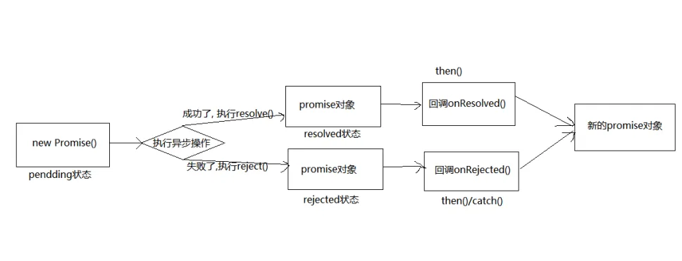

## 创建一个 Promise

你可以通过 `new Promise` 构造函数来创建一个 `Promise` 对象。构造函数接受一个执行函数，该函数有两个参数：`resolve` 和 `reject`。

- 在成功的位置放入`resolve(value)`
- 在失败的地方放入`reject（reason）`
```javascript
let promise = new Promise(function(resolve, reject) {
  // 异步操作
  let success = true; // 示例条件
  if (success) {
    resolve('操作成功');
  } else {
    reject('操作失败');
  }
});
```


<a name="GQmrk"></a>
## Promise 的实例方法

<a name="wXsW3"></a>
###   `promise.then(onFulfilled, onRejected)  `

   - 用于指定当 `Promise` 成功时的回调函数。
   - 它接受两个参数，第一个是成功时的回调函数`onFulfilled` 
   - 第二个是失败时的回调函数`onRejected`（可选）。  
   - 返回一个新的 `Promise` 对象。  
```javascript
const p1 = new Promise((resolve, reject) => {
  resolve("成功！");
  // 或
  // reject(new Error("错误!"));
});

p1.then(
  (value) => {
    console.log(value); // 成功！
  },
  (reason) => {
    console.error(reason); // 错误！
  },
);

```
链式调用，如果作为 `then()` 方法的处理函数传递的函数返回一个 `Promise`，则相应的 `Promise` 对象将被暴露给方法链中的后续 `then() `方法。下面的代码段使用 `setTimeout` 函数来模拟异步代码操作。
```javascript
Promise.resolve("foo")
  // 1. 接收 "foo" 并与 "bar" 拼接，并将其结果做为下一个 resolve 返回。
  .then(
    (string) =>
      new Promise((resolve, reject) => {
        setTimeout(() => {
          string += "bar";
          resolve(string);
        }, 1);
      }),
  )
  // 2. 接收 "foobar", 放入一个异步函数中处理该字符串
  // 并将其打印到控制台中，但是不将处理后的字符串返回到下一个。
  .then((string) => {
    setTimeout(() => {
      string += "baz";
      console.log(string); // foobarbaz
    }, 1);
    return string;
  })
  // 3. 打印本节中代码将如何运行的帮助消息，
  // 字符串实际上是由上一个回调函数之前的那块异步代码处理的。
  .then((string) => {
    console.log(
      "最后一个 then：哎呀……之前懒得实例化并返回一个 Promise，所以顺序可能有点令人惊讶",
    );

    // 注意 `string` 这时不会存在 'baz'。
    // 因为这是发生在我们通过 setTimeout 模拟的异步函数中。
    console.log(string); // foobar
  });

// 按顺序打印：
// 最后一个 then：哎呀……之前懒得实例化并返回一个 Promise，所以顺序可能有点令人惊讶
// foobar
// foobarbaz

```
`then()` 方法返回的值的解决方式与 [Promise.resolve()](https://developer.mozilla.org/zh-CN/docs/Web/JavaScript/Reference/Global_Objects/Promise/resolve) 相同。这意味着该方法支持 [thenable 对象](https://developer.mozilla.org/zh-CN/docs/Web/JavaScript/Reference/Global_Objects/Promise#thenable)，如果返回值不是一个 `Promise` 对象，则会隐式地将其包装在 `Promise` 中，然后解决。
```javascript
const p2 = new Promise((resolve, reject) => {
  resolve(1);
});

p2.then((value) => {
  console.log(value); // 1
  return value + 1;
}).then((value) => {
  console.log(value, "- A synchronous value works"); // 2 - A synchronous value works
});

p2.then((value) => {
  console.log(value); // 1
});

```
如果函数抛出错误或返回一个被拒绝的 `Promise`，则 `then` 返回的 `Promise` 最终将被拒绝。
```javascript
Promise.resolve()
  .then(() => {
    // 令 .then() 返回一个被拒绝的 promise
    throw new Error("Oh no!");
  })
  .then(
    () => {
      console.log("不会被调用。");
    },
    (error) => {
      console.error(`onRejected 函数被调用：${error.message}`);
    },
  );

```
在实践中，通常更希望使用 [catch()](https://developer.mozilla.org/zh-CN/docs/Web/JavaScript/Reference/Global_Objects/Promise/catch) 方法来捕获被拒绝的 `Promise`，而不是使用` then() `方法传入两个处理器的语法，如下例所示。
```javascript
Promise.resolve()
  .then(() => {
    // 令 .then() 返回一个被拒绝的 promise
    throw new Error("噢，不！");
  })
  .catch((error) => {
    console.error(`onRejected 函数被调用：${error.message}`);
  })
  .then(() => {
    console.log("即使前面的 Promise 被拒绝，我也总是会被调用");
  });

```
如果 `onFulfilled` 返回一个 `Promise`，那么 `then` 的返回值将根据该 `Promise` 的最终状态被兑现或被拒绝。
```javascript
function resolveLater(resolve, reject) {
  setTimeout(() => {
    resolve(10);
  }, 1000);
}
function rejectLater(resolve, reject) {
  setTimeout(() => {
    reject(new Error("错误"));
  }, 1000);
}

const p1 = Promise.resolve("foo");
const p2 = p1.then(() => {
  // 此处返回一个 Promise，将在 1 秒后解决为 10
  return new Promise(resolveLater);
});
p2.then(
  (v) => {
    console.log("已解决", v); // "已解决", 10
  },
  (e) => {
    // 不会被调用
    console.error("已拒绝", e);
  },
);

const p3 = p1.then(() => {
  // 此处返回一个 Promise，将在 1 秒后以 '错误' 被拒绝
  return new Promise(rejectLater);
});
p3.then(
  (v) => {
    // 不会被调用
    console.log("已解决", v);
  },
  (e) => {
    console.error("已拒绝", e); // "已拒绝", '错误'
  },
);

```
以下是一个示例，用于演示 `then` 方法的异步性。
```javascript
// 用一个已解决的 Promise——“resolvedProm”为例，
// 函数调用“resolvedProm.then(...)”立即返回一个新的 Promise，
// 但是其中的处理器“(value) => {...}”将被异步调用，正如打印输出所示。
// 新的 Promise 被赋值给“thenProm”，
// 并且 thenProm 将被解决为处理函数返回的值。
const resolvedProm = Promise.resolve(33);
console.log(resolvedProm);

const thenProm = resolvedProm.then((value) => {
  console.log(
    `在主堆栈结束后被调用。收到的值是：${value}，返回的值是：${value + 1}`,
  );
  return value + 1;
});
console.log(thenProm);

// 使用 setTimeout，我们可以将函数的执行推迟到调用栈为空的时刻。
setTimeout(() => {
  console.log(thenProm);
});

// 按顺序打印：
// Promise {[[PromiseStatus]]: "resolved", [[PromiseResult]]: 33}
// Promise {[[PromiseStatus]]: "pending", [[PromiseResult]]: undefined}
// "在主堆栈结束后被调用。收到的值是：33，返回的值是：34"
// Promise {[[PromiseStatus]]: "resolved", [[PromiseResult]]: 34}

```

<a name="C5OQV"></a>
###  ` promise.catch(onRejected)  ` 

   - 用于指定当 `Promise` 失败时的回调函数`onRejected`。 
   - 抛出错误也可以使状态变为`Rejected`
   - `Promise`已对现，则`catch`不会被调用
   - 返回一个新的 `Promise` 对象。  
```javascript
let promise = new Promise((resolve, reject) => {
  reject('失败');
});

promise.catch(function(reason) {
  console.log(reason); // 失败
});

```
```javascript
 const promise1 = new Promise((resolve, reject) => {
  throw new Error('Uh-oh!');
});

promise1.catch((error) => {
  console.error(error);
});
// Expected output: Error: Uh-oh!
```
```javascript
// 创建一个不会调用 onReject 的 Promise
const p1 = Promise.resolve("调用下一个");

const p2 = p1.catch((reason) => {
  // 这里永远不会执行
  console.error("p1 的 catch 函数被调用了！");
  console.error(reason);
});

p2.then(
  (value) => {
    console.log("下一个 Promise 的 onFulfilled 函数被调用了");
    console.log(value); // 调用下一个
  },
  (reason) => {
    console.log("下一个 Promise 的 onRejected 函数被调用了");
    console.log(reason);
  },
);

```
在调用 `resolve` 之后抛出的错误会被忽略：
```javascript
const p3 = new Promise((resolve, reject) => {
  resolve();
  throw new Error("Silenced Exception!");
});

p3.catch((e) => {
  console.error(e); // 这里永远不会执行
});

```

<a name="EXs67"></a>
###  ` promise.finally(onFinally)  ` 

   -  用于指定不论 `Promise` 最终状态如何都会执行的回调函数。 
   -  返回一个新的 `Promise` 对象。  
```javascript
function checkMail() {
  return new Promise((resolve, reject) => {
    if (Math.random() > 0.5) {
      resolve('Mail has arrived');
    } else {
      reject(new Error('Failed to arrive'));
    }
  });
}

checkMail()
  .then((mail) => {
    console.log(mail);
  })
  .catch((err) => {
    console.error(err);
  })
  .finally(() => {
    console.log('Experiment completed');
  });
```
```javascript
let isLoading = true;

fetch(myRequest)
  .then((response) => {
    const contentType = response.headers.get("content-type");
    if (contentType && contentType.includes("application/json")) {
      return response.json();
    }
    throw new TypeError("Oops, we haven't got JSON!");
  })
  .then((json) => {
    /* 进一步处理 JSON */
  })
  .catch((error) => {
    console.error(error); // 这行代码也可能抛出错误，例如：when console = {}
  })
  .finally(() => {
    isLoading = false;
  });

```


<a name="xfBRx"></a>
## Promise 的静态方法[PromiseResult]

<a name="skHYM"></a>
###  ` Promise.resolve(value)`  

   - 返回一个成功的以给定值解析后的 `Promise` 对象。
   - 如果传入的参数是一个 `Promise` 对象，则参数的结果直接影响返回值。
   - 如果不是`Promise` 对象，那么就直接返会成功的`Promise` 对象
   - 该函数将嵌套的类 `Promise` 对象（例如，一个将被兑现为另一个 `Promise` 对象的 `Promise` 对象）展平，转化为单个 `Promise` 对象，其兑现值为一个非 `thenable` 值。
```javascript
Promise.resolve(42).then(function(value) {
  console.log(value); // 42 //resolve
});

let p1 = Promise.resolve(521);
console.log(p1)  //resolve
```
[resolve 另一个 promise](https://developer.mozilla.org/zh-CN/docs/Web/JavaScript/Reference/Global_Objects/Promise/resolve#resolve_%E5%8F%A6%E4%B8%80%E4%B8%AA_promise)<br />`Promise.resolve() `方法会重用已存在的 `Promise` 实例。如果它正在解决一个原生的 `Promise`，它将返回同一 `Promise` 实例，而不会创建一个封装对象。
```javascript
const original = Promise.resolve(33);
const cast = Promise.resolve(original);
cast.then((value) => {
  console.log(`值：${value}`);
});
console.log(`original === cast ? ${original === cast}`);

// 按顺序打印：
// original === cast ? true
// 值：33

```

<a name="v6xWJ"></a>
###  `Promise.reject (reason)  `

   - 返回一个失败的 Promise。 
   - 无论参数的形式，结果都是失败的，哪怕是成功的Promise
```javascript
function resolved(result) {
  console.log('Resolved');
}

function rejected(result) {
  console.error(result);
}

Promise.reject(new Error('fail')).then(resolved, rejected);
// Expected output: Error: fail
```
 

<a name="tuuEl"></a>
###  `Promise.all (iterable) ` 

   -  接受一个包含多个 `Promise` 的数组，返回的也是数组
   -  **返回一个新的 **`**Promise**`**， 当所有传入的 **`**Promise**`** 都成功完成（**`**fulfilled**`**）时完成**
   - ** 或者只要有一个 **`**Promise**`** 失败（**`**rejected**`**）时就失败并带有第一个被拒绝的原因。**  
```javascript
const promise1 = Promise.resolve(3);
const promise2 = 42;
const promise3 = new Promise((resolve, reject) => {
  setTimeout(resolve, 100, 'foo');
});

Promise.all([promise1, promise2, promise3]).then((values) => {
  console.log(values);
});
// Expected output: Array [3, 42, "foo"]
```
如果 `iterable` 包含非 `promise` 值，这些值将被忽略，但仍包含在返回的 `promise` 数组值中（如果该 `promise` 得到了兑现）：	
```javascript
// 所有的值都不是 Promise，因此返回的 Promise 将被兑现
const p = Promise.all([1, 2, 3]);
// 输入中唯一的 Promise 已经被兑现，因此返回的 Promise 将被兑现
const p2 = Promise.all([1, 2, 3, Promise.resolve(444)]);
// 一个（也是唯一的一个）输入 Promise 被拒绝，因此返回的 Promise 将被拒绝
const p3 = Promise.all([1, 2, 3, Promise.reject(555)]);

// 使用 setTimeout，我们可以在队列为空后执行代码
setTimeout(() => {
  console.log(p);
  console.log(p2);
  console.log(p3);
});

// 打印：
// Promise { <state>: "fulfilled", <value>: Array[3] }
// Promise { <state>: "fulfilled", <value>: Array[4] }
// Promise { <state>: "rejected", <reason>: 555 }

```
异步性和同步性：<br />成功的
```javascript
// 传入一个已经 resolved 的 Promise 数组，以尽可能快地触发 Promise.all
const resolvedPromisesArray = [Promise.resolve(33), Promise.resolve(44)];

const p = Promise.all(resolvedPromisesArray);
// 立即打印 p 的值
console.log(p);

// 使用 setTimeout，我们可以在队列为空后执行代码
setTimeout(() => {
  console.log("队列现在为空");
  console.log(p);
});

// 按顺序打印：
// Promise { <state>: "pending" }
// 队列现在为空
// Promise { <state>: "fulfilled", <value>: Array[2] }

```
失败的
```javascript
const mixedPromisesArray = [Promise.resolve(33), Promise.reject(44)];
const p = Promise.all(mixedPromisesArray);
console.log(p);
setTimeout(() => {
  console.log("队列现在为空");
  console.log(p);
});

// Logs:
// Promise { <state>: "pending" }
// 队列现在为空
// Promise { <state>: "rejected", <reason>: 44 }

```
快速失败<br />`Promise.all` 在任意一个传入的 `promise` 失败时返回失败。例如，如果你传入四个超时后解决的 `promise` 和一个立即拒绝的 `promise`，那么` Promise.all `将立即被拒绝。
```javascript
const p1 = new Promise((resolve, reject) => {
  setTimeout(() => resolve("一"), 1000);
});
const p2 = new Promise((resolve, reject) => {
  setTimeout(() => resolve("二"), 2000);
});
const p3 = new Promise((resolve, reject) => {
  setTimeout(() => resolve("三"), 3000);
});
const p4 = new Promise((resolve, reject) => {
  setTimeout(() => resolve("四"), 4000);
});
const p5 = new Promise((resolve, reject) => {
  reject(new Error("拒绝"));
});

// 使用 .catch:
Promise.all([p1, p2, p3, p4, p5])
  .then((values) => {
    console.log(values);
  })
  .catch((error) => {
    console.error(error.message);
  });

// 打印：
// "拒绝"

```
通过处理可能的拒绝，可以更改此行为：
```javascript
const p1 = new Promise((resolve, reject) => {
  setTimeout(() => resolve("p1 延迟解决"), 1000);
});

const p2 = new Promise((resolve, reject) => {
  reject(new Error("p2 立即拒绝"));
});

Promise.all([p1.catch((error) => error), p2.catch((error) => error)]).then(
  (values) => {
    console.log(values[0]); // "p1 延迟解决"
    console.error(values[1]); // "Error: p2 立即拒绝"
  },
);

```


<a name="ijZx9"></a>
### `Promise.allSettled(iterable) `  

   - 接受一个可迭代对象
   - 返回一个新的 `Promise`，**当所有传入的 **`**Promise**`** 都已完成（无论成功或失败）时完成。  **
   - 一个 [Promise](https://developer.mozilla.org/zh-CN/docs/Web/JavaScript/Reference/Global_Objects/Promise)，其状态为：
      - 已兑现（already fulfilled），如果传入的 iterable 为空的话。
      - 异步兑现（asynchronously fulfill），当给定的 iterable 中所有 promise 已经敲定时（要么已兑现，要么已拒绝）。兑现的值是一个对象数组，其中的对象按照 iterable 中传递的 promise 的顺序，描述每一个 promise 的结果，无论完成顺序如何。每个结果对象都有以下的属性：
         - [status](https://developer.mozilla.org/zh-CN/docs/Web/JavaScript/Reference/Global_Objects/Promise/allSettled#status)

一个字符串，要么是 "fulfilled"，要么是 "rejected"，表示 promise 的最终状态。

         - [value](https://developer.mozilla.org/zh-CN/docs/Web/JavaScript/Reference/Global_Objects/Promise/allSettled#value)

仅当 status 为 "fulfilled"，才存在。promise 兑现的值。

         - [reason](https://developer.mozilla.org/zh-CN/docs/Web/JavaScript/Reference/Global_Objects/Promise/allSettled#reason)

仅当 status 为 "rejected"，才存在，promsie 拒绝的原因。

         - 如果传入的 iterable 是非空的，但不包含待定的（pending）promise，则返回的 promise 仍然是异步兑现的，而不是同步兑现。
```javascript
const promise1 = Promise.resolve(3);
const promise2 = new Promise((resolve, reject) =>
  setTimeout(reject, 100, 'foo'),
);
const promises = [promise1, promise2];

Promise.allSettled(promises).then((results) =>
  results.forEach((result) => console.log(result.status)),
);

// Expected output:
// "fulfilled"
// "rejected"
```
```javascript
Promise.allSettled([
  Promise.resolve(33),
  new Promise((resolve) => setTimeout(() => resolve(66), 0)),
  99,
  Promise.reject(new Error("一个错误")),
]).then((values) => console.log(values));

// [
//   { status: 'fulfilled', value: 33 },
//   { status: 'fulfilled', value: 66 },
//   { status: 'fulfilled', value: 99 },
//   { status: 'rejected', reason: Error: 一个错误 }
// ]

```


<a name="o0ZxT"></a>
### `Promise.race(iterable)  ` 

   - 接受一个包含多个 `Promise` 的数组
   - **返回一个新的 **`**Promise**`**，谁先执行完毕，谁的结果就决定**`**race**`**的结果**。 
```javascript
const promise1 = new Promise((resolve, reject) => {
  setTimeout(resolve, 500, 'one');
});

const promise2 = new Promise((resolve, reject) => {
  setTimeout(resolve, 100, 'two');
});

Promise.race([promise1, promise2]).then((value) => {
  console.log(value);
  // Both resolve, but promise2 is faster
});
// Expected output: "two"
```
这个例子展示了如何使用 `Promise.race()` 来比较多个使用 [setTimeout()](https://developer.mozilla.org/zh-CN/docs/Web/API/setTimeout) 实现的计时器。计时时间最短的计时器总是赢得竞态，并成为返回的 `promise` 状态。
```javascript
function sleep(time, value, state) {
  return new Promise((resolve, reject) => {
    setTimeout(() => {
      if (state === "兑现") {
        return resolve(value);
      } else {
        return reject(new Error(value));
      }
    }, time);
  });
}

const p1 = sleep(500, "一", "兑现");
const p2 = sleep(100, "二", "兑现");

Promise.race([p1, p2]).then((value) => {
  console.log(value); // “二”
  // 两个都会兑现，但 p2 更快
});

const p3 = sleep(100, "三", "兑现");
const p4 = sleep(500, "四", "拒绝");

Promise.race([p3, p4]).then(
  (value) => {
    console.log(value); // “三”
    // p3 更快，所以它兑现
  },
  (error) => {
    // 不会被调用
  },
);

const p5 = sleep(500, "五", "兑现");
const p6 = sleep(100, "六", "拒绝");

Promise.race([p5, p6]).then(
  (value) => {
    // 不会被调用
  },
  (error) => {
    console.error(error.message); // “六”
    // p6 更快，所以它拒绝
  },
);

```
<a name="KqS6U"></a>
#### [使用 Promise.race() 实现请求超时](https://developer.mozilla.org/zh-CN/docs/Web/JavaScript/Reference/Global_Objects/Promise/race#%E4%BD%BF%E7%94%A8_promise.race_%E5%AE%9E%E7%8E%B0%E8%AF%B7%E6%B1%82%E8%B6%85%E6%97%B6)
你可以使用一个定时器来与一个可能持续很长时间的请求进行竞争，以便超出时间限制时，返回的 Promise 自动拒绝。
```javascript
const data = Promise.race([
  fetch("/api"),
  new Promise((resolve, reject) => {
    // 5 秒后拒绝
    setTimeout(() => reject(new Error("请求超时")), 5000);
  }),
])
  .then((res) => res.json())
  .catch((err) => displayError(err));

```
如果 data Promise 被兑现，它将包含从 /api 获取的数据；否则，如果 fetch 保持待定状态并输给 setTimeout 定时器，这个 Promise 将在 5 秒后被拒绝。


<a name="qpMPD"></a>
### `Promise.any(iterable)  `

   - 接受一个可迭代对象
   - 返回一个新的 `Promise`，**只要传入的 **`**Promise**`** 中有一个成功，并返回第一个兑现的值**。
   - 如果所有的 `Promise` 都失败，则返回一个失败的 `Promise`，并附带一`AggregateError` 错误。  
```javascript
const promise1 = Promise.reject(0);
const promise2 = new Promise((resolve) => setTimeout(resolve, 100, 'quick'));
const promise3 = new Promise((resolve) => setTimeout(resolve, 500, 'slow'));

const promises = [promise1, promise2, promise3];

Promise.any(promises).then((value) => console.log(value));

// Expected output: "quick"
```
`Promise.any()` 会以第一个兑现的 `Promise` 来兑现，即使有 `Promise` 先被拒绝。这与 [Promise.race()](https://developer.mozilla.org/zh-CN/docs/Web/JavaScript/Reference/Global_Objects/Promise/race) 不同，后者会使用第一个敲定的 `Promise` 来兑现或拒绝。
```javascript
const pErr = new Promise((resolve, reject) => {
  reject("总是失败");
});

const pSlow = new Promise((resolve, reject) => {
  setTimeout(resolve, 500, "最终完成");
});

const pFast = new Promise((resolve, reject) => {
  setTimeout(resolve, 100, "很快完成");
});

Promise.any([pErr, pSlow, pFast]).then((value) => {
  console.log(value);
  // pFast 第一个兑现
});
// 打印：
// 很快完成
```
如果没有 `Promise` 被兑现，`Promise.any()` 将使用 [AggregateError](https://developer.mozilla.org/zh-CN/docs/Web/JavaScript/Reference/Global_Objects/AggregateError) 进行拒绝。
```javascript
const failure = new Promise((resolve, reject) => {
  reject("总是失败");
});

Promise.any([failure]).catch((err) => {
  console.log(err);
});
// AggregateError: No Promise in Promise.any was resolved

```


<a name="b4Snw"></a>
## Promise 的链式调用

Promise 可以通过链式调用来处理多个异步操作：

```javascript
promise
  .then(function(result) {
    return new Promise((resolve, reject) => {
      // 另一个异步操作
      resolve('另一个操作成功');
    });
  })
  .then(function(newResult) {
    console.log(newResult); // 另一个操作成功
  })
  .catch(function(error) {
    console.log(error); // 操作失败
  });
```
