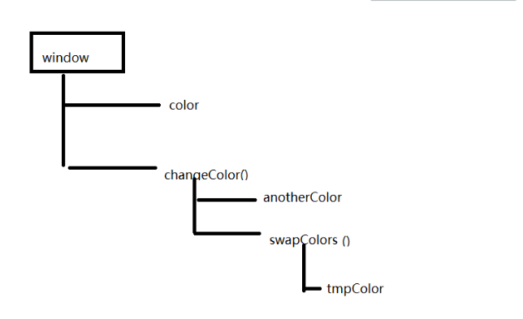

# Scope(ES6)

<!-- ## 目录

- [Global Scope](#Global-Scope)
- [Block Scope](#Block-Scope)
- [Local Scope](#Local-Scope)
- [Function Scope](#Function-Scope)
- [Automatically Globa](#Automatically-Globa)
- [同名的坑](#同名的坑)
- [Code](#Code)
- [作用域链](#作用域链)
- [为什么不全部用全局?](#为什么不全部用全局) -->

> 📌作用域决定了代码不同部分的变量、对象和函数的可访问性。

## Global Scope

> 全局作用域（Global Scope）：全局作用域是在整个代码中都可见和访问的范围。在全局作用域中声明的变量和函数可以被代码中的任何位置访问。

全局声明的变量（在任何函数之外）具有全局作用域。全局变量可以从JavaScript程序中的任何位置访问。使用 `var` 、 `let` 和 `const` 声明的变量在块外声明时非常相似。它们都具有全局范围：

```javascript
var x = 2;       // Global scope
let x = 2;       // Global scope
const x = 2;       // Global scope

let carName = "Volvo";
// code here can use carName

function myFunction() {
// code here can also use carName
}

var globalVariable = 'I am a global variable'; // 全局变量
function globalFunction() {
  console.log('I am a global function'); // 全局函数
}
```

在函数外部声明的变量将变为GLOBAL。

```javascript
let carName = "Volvo";
// code here can use carName

function myFunction() {
// code here can also use carName
}
```

> 📌全局变量具有全局作用域：网页上的所有脚本和函数都可以访问它。

## Block Scope

> 在ES6（2015）之前，JavaScript只有全局作用域和函数作用域。ES6引入了两个重要的新JavaScript关键字： `let` 和 `const` 这两个关键字提供了JavaScript中的块作用域。在{ }块内声明的变量不能从块外访问：

```javascript
{
  let x = 2;
}
// x can NOT be used here
```

用 `var` 关键字声明的变量不能有块作用域。在{ }块内声明的变量可以从块外访问。

```javascript
{
  var x = 2;
}
// x CAN be used here
```

## Local Scope

> 局部作用域（Local Scope）：局部作用域是在函数内部声明的范围。在局部作用域中声明的变量和函数只能在函数内部访问和使用，无法在函数外部访问。

```javascript
function localScopeExample() {
  var localVariable = 'I am a local variable'; // 局部变量
  console.log(localVariable); // 在函数内部访问局部变量
}

localScopeExample(); // 输出 'I am a local variable'
console.log(localVariable); // 报错，无法在函数外部访问局部变量
```

在JavaScript函数中声明的变量，对于函数而言，变为LOCAL。

```javascript
// code here can NOT use carName

function myFunction() {
  let carName = "Volvo";
  // code here CAN use carName
}

// code here can NOT use carName
```

> 📌局部变量具有函数作用域：它们只能从函数内部访问。由于局部变量只能在其函数中被识别，因此同名的变量可以在不同的函数中使用。局部变量在函数开始时创建，并在函数完成时删除。

## Function Scope

> JavaScript有函数作用域：每个函数创建一个新的作用域。在函数内部定义的变量不能从函数外部访问（可见）。使用 `var` 、 `let` 和 `const` 声明的变量在函数内部声明时非常相似。它们都具有功能范围：

```javascript
function myFunction() {
  var carName = "Volvo";   // Function Scope
}
```

```javascript
function myFunction() {
  let carName = "Volvo";   // Function Scope
}
```

```javascript
function myFunction() {
  const carName = "Volvo";   // Function Scope
}
```

## Automatically Globa

> 如果你给一个没有声明的变量赋值，它将自动成为一个GLOBAL变量。

此代码示例将声明一个全局变量 `carName` ，即使该值是在函数内部赋值的。

```javascript
myFunction();

// code here can use carName

function myFunction() {
  carName = "Volvo";
}

```

## 同名的坑

全局变量和局部变量同名的坑

(1)在全局变量和局部变量不同名时，其作用域是整个程序。

(2)在全局变量和局部变量同名时，全局变量的作用域不包含同名局部变量的作用域。

```javascript
var a=1;
function fn1(){
   console.log(a)
 var a = 2;
};
fn1();
console.log(a);
```

## Code

```javascript
window.onload = function(){
    var g = 1; //全局环境  全局变量

    function f(){
        console.log(g); 
        var x = 10;  //函数环境  局部变量
    };
    console.log(x);  //x is not defined
    f();


    var a = 1;
    function f1(){
        var b = 2;
        function f2(){
            var c = b;  //C = 2
            b = a;  //b = 1;  修改局部变量的值
            a = c;  //修改全局变量的值 a = 2
            console.log(a,b,c);
        };
        f2();
    };
    f1();  //1


    var a = 1;
    function f1(){
        console.log(a);  //1
        a = 2;  //修改全局变量
    };
    f1();
    console.log(a); //2


    //全局变量和局部变量同名的坑
    //全局变量和局部变量同名，全局变量的作用域不作用于局部变量
    var a = 1;
    function f1(){
        console.log(a); //undefined
        var a = 2;  //局部变量
    };
    f1();
    console.log(a);  
    //解析过程
    //预解析
    var a;
    function f1(){}
    //逐行解析
    a = 1;
    f1();
    //函数执行  
    //预解析
    var a;
    console.log(a);  //undefined
    a = 2;

    console.log(a);  //全局a变量  1


    //常见面试题一
    var a = 10;    
    function f1(){    
        var b = 2 * a;    //20  
        var a = 20; 
        var c = a+1;    
        console.log(b);     
        console.log(c);    
    }    
    f1();
    //解析过程
    //预解析
    var a;
    function f1(){}
    //逐行解析
    a = 10;  //无效
    f1();
    //函数解析
     //预解析
    var b;   //undefined
    var a;   //undefined
    var c;   //undefined
    //逐行解析
    b = 2*a;  //2*undefined     NaN
    a = 20;
    c = a+1;   //21
    console.log(b);     
    console.log(c); 


    //常见面试题二
    var a=10;
    function test(){
        console.log(a);     //undefined  
        a=100;       
        console.log(this.a); //10    
        var a;      
        console.log(a); //100
    }
    test();
    //test()解析过程
    var a;
    console.log(a);
    a = 100;
    console.log(a); //100

    //扩展一
    var a=10;
    function test(){
        console.log(a);     
        a=100;       
        console.log(a); 
    }
    test();

    //扩展二
    var a=10;
    function test(){
        a=100; 
        console.log(a);     
        var a; 
        console.log(a); 
    }
    test();


    //常见面试题三
    console.log(a);  
    var a=0;
    if(true){
        console.log(a);
        a=1;
        console.log(a);
        function a(){}
        a=21;
        console.log(a);
    }
    console.log(a);


}

```

## 作用域链

> 作用域链（Scope Chain）：JavaScript中的作用域链是指在函数被创建时，会将父级函数的作用域在创建的函数内部进行保存。这样，内部函数可以访问外部函数中的变量，一直追溯到全局作用域。

```javascript
function outerFunction() {
  var outerVar = 'I am an outer variable';
  
  function innerFunction() {
    console.log(outerVar); // 在内部函数中访问外部函数的变量
  }
  
  innerFunction();
}

outerFunction(); // 输出 'I am an outer variable'
```

> 作用域的原理是在函数被调用和执行时，JavaScript会根据作用域链来查找变量和函数的定义。它会先在当前作用域中查找，如果没有找到，就会向上层作用域查找，直到找到或者到达全局作用域。如果在任何作用域都找不到变量或函数的定义，就会抛出一个引用错误。



## **为什么不全部用全局?**

- 变量污染,过多的变量名被占用
- 占用内存,浪费空间
- 查找速度慢.
