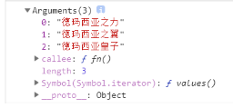

# Spread ...(ES6)

<!-- ## 目录

- [使用场景](#使用场景)
- [展开数组](#展开数组)
- [展开对象](#展开对象)
- [函数参数](#函数参数) -->

> 📌扩展运算符（spread）也是三个点（…），它好比 rest 参数的逆运算，将一个数组转为用逗号分隔的参数序列，对数组进行解包。

```javascript
=> 含义1: 展开
  -> 对象或者数组数据结构
  -> 函数的实参
=> 含义2: 合并
  -> 数组的解构赋值
  -> 函数的形参
```

## 使用场景

数组的合并

```javascript
const kuaizi=['阿坤','akun'];
const sanzhihua=['E','G','M']
//合并
const zuhe=[...kuaizi,...sanzhihua]
console.log(zuhe)
```

数组的克隆

```javascript
const sanzhihua=['E','G','M']
const sanyecao=[...sanzhihua]
console.log(sanyecao)
```

伪数组变为真正的数组

```javascript
const divs=document.querySelectorAll('div');
const divArr=[...divs];
console.log(aivArr)
```

## **展开数组**

这时候叫剩余运算符

```javascript
// 展开数组
let tfboys = ["德玛西亚之力", "德玛西亚之翼", "德玛西亚皇子"];
function fn() {
    console.log(arguments);
}
fn(...tfboys);

```



```javascript
 [...a] : 最后一个变量之前可以加上 ... , 我们把这时候的... 称之为剩余运算;
 let [ a , ...b ] = [1,2,3,4,5,6,7,8,9];
 // 剩余运算如果存在多个数据，会以数组的形式赋值个变量; 
 console.log( a ,  b );
```

## 展开对象

... 不能用在对象的结构赋值上 , 但是可以用在对象上，叫做展开运算;&#x20;

```javascript
 let obj1 = {
        a : 1, 
        b : 2, 
        c : 3
  }
  // 需求 : 想要把obj1里面的所有属性都放入到obj2之中, 那么我们就需要使用 ... 展开运算; 
  let obj2 = {
        ...obj1,
        d : 4 
  }
  console.log( obj2 );

```

三个点...,  将一个数组转为用逗号分隔的参数序列。

```javascript
console.log(...[1, 2, 3])
```

对象的使用

```javascript
var wcs = {
    name: "王春生",
    age: 18,
    sing() {
        console.log("解开王春生的鞋带！")
    }
}

// 使用...可以将对象中所有的属性给当前对象添加一份！
var xiaowsc = { ...wcs, money: 9999999999999 };

console.log(xiaowsc)
```

将字符串转化为数组

```javascript
[...'hello']
```

## 函数参数

... : 在函数的参数之中 ... 表示的涵义是剩余所有的实参;

- 函数结构赋值语法 :
- 结构赋值语法 :
- 实参就是等号右边的数据;
- 形参就是等号左右的变量;
- 可以按照解构赋值的语法，使用函数的参数;

```javascript
function foo(a, ...arg) {
  console.log(arg);
}
foo(10, 20, 30, 40);
```

```javascript
function foo( { a } , [ c , d , e ] , ...arg ){
      console.log( a , d , arg );
}     
foo( { a : 10 }  , [1,2,3] , 1,2,3,4,5,6) ;
```
