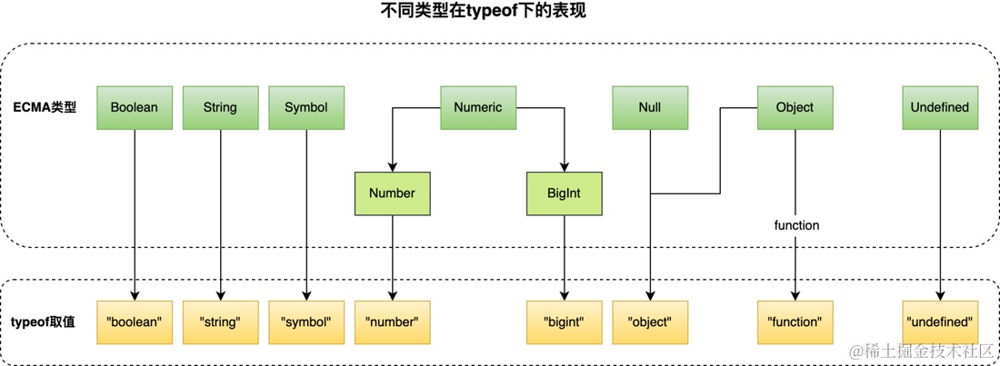

# Typejudgment

<!-- ## 目录

- [Typeof](#Typeof)
  - [缺陷](#缺陷)
- [instanceof](#instanceof)
  - [缺陷](#缺陷)
- [constructor](#constructor)
- [Object.prototype.toString.call() ](#ObjectprototypetoStringcall-)
  - [1) 判断基本类型](#1-判断基本类型)
  - [2) 判断原生引用类型](#2-判断原生引用类型)
- [Array.isArray(ES5)](#ArrayisArrayES5)
- [Object.is(要判断的东西，想要判断的类型)](#Objectis要判断的东西想要判断的类型)
- [总结](#总结) -->

> 📌类型判断

## Typeof

> **typeof 用于获取数据的基本类型，返回一个表示数据类型的字符串。它的实现原理是通过返回数据类型的内部属性。** 返回的结果用该类型的字符串(全小写字母)形式表示，包括以下 7 种：number、boolean、symbol、string、object、undefined、function 等。

> `typeof` 运算符返回变量或表达式的类型：

```javascript
//判断基本类型
typeof 42; // 返回 "number"
typeof "hello"; // 返回 "string"
typeof true; // 返回 "boolean"
typeof undefined; // 返回 "undefined"

//检查对象类型
typeof {}; // 返回 "object"
typeof []; // 返回 "object" （数组在 JavaScript 中也被视为对象）
typeof null; // 返回 "object" （尽管 null 是原始值的一种）

//检查函数类型
typeof function() {}; // 返回 "function"

//检查未声明的变量
typeof undeclaredVariable; // 返回 "undefined"


```

### 缺陷

有些时候，typeof 操作符会返回一些令人迷惑但技术上却正确的值：

- **对于基本类型，除 null 返回 object 类型以外，均可以返回正确的结果。**
- **对于引用类型，除 function****返回  function 类型**** 以外，一律返回 object 类型。**

其中，null 有属于自己的数据类型 Null ， 引用类型中的 数组、日期、正则 也都有属于自己的具体类型，而 typeof 对于这些类型的处理，只返回了处于其原型链最顶端的 Object 类型，没有错，但不是我们想要的结果。



## **instanceof**

> &#x20;instanceof 运算符用于判断\*\*构造函数的 prototype 属性是否出现在对象的原型链中的任何位置。它的实现原理是通过检查对象的原型链。****instanceof 运算符可以用于检测一个对象是否是某个构造函数的实例****。\*\*例如，"hello" instanceof String 会返回 false，因为 "hello" 是一个字符串字面量，而不是 String 对象的实例。

```javascript
// 判断 p 是否为 Person 的实例
function Person(name) {
 this.name = name
}
const p = new Person('sunshine')
 p instanceof Person // true
 
// 这里的 p 是 Person 函数构造出来的，所以顺着 p 的原型链可以找到Object的构造函数
p.__proto__ === Person.prototype // true
p.__proto__.__proto__ === Object.prototype // true
```

```javascript
function myInstanceof(left, right) {
  // 获取对象的原型
  let proto = Object.getPrototypeOf(left)
  // 获取构造函数的 prototype 对象
  let prototype = right.prototype; 
 
  // 判断构造函数的 prototype 对象是否在对象的原型链上
  while (true) {
    if (!proto) return false;
    if (proto === prototype) return true;
    // 如果没有找到，就继续从其原型上找，Object.getPrototypeOf方法用来获取指定对象的原型
    proto = Object.getPrototypeOf(proto);
  }
}
```

### 缺陷

- **`对于基本类型的数据，instanceof是不能直接判断它的类型的`，****因为实例是一个对象或函数创建的，是引用类型，所以需要通过基本类型对应的包装对象来判断。****所以对于****`null`**** 和 ****`undefined`**** 这两个家伙就检测不了**

```javascript
5 instanceof Number // false
new Number(5) instanceof Number  // true

```

- 因为原型链继承的关系，instanceof 会把数组都识别为 Object 对象，所有引用类型的祖先都是 Object 对象

```javascript
let arr = [1,2,3]
console.log(Object.prototype.toString.call(arr) === '[object Array]') // true
console.log(arr instanceof Array) // true
console.log(arr instanceof Object) // true
let fn = function(){}
console.log(fn instanceof Object)  // true
```

## constructor

> constructor 通过访问对象的 constructor 属性，可以获取对象的构造函数。它的实现原理是每个对象都有一个 constructor 属性，指向创建该对象的构造函数。

例如，new String("hello").constructor === String 会返回 true。

```javascript
console.log((2).constructor === Number); // true
console.log((true).constructor === Boolean); // true
console.log(('str').constructor === String); // true
console.log(([]).constructor === Array); // true
console.log((function() {}).constructor === Function); // true
console.log(({}).constructor === Object); // true
```

constructor有两个作用，一是判断数据的类型，二是对象实例通过 constrcutor 对象访问它的构造函数。需要注意，如果创建一个对象来改变它的原型，constructor就不能用来判断数据类型了：

```javascript
function Fn(){};
Fn.prototype = new Array();
var f = new Fn();
console.log(f.constructor===Fn);    // false
console.log(f.constructor===Array); // true
```

## Object.prototype.toString.call()&#x20;

> 📌在判断数据类型时，我们称 Object.prototype.toString 为 “万能方法” “终极方法”，工作中也是比较常用而且准确。  `它的实现原理是返回对象的内部特性[[Class]]。`
> 对于Object.prototype.toString() 方法，可以返回一个值的类型字符串，例如 "\[object Object]"、"\[object Array]"、"\[object Function]" 等。需要注意的是，这种方法只适用于基本类型的包装对象和一些内置对象，对于自定义对象则无法判断。

同样是检测对象obj调用toString方法，obj.toString()的结果和Object.prototype.toString.call(obj)的结果不一样，这是为什么？

> 📌这是因为toString是Object的原型方法，而Array、function等类型作为Object的实例，都重写了toString方法。不同的对象类型调用toString方法时，根据原型链的知识，调用的是对应的重写之后的toString方法（function类型返回内容为函数体的字符串，Array类型返回元素组成的字符串…），而不会去调用Object上原型toString方法（返回对象的具体类型），所以采用obj.toString()不能得到其对象类型，只能将obj转换为字符串类型；因此，在想要得到对象的具体类型时，应该调用Object原型上的toString方法。

### 1) 判断基本类型

```javascript
Object.prototype.toString.call('stjd')
//"[object String]"
 
Object.prototype.toString.call(1)
//"[object Number]"
 
Object.prototype.toString.call(true)
//"[object Boolean]"

Object.prototype.toString.call(null)
//"[object Null]"

Object.prototype.toString.call(undefined)
//"[object Undefined]"
```

### 2) 判断原生引用类型

**a 函数类型**

```javascript
Object.prototype.toString.call(function(){})  //这个方法就建立在js任何类型皆可视为对象**
// "[object Function]"

```

**b 日期类型**

```javascript
var date = new Date();
Object.prototype.toString.call(date);
//”[object Date]”

```

**c 数组类型**

```javascript
Object.prototype.toString.call([2])
//"[object Array]"

```

**d 对象类型**

```javascript
Object.prototype.toString.call({q:8})
//"[object Object]"

```

**e 正则表达式**

```javascript
var reg = /[hbc]at/gi;
Object.prototype.toString.call(reg); // "[object RegExp]"

```

**f 自定义类型**

```javascript
function Person(name, age) {
    this.name = name;
    this.age = age;
}
var person = new Person("Rose", 18);
Object.prototype.toString.call(person); 
//”[object Object]”

```

显然这种方法不能准确判断person是Person类的实例，而只能用instanceof 操作符来进行判断，如下所示：

```javascript
console.log(person instanceof Person);//输出结果为true

```

## Array.isArray(ES5)

Array.isArray 方法可以用于判断一个值是否为数组，它是 ES5 中新增的方法。

```javascript
console.log(Array.isArray([])); // true
console.log(Array.isArray([1, 2, 3])); // true
console.log(Array.isArray({})); // false
console.log(Array.isArray("hello")); // false
console.log(Array.isArray(42)); // false

function myFunction() {
  var fruits = ["Banana", "Orange", "Apple", "Mango"];
  var x = document.getElementById("demo");
  x.innerHTML = Array.isArray(fruits);
}

```

## Object.is(要判断的东西，想要判断的类型)

```vue
console.log(Object.is(hhh),NaN)
```

## 总结

```javascript
js数据类型的判断主要有三种方法： typeof ，instanceof，Object.prototype.toString.call()
typeof可以区分 原始类型，undfined和 function 数据类型
Object.prototype.toString.call() 区分的数据类型适用范围更大，但是无法区分自定义对象类型
区分自定义对象类型使用 instanceof 操作符
js中null：即是对象，又不是对象，史称【薛定谔的对象】
判断数据类型方法有很多，实际使用需要根据自己的需求使用最适合自己的方法
```
