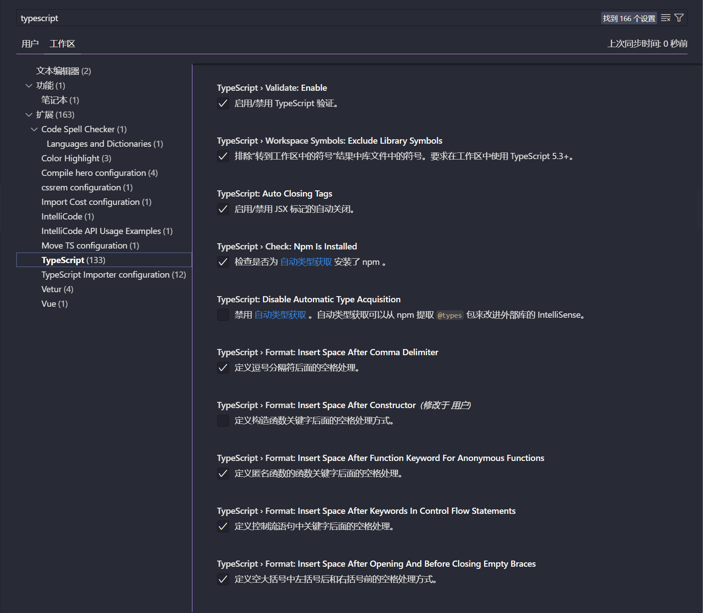
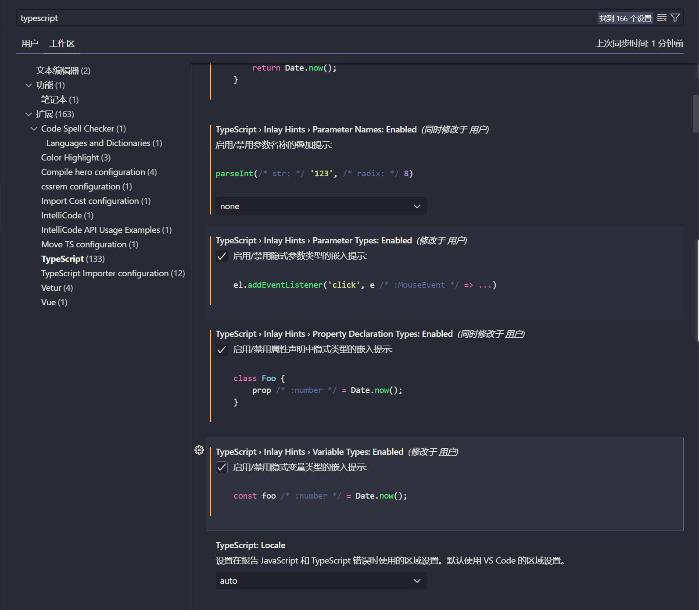
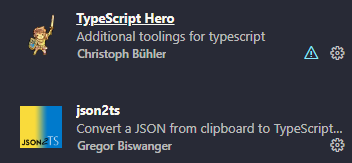
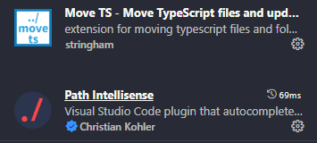
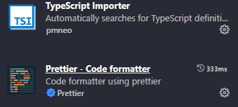
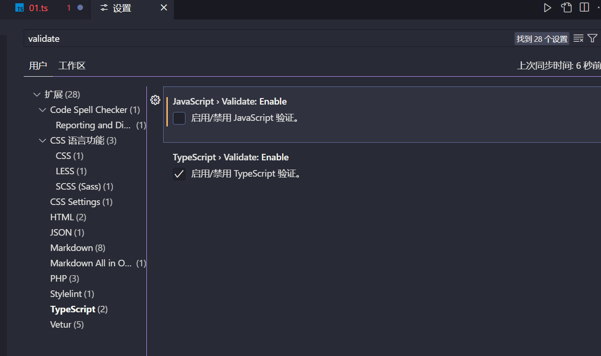
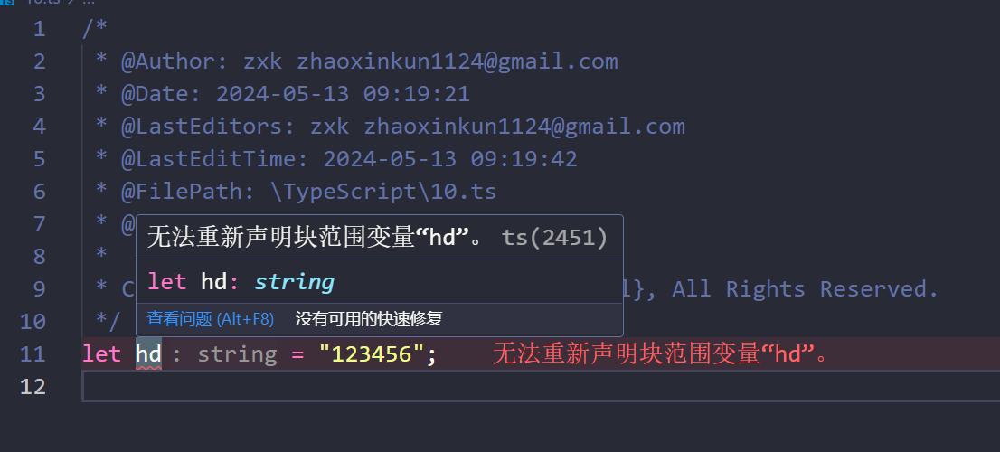
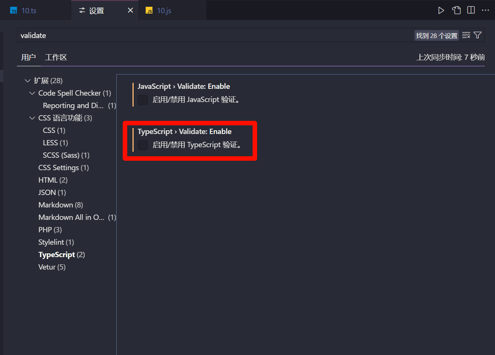

# 环境搭建

<!-- ## 目录

- [环境搭建](#环境搭建)
  - [目录](#目录)
  - [Vs code](#vs-code)
  - [安装插件](#安装插件)
  - [模块编译](#模块编译)
  - [关闭校验](#关闭校验)
  - [配置文件](#配置文件) -->

## Vs code

Ctrl+shift+p打开首选项—》打开工作区设置—》搜索Typescript





推荐开启的配置项主要是这几个：

- Function Like Return Types，显示推导得到的函数返回值类型；
- Parameter Names，显示函数入参的名称；
- Parameter Types，显示函数入参的类型；
- Variable Types，显示变量的类型。

## 安装插件









TSlint

## 模块编译

> 📌这是使用模块的方式编译Ts文件，主要是typescript 和ts-node两个NPM包

```bash
#安装模块
npm install typescript -g

#监听文件
tsc file -w

#自动监听
tsc -w

```

```bash
#或者使用ts-node模块运行
npm install ts-node -g
npm install tslib @types/node -g

#然后直接运行
ts-node XXX.ts

#不安装模块使用
$ npx ts-node script.ts
```

## 关闭校验

> 📌对于我们的ts文件中，如果你使用了一个变量的名字，那么其他的文件中也有这个变量名字的赋值操作，就会进行报错提醒，但是我们一般来说，我们ts中是要使用到的，但是转换为js后，竟然提醒有了冲突，所以要解决。





## 配置文件

TS 支持对编译过程使用配置项自定义，因为下面要讲的有些类型在不同 TS 配置时有差异，所以我们要掌握 TS 配置文件的创建与使用。

```typescript
//初始化
tsc -init
//进行自动监测
tsc -w  
```

配置选项

| 配置               | 说明                                   |
| ---------------- | ------------------------------------ |
| noImplicitAny    | 禁止使用隐含的 any 类型，如函数参数没有设置具体类型         |
| strictNullChecks | 开启时不否允许将 null、undefined 赋值给其他类型比如字符串 |
| target           | 转换成 JS 的版本                           |
| strict           | 是否严格模式执行                             |
| module           | 使用的模块系统                              |
