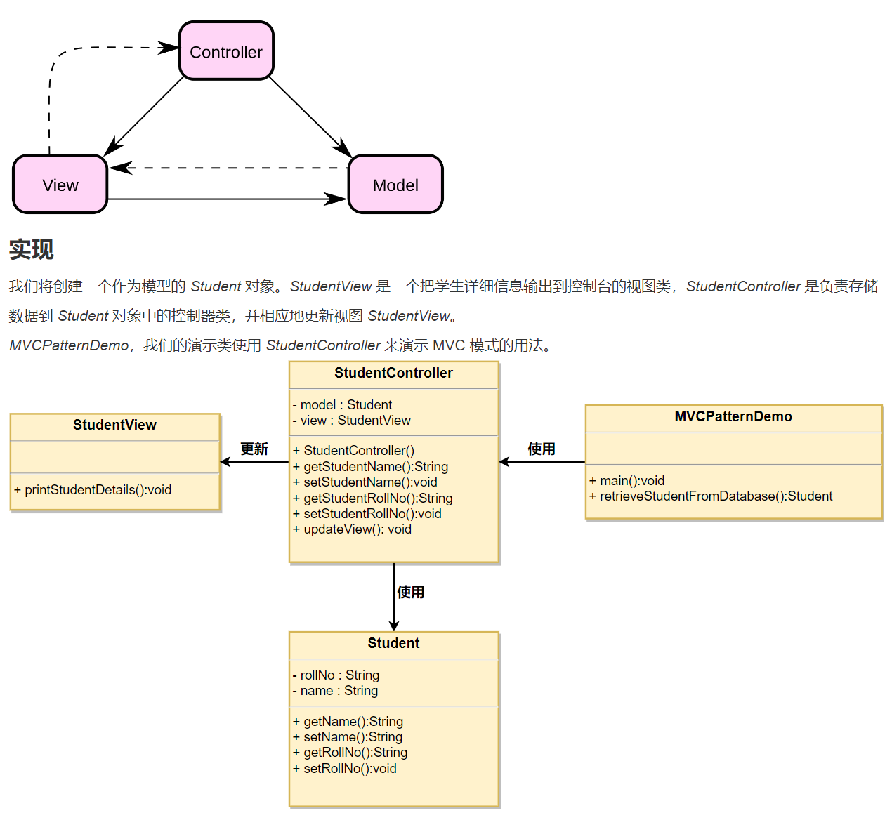
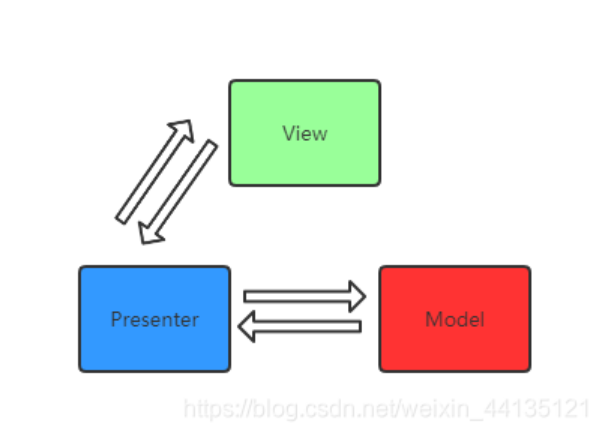
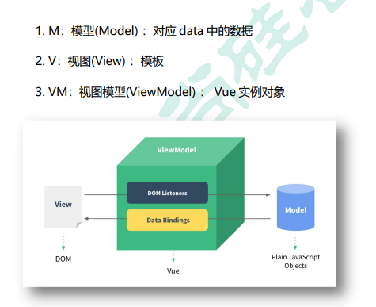

# 模型介绍

<!-- ## 目录

- [MVC](#MVC)
- [MVP](#MVP)
- [MVVM](#MVVM) -->

## MVC

- **Model（模型）** - 模型代表一个存取数据的对象或 JAVA POJO。它也可以带有逻辑，在数据变化时更新控制器。
- **View（视图）** - 视图代表模型包含的数据的可视化。
- **Controller（控制器）** - 控制器作用于模型和视图上。它控制数据流向模型对象，并在数据变化时更新视图。它使视图与模型分离开。
- 是使用一种将业务，数据，视图分离的方式组织架构代码
- 组件是架构开发，常常将视图，数据，业务逻辑等写在一个模块内，如果组件内容很多，常常造成层次的混乱，增加开发和日后维护的成本
- MVC模式就是专门处理这种问题的。



## MVP

- 传统的MVC模式虽然可以管理页面系统中的数据，视图，控制器，但是在视图层创建界面时常常会用到模型层内的数据，使模型层和视图层耦合在一起，降低了复用性和灵活性
- MVP模式就是为了解决这方面的问题。
- M（Model）模型，V（View）视图，P（Presenter）管理器
- 视图层不再直接引入模型层中的数据，而是通过管理层实现对模型层内的数据的访问。
- 即所有层次的交互都发生在管理层中，从而降低了模型层和视图层之间的耦合关系，提升了灵活性和复用性



## MVVM

MVVM（Model-View-ViewModel）是一种软件架构模式，主要应用于构建用户界面。这种模式在前端开发中被广泛采用，特别是在Vue.js、Angular等现代JavaScript框架中得到体现。MVVM的设计目的是为了实现视图与业务逻辑的松耦合，并简化UI层的开发工作。

以下是MVVM模型的三个核心组成部分及其职责：

1. **Model（模型）**：
   - Model是应用程序的核心数据结构，它代表了应用程序的状态和业务逻辑。
   - 模型通常包含数据以及对数据的操作方法，通过ajax等api完成服务端到客户端model的同步，例如获取数据、更新数据、执行业务规则等。
   - 在MVVM模式下，模型不直接与视图进行交互，而是通过ViewModel间接通信。
   - 对应Vue实例中的响应式数据对象（`data`属性），存储组件的状态信息。
2. **View（视图）**：
   - View是用户看到并与之交互的界面部分，它是模型状态的一种可视化表示。
   - 视图由HTML或模板语言编写的UI元素组成，展示的数据来源于ViewModel。
   - 当模型数据变化时，视图能够自动反映这些变化，反之亦然。
   - 展示的是VM的数据和状态，不处理状态，做的只是数据绑定的声明、指令的声明、事件绑定的声明
   - 使用Vue的模板语法编写的HTML片段，其中的数据绑定表达式如`{{ }}`、指令如`v-bind`和`v-model`等实现了数据和视图的动态绑定。
3. **ViewModel（视图模型）**：
   - ViewModel作为Model和View之间的桥梁，负责连接二者并维护它们之间的同步关系。
   - ViewModel包含了视图需要显示的所有数据及行为逻辑，但它并不关心具体的呈现方式，这使得视图可以独立于ViewModel改变。
   - ViewModel利用双向数据绑定机制，将Model中的数据映射到View上，并监听Model的变化，一旦数据发生变化，它会自动更新视图；同时，当用户在视图上做出操作时，ViewModel也会捕获这些事件并相应地更新Model。
   - **ViewModel**：Vue组件实例本身，它管理着数据和视图的关系，处理用户交互并通过Vue的响应式系统自动协调数据和视图的同步。

实现MVVM的必要操作：

- 视图引擎，帮助developer操作DOM
- 数据存储器，通过`Object.defineProperty()`自行封装存取数据的方式。往往封装的是发布 / 订阅模式，来完成数据的监听、数据变更时更新的通知
- 组件机制，因为有涉及继承、生命周期、组件通信机制，所以MVVM都有提供

观察发现：

1.data中所有的属性，最后都出现在了vm身上。数据代理

2.vm身上所有的属性 及 Vue原型上所有属性，在Vue模板中都可以直接使用。



```html
<!-- 引入文件 -->
    <script src="../js//vue.js"></script>

  <body>
    <!-- 准备好一个容器-- -->
    <div id="root">
      <!-- 这是自定义属性 -->
      <h1>姓名{{name}}</h1>
      <h1>年龄{{age}}</h1>
       //vm身上所有的属性 及 Vue原型上所有属性，在Vue模板中都可以直接使用。 
      <!-- vm中的属性 -->
      <h1>测试一下2:{{$options}}</h1>
      <h1>测试一下3:{{$emit}}</h1>
      <h1>测试一下4:{{_c}}</h1>
    </div>
    
    <script>
      const vm = new Vue({
        el: "#root",
        data() {
          return {
            name: "赵新坤",
            age: "18",
          };
        },
      });
      //   输出一下vm
      console.log(vm);
    </script>
  </body>

```
