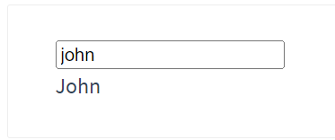

# Filter

<!-- ## 目录

- [使用](#使用)
- [链式](#链式)
- [参数](#参数) -->

> 📌不是Vue的实例配置选项！！！！！

> &#x20;filter过滤器-定义：对要显示的数据进行特定格式化后再显示（适用于一些简单逻辑的处理）。绝对不支持双向数据绑定v-model，支持插值语法和bind

- **定义**：过滤器是用于文本格式化的工具，可以在模板表达式中使用。
- **全局过滤器**：可以在 Vue 实例创建之前定义，全局过滤器在任何组件中都可以使用。
- **局部过滤器**：可以在组件内定义，局部过滤器仅在该组件及其子组件中可用。
- **参数**：过滤器可以接收多个参数，使用管道符号 (`|`) 和冒号 (`:`) 分隔。
- **链式调用**：可以将多个过滤器链式调用，前一个过滤器的输出会作为后一个过滤器的输入。
- 语法：
  - 注册过滤器：Vue.filter(name,callback) 或 new Vue{filters:{}}
  - 使用过滤器：{{ xxx | 过滤器名}}  或  v-bind:属性 = "xxx | 过滤器名"
- &#x20;备注：
  - 过滤器也可以接收额外参数、多个过滤器也可以串联
  - 并没有改变原本的数据, 是产生新的对应的数据

```html
<!DOCTYPE html>
<html>
  <head>
    <meta charset="UTF-8" />
    <title>过滤器</title>
    <script type="text/javascript" src="../js/vue.js"></script>
    <script type="text/javascript" src="../js/dayjs.min.js"></script>
  </head>
  <body> 
     <!-- 准备好一个容器-->
    <div id="root">
      <h2>显示格式化后的时间</h2>
      <!-- 计算属性实现 -->
      <h3>现在是：{{fmtTime}}</h3>
      <!-- methods实现 -->
      <h3>现在是：{{getFmtTime()}}</h3>
      <!-- 过滤器实现 -->
      <h3>现在是：{{time | timeFormater}}</h3>
      <!-- 过滤器实现（传参） -->
      <h3>现在是：{{time | timeFormater('YYYY_MM_DD') | mySlice}}</h3>
      <h3 :x="msg | mySlice">尚硅谷</h3>
    </div>

    <div id="root2">
      <h2>{{msg | mySlice}}</h2>
    </div>
  </body>

  <script type="text/javascript">
    Vue.config.productionTip = false
    //全局过滤器
    Vue.filter('mySlice',function(value){
      return value.slice(0,4)
    })
    
    new Vue({
      el:'#root',
      data:{
        time:1621561377603, //时间戳
        msg:'你好，尚硅谷'
      },
      computed: {
        fmtTime(){
          return dayjs(this.time).format('YYYY年MM月DD日 HH:mm:ss')
        }
      },
      methods: {
        getFmtTime(){
          return dayjs(this.time).format('YYYY年MM月DD日 HH:mm:ss')
        }
      },
      //局部过滤器
      filters:{
        timeFormater(value,str='YYYY年MM月DD日 HH:mm:ss'){
          // console.log('@',value)
          return dayjs(value).format(str)
        }
      }
    })

    new Vue({
      el:'#root2',
      data:{
        msg:'hello,atguigu!'
      }
    })
  </script>
</html>
```

## 使用

> 📌Vue.js 允许你自定义过滤器，可被用于一些常见的文本格式化。过滤器可以用在两个地方：**双花括号插值和 ****`v-bind`**** 表达式** (后者从 2.1.0+ 开始支持)。过滤器应该被添加在 JavaScript 表达式的尾部，由“管道”符号指示：

```vue
<div id="app">
  <!-- 使用过滤器 -->
  <p>{{ message | capitalize }}</p>
</div>

```

你可以在一个组件的选项中定义本地的过滤器：

```javascript
new Vue({
  el: '#app',
  data: {
    message: 'hello, world'
  },
  filters: {
    capitalize(value) {
      if (!value) return '';
      value = value.toString();
      return value.charAt(0).toUpperCase() + value.slice(1);
    }
  }
});

```

或者在创建 Vue 实例之前全局定义过滤器：

```javascript
// 定义全局过滤器
Vue.filter('capitalize', function(value) {
  if (!value) return '';
  value = value.toString();
  return value.charAt(0).toUpperCase() + value.slice(1);
});

new Vue({
  el: '#app',
  data: {
    message: 'hello, world'
  }
});

```

> 📌当全局过滤器和局部过滤器重名时，会采用局部过滤器。

## 链式

下面这个例子用到了 `capitalize` 过滤器：



过滤器函数总接收表达式的值 (之前的操作链的结果) 作为第一个参数。在上述例子中，`capitalize` 过滤器函数将会收到 `message` 的值作为第一个参数。

过滤器可以串联：

```javascript
{{ message | filterA | filterB }}
```

> 📌在这个例子中，`filterA` 被定义为接收单个参数的过滤器函数，表达式 `message` 的值将作为参数传入到函数中。然后继续调用同样被定义为接收单个参数的过滤器函数 `filterB`，将 `filterA` 的结果传递到 `filterB` 中。

## 参数

时间处理：

重量级处理库：[https://www.bootcdn.cn/moment.js/](https://www.bootcdn.cn/moment.js/ "https://www.bootcdn.cn/moment.js/")

轻量级处理：[https://www.bootcdn.cn/dayjs/](https://www.bootcdn.cn/dayjs/ "https://www.bootcdn.cn/dayjs/")   &#x20;

仓库：[https://github.com/iamkun/dayjs](https://github.com/iamkun/dayjs "https://github.com/iamkun/dayjs")

如果你需要在过滤器中传递参数，可以通过在过滤器名称后面使用冒号（:）传递参数。以下是将参数与过滤器结合的示例：

1. 字母大写过滤器，传递参数：
   ```html
   <div>{{ message | uppercase('extra') }}</div>
   ```
   ```javascript
   filters: {
     uppercase(value, extra) {
       return value.toUpperCase() + extra;
     }
   }
   ```
2. 日期格式化过滤器，传递参数：
   ```html
   <div>{{ date | formatDate('YYYY-MM-DD') }}</div>
   ```
   ```javascript
   filters: {
     formatDate(value, format) {
       const date = new Date(value);
       // 使用format库进行日期格式化
       return formatLibrary.format(date, format);
     }
   }
   ```
3. 小数位数控制过滤器，传递参数：
   ```html
   <div>{{ price | decimal(2, '元') }}</div>
   ```
   ```javascript
   filters: {
     decimal(value, decimals, unit) {
       return value.toFixed(decimals) + unit;
     }
   }
   ```

在上述示例中，我们在使用过滤器时，在过滤器名称后面使用括号传递参数。在过滤器函数中，我们可以接收并处理这些参数，并根据需要进行相应的操作。

请注意，传递多个参数时，需要按照顺序依次传递。如果需要传递不同类型的参数或更复杂的参数，可以使用对象或数组作为参数进行传递，并在过滤器函数中解构或使用索引来获取这些参数。

对于多个参数，你可以使用自定义方法来替代过滤器。以下是一个示例：

```html
<template>
  <div>
    <!-- 使用过滤器 -->
    <p>{{ message | toUpperCase('extraParam') }}</p>

    <!-- 使用自定义方法 -->
    <p>{{ customFilter(message, 'extraParam') }}</p>
  </div>
</template>

<script>
export default {
  data() {
    return {
      message: 'Hello, Vue!'
    };
  },
  methods: {
    customFilter(value, extraParam) {
      // 在这里执行自定义的过滤逻辑
      return value.toUpperCase() + extraParam;
    }
  }
};
</script>
```

在上述示例中，`customFilter` 是一个自定义的方法，它接受多个参数。你可以在方法中执行任意的逻辑来处理这些参数，替代了过滤器的功能。这样可以更灵活地处理多个参数的情况。

总体而言，如果过滤器的参数比较复杂，或者需要进行多步处理，使用自定义方法可能会更合适。如果参数较为简单，仍然可以使用过滤器，只需注意传递参数的方式。
