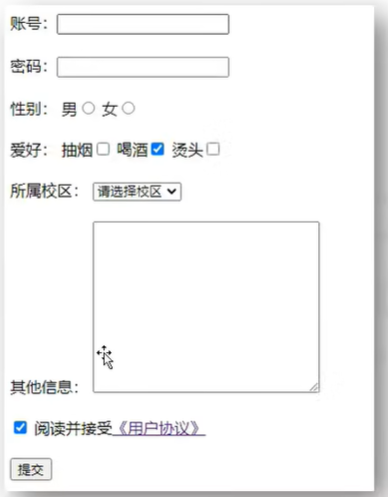
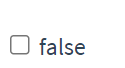
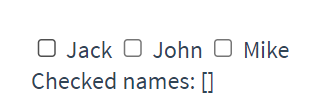
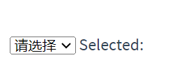
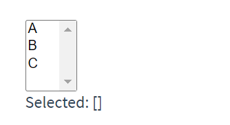
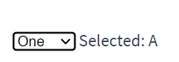
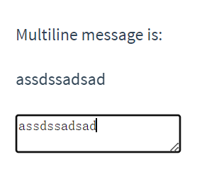

# Form Input Bindings

<!-- ## 目录

- [v-model](#v-model)
- [基础使用](#基础使用)
- [input文本](#input文本)
- [单选按钮](#单选按钮)
- [复选框](#复选框)
- [选择框](#选择框)
- [多行文本](#多行文本)
- [修饰符](#修饰符)
  - [.lazy](#lazy)
  - [.number](#number)
  - [.trim](#trim)
- [文件上传](#文件上传) -->

## [v-model](https://v2.cn.vuejs.org/v2/api/#v-model "v-model")

- **预期**：随表单控件类型不同而不同。
- **限制**：
  - `<input>`
  - `<select>`
  - `<textarea>`
  - components
- **修饰符**：
  - [.lazy](https://v2.cn.vuejs.org/v2/guide/forms.html#lazy ".lazy") - 取代 `input` 监听 `change` 事件
  - [.number](https://v2.cn.vuejs.org/v2/guide/forms.html#number ".number") - 输入字符串转为有效的数字
  - [.trim](https://v2.cn.vuejs.org/v2/guide/forms.html#trim ".trim") - 输入首尾空格过滤
- **用法**：

  在表单控件或者组件上创建双向绑定。细节请看下面的教程链接。
- **参考**：
  - [表单控件绑定](https://v2.cn.vuejs.org/v2/guide/forms.html "表单控件绑定")
  - [组件 - 在输入组件上使用自定义事件](https://v2.cn.vuejs.org/v2/guide/components-custom-events.html#将原生事件绑定到组件 "组件 - 在输入组件上使用自定义事件")
- 缩写
  ```html
    双向数据绑定：<input type="text" v-model="name"><br/>
  ```

> 📌双向绑定(v-model)：数据不仅能从data流向页面，还可以从页面流向data。

- 双向绑定一般都应用在表单类元素上（如：input、select等）
- v-model:value 可以简写为 v-model，因为v-model默认收集的就是value值。

## 基础使用

- **若：\<input type="text"/>，则v-model收集的是value值，用户输入的就是value值。**
- **若：\<input type="radio"/>，则v-model收集的是value值，且要给标签配置value值。**
- **若：\<input type="checkbox"/>**
  - **没有配置input的value属性，那么收集的就是checked（勾选 or 未勾选，是布尔值）**
  - **配置input的value属性:**

    **v-model的初始值是非数组，那么收集的就是checked（勾选 or 未勾选，是布尔值）**

    **v-model的初始值是数组，那么收集的的就是value组成的数组**

**备注：v-model的三个修饰符：**

- **lazy：失去焦点再收集数据**
- **number：输入字符串转为有效的数字**
- \*\* trim：输入首尾空格过滤\*\*​

> 📌你可以用 `v-model` 指令在表单 `<input>`、`<textarea>` 及 `<select>` 元素上创建双向数据绑定。它会根据控件类型自动选取正确的方法来更新元素。尽管有些神奇，但 `v-model` 本质上不过是语法糖。它负责监听用户的输入事件以更新数据，并对一些极端场景进行一些特殊处理。

> 📌`v-model` 会忽略所有表单元素的 `value`、`checked`、`selected` attribute 的初始值而总是将 Vue 实例的数据作为数据来源。

你应该通过 JavaScript 在组件的 `data` 选项中声明初始值。

`v-model` 在内部为不同的输入元素使用不同的 property 并抛出不同的事件：

- text 和 textarea 元素使用 `value` property 和 `input` 事件；
- checkbox 和 radio 使用 `checked` property 和 `change` 事件；
- select 字段将 `value` 作为 prop 并将 `change` 作为事件。



```html
<!DOCTYPE html>
<html>
  <head>
    <meta charset="UTF-8" />
    <title>收集表单数据</title>
    <script type="text/javascript" src="../js/vue.js"></script>
  </head>
  <body>
    <!-- 准备好一个容器-->
    <div id="root">
      <form  @submit.prevent="demo" >//取消点击提交的默认刷新行为
       //默认的value 
        账号：<input type="text"  v-model.trim="userInfo.account" > <br/><br/>
        密码：<input type="password"  v-model="userInfo.password" > <br/><br/>
        年龄：<input type="number"  v-model.number="userInfo.age" > <br/><br/>
        性别：
         //radio要亲自配上value 
        男<input type="radio" name="sex" v-model="userInfo.sex"  value="male" >
        女<input type="radio" name="sex" v-model="userInfo.sex"  value="female" > <br/><br/>
        爱好：
         //checkbox也要配上value，且接收的时候要是数组 
        学习<input type="checkbox" v-model="userInfo.hobby" value="study">
        打游戏<input type="checkbox" v-model="userInfo.hobby" value="game">
        吃饭<input type="checkbox" v-model="userInfo.hobby" value="eat">
        <br/><br/>
        所属校区
        <select v-model="userInfo.city">
          <option value="">请选择校区</option>
          <option value="beijing">北京</option>
          <option value="shanghai">上海</option>
          <option value="shenzhen">深圳</option>
          <option value="wuhan">武汉</option>
        </select>
        <br/><br/>
        其他信息：
        <textarea v-model.lazy="userInfo.other"></textarea> <br/><br/>
        <input type="checkbox" v-model="userInfo.agree">阅读并接受<a href="http://www.atguigu.com">《用户协议》</a>
        <button>提交</button>
      </form>
    </div>
  </body>

  <script type="text/javascript">
    Vue.config.productionTip = false

    new Vue({
      el:'#root',
      data:{
        userInfo:{
          account:'',
          password:'',
          age:18,
          sex:'female',
           hobby:[], 
          city:'beijing',
          other:'',
          agree:''
        }
      },
      methods: {
        demo(){
           console.log(JSON.stringify(this.userInfo)) 
        }
      }
    })
  </script>
</html>
```

***

## [input文本](https://v2.cn.vuejs.org/v2/guide/forms.html#文本 "input文本")

```html
<input  v-model="message"  placeholder="edit me">
<p>Message is: {{ message }}</p>
```

> 📌在上述示例中，文本输入框value值与Vue实例中的`message`属性进行双向绑定。当用户在输入框中输入内容时，`message`的值也会更新，反之亦然。

## [单选按钮](https://v2.cn.vuejs.org/v2/guide/forms.html#单选按钮 "单选按钮")

> 📌v-model收集的是value值，radio类型的要亲自给标签配置value值。

```html
<div id="example-4">
  <input type="radio" id="one"  value="One"   v-model="picked" >
  <label for="one">One</label>
  <br>
  <input type="radio" id="two"  value="Two" v-model="picked" >
  <label for="two">Two</label>
  <br>
  <span>Picked: {{ picked }}</span>
</div>

new Vue({
  el: '#example-4',
  data: {
    picked: ''
  }
})

```

## [复选框](https://v2.cn.vuejs.org/v2/guide/forms.html#复选框 "复选框")

> 📌单个复选框，绑定到布尔值：

```html
<input type="checkbox" id="checkbox"  v-model="checked" >
<label for="checkbox">{{ checked }}</label>
```



> 📌多个复选框，绑定到同一个数组：

```html
<input type="checkbox" id="jack" value="Jack"  v-model="checkedNames" >
<label for="jack">Jack</label>
<input type="checkbox" id="john" value="John"  v-model="checkedNames" >
<label for="john">John</label>
<input type="checkbox" id="mike" value="Mike"  v-model="checkedNames" >
<label for="mike">Mike</label>
<br>
<span>Checked names: {{ checkedNames }}</span>
```

```javascript
new Vue({
  el: '...',
  data: {
     checkedNames: [] 
  }
})
```



## [选择框](https://v2.cn.vuejs.org/v2/guide/forms.html#选择框 "选择框")

单选时：

```html
<div id="example-5">
  <select  v-model="selected" >
    <option disabled value="">请选择</option>
    <option>A</option>
    <option>B</option>
    <option>C</option>
  </select>
  <span>Selected: {{ selected }}</span>
</div>

new Vue({
  el: '...',
  data: {
    selected: ''
  }
})

```



> 📌如果 `v-model` 表达式的初始值未能匹配任何选项，`<select>` 元素将被渲染为“未选中”状态。在 iOS 中，这会使用户无法选择第一个选项。因为这样的情况下，iOS 不会触发 change 事件。因此，更推荐像上面这样提供一个值为空的禁用选项。

多选时 (绑定到一个数组)：

```html
<div id="example-6">
  <select v-model="selected" multiple style="width: 50px;">
    <option>A</option>
    <option>B</option>
    <option>C</option>
  </select>
  <br>
  <span>Selected: {{ selected }}</span>
</div>
```

```javascript
new Vue({
  el: '#example-6',
  data: {
    selected: []
  }
})
```



用 `v-for` 渲染的动态选项：

```html
<select v-model="selected">
  <option v-for="option in options" v-bind:value="option.value">
    {{ option.text }}
  </option>
</select>
<span>Selected: {{ selected }}</span>
```

```javascript
new Vue({
  el: '...',
  data: {
    selected: 'A',
    options: [
      { text: 'One', value: 'A' },
      { text: 'Two', value: 'B' },
      { text: 'Three', value: 'C' }
    ]
  }
})
```



## [多行文本](https://v2.cn.vuejs.org/v2/guide/forms.html#多行文本 "多行文本")

> 📌给一个data中的属性即可

```html
<span>Multiline message is:</span>
<p style="white-space: pre-line;">{{ message }}</p>
<br>
<textarea  v-model="message"  placeholder="add multiple lines"></textarea>
```



> 📌在文本区域插值 (`<textarea>{{text}}</textarea>`) 并不会生效，应用 `v-model` 来代替。

## 修饰符

### [.lazy](https://v2.cn.vuejs.org/v2/guide/forms.html#lazy ".lazy")

> 📌在默认情况下，`v-model` 在每次 `input` 事件触发后将输入框的值与数据进行同步 (除了[上述](https://v2.cn.vuejs.org/v2/guide/forms.html#vmodel-ime-tip "上述")输入法组合文字时)。你可以添加 `lazy` 修饰符，从而转为在 `change` 事件\_之后\_进行同步：

```html
<!-- 在“change”时而非“input”时更新 -->
<input  v-model.lazy ="msg">
```

### [.number](https://v2.cn.vuejs.org/v2/guide/forms.html#number ".number")

> 📌如果想自动将用户的输入值转为数值类型，可以给 `v-model` 添加 `number` 修饰符：

```html
<input  v-model.number ="age" type="number">
```

这通常很有用，因为即使在 `type="number"` 时，HTML 输入元素的值也总会返回字符串。如果这个值无法被 `parseFloat()` 解析，则会返回原始的值。

### [.trim](https://v2.cn.vuejs.org/v2/guide/forms.html#trim ".trim")

> 📌如果要自动过滤用户输入的首尾空白字符，可以给 `v-model` 添加 `trim` 修饰符：

```html
<input  v-model.trim ="msg">
```

## 文件上传

```html
<input type="file" v-on:change="handleFileUpload">
```

上述示例中的文件上传使用了`v-on`指令来绑定`change`事件，当用户选择文件后会触发指定的方法`handleFileUpload`，你可以在方法中访问上传的文件进行进一步处理。
