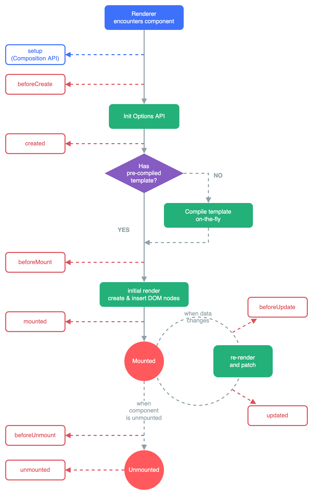

# Lifecycle Hooks

<!-- ## 目录

- [Lifecycle Hooks](#lifecycle-hooks)
  - [目录](#目录)
  - [创建阶段（Creation Phase）](#创建阶段creation-phase)
    - [`beforeCreate（创建前）：`](#beforecreate创建前)
    - [`created（创建后）：`](#created创建后)
  - [挂载阶段（Mounting Phase）](#挂载阶段mounting-phase)
    - [`beforeMount（挂载前）：`](#beforemount挂载前)
    - [`mounted（挂载后）：`](#mounted挂载后)
  - [更新阶段（Updating Phase）](#更新阶段updating-phase)
    - [`beforeUpdate（更新前）：`](#beforeupdate更新前)
    - [`updated（更新后）：`](#updated更新后)
  - [销毁阶段（Destroying Phase）](#销毁阶段destroying-phase)
    - [`beforeDestroy（销毁前）：`](#beforedestroy销毁前)
    - [`destroyed（销毁后）：`](#destroyed销毁后)
  - [`keep-alive`组件](#keep-alive组件)
    - [`activated（keep-alive）激活时：`](#activatedkeep-alive激活时)
    - [`deactivated（keep-alive）失活时：`](#deactivatedkeep-alive失活时)
  - [错误捕获（Error Handling Phase）](#错误捕获error-handling-phase)
    - [`errorCaptured`](#errorcaptured)
  - [开发者模式](#开发者模式)
    - [`renderTracked `](#rendertracked-)
    - [`renderTriggered`](#rendertriggered)
  - [服务端渲染](#服务端渲染)
    - [`serverPrefetch `](#serverprefetch-)
  - [父子组件生命周期钩子执行顺序](#父子组件生命周期钩子执行顺序)
  - [父组件能监听到子组件的生命周期吗](#父组件能监听到子组件的生命周期吗)
    - [方法一：使用自定义事件（`$emit`）](#方法一使用自定义事件emit)
    - [方法二：使用事件总线（Event Bus）](#方法二使用事件总线event-bus)
    - [方法三：调用父组件的方法](#方法三调用父组件的方法) -->

> 📌每个 Vue 实例在被创建时都要经过一系列的初始化过程——例如，需要设置数据监听、编译模板、将实例挂载到 `DOM` 并在数据变化时更新 `DOM `等。同时在这个过程中也会运行一些叫做**生命周期钩子**的函数，这给了用户在不同阶段添加自己的代码的机会。

不要在选项 `property `或回调上使用[箭头函数](https://developer.mozilla.org/zh-CN/docs/Web/JavaScript/Reference/Functions/Arrow_functions "箭头函数")，比如 `created: () => console.log(this.a)` 或 `vm.$watch('a', newValue => this.myMethod())`。因为箭头函数并没有 `this`，`this` 会作为变量一直向上级词法作用域查找，直至找到为止，经常导致 `Uncaught TypeError: Cannot read property of undefined` 或 `Uncaught TypeError: this.myMethod is not a function` 之类的错误。




```javascript
const vm = new Vue({
    el:"#app",
    beforeCreate() {
        /*备孕*/
        console.log("实例创建之前")
    },
    created() {
        /*怀上了*/
        // 数据请求
        console.log("实例创建之后")
    },
    beforeMount() {
        /*快生了*/
        console.log("挂载到页面之前")
    },
    mounted() {
        /*生了*/
        // 数据请求，DOM操作，监听滚动事件...
        console.log("挂载到页面之后")
    },
    beforeUpdate() {
        /*快长大了*/
        console.log("数据更新之前")
    },
    updated() {
        /*长大了*/
        // DOM操作，实例化的操作...
        console.log("数据更新之后")
    },
    beforeDestroy() {
        /*要挂了*/
        // 取消数据订阅
        console.log("实例销毁之前")
    },
    destroyed() {
        /*挂了*/
        console.log("实例销毁之后")
    }
})
```

```javascript
<!DOCTYPE html>
<html>
<head>
    <meta charset="UTF-8">
    <title>Document</title>
    <style>
        
    </style>
</head>
<body>
    <div id="app">
        <input type="text" v-model="txt"><span>{{txt}}</span>
        <button @click="del" ref="b">销毁当前实例</button>
    </div>
</body>
<script src="../libs/vue.js"></script>
<script>

    new Vue({
        el:"#app",
        data:{
            txt:"hello"
        },
        methods:{
            del(){
                // 主动销毁当前实例
                this.$destroy();
            }
        },
        beforeCreate() {
            // 无法通过实例获取到结构中的元素
            // 还可以在此处做一些权限拦截
            // 提前绑定自定义事件，准备被其他组件触发，用来接收数据
            console.log("实例创建之前", this.$refs.b);
        },
        created() {
            // 无法通过实例获取到结构中的元素
            // 还可以做一些异步的数据请求处理操作
            // 提前绑定自定义事件，准备被其他组件触发，用来接收数据
            console.log("实例创建之后", this.$refs.b);
        },
        beforeMount() {
            // 无法通过实例获取到结构中的元素
            // 还可以做一些异步的数据请求处理操作
            // 触发别的组件的自定义事件，用来发送数据
            console.log("实例挂载到页面之前", this.$refs.b)
        },
        mounted() {
            // 可以通过实例获取到结构中的元素（操作DOM）
            // 还可以做一些异步的数据请求处理操作
            // 触发别的组件的自定义事件，用来发送数据
            console.log("实例挂载到页面之后", this.$refs.b)
        },
        beforeUpdate() {
            // 监听当前实例的变化，做出不同的响应（没有watch好用）
            console.log("实例中的数据或视图更新之前")
        },
        updated() {
            // 监听当前实例的变化，做出不同的响应（没有watch好用）
            console.log("实例中的数据或视图更新之后")
        },
        beforeDestroy() {
            // 销毁之前，可以将之前注册过的数据或结构或功能或绑定，提前进行解绑
            console.log("实例销毁之前");
        },
        destroyed() {
            // 开启新的实例，新的功能
            console.log("实例销毁之后");
        }
    })

    // 基本语法：
    // 每个生命周期的钩子函数都是直接写给vue实例的选项
    // 和data，methods，watch，computed同级
    // 但是钩子函数是函数！！！
    // data，methods，watch，computed都是对象！！！

</script>
</html>
```

## 创建阶段（Creation Phase）

### `beforeCreate（创建前）：`

- **作用：** 在实例初始化之后、数据观测 (data observation) 和 `event`/`watcher `事件配置之前被调用。`_data`都没有呢
- **可以进行的操作：** 在此阶段，实例还未初始化，无法访问 `data` 和 `methods`。
- **注意事项：** 适合执行一些初始化操作，如设置初始数据、注册自定义事件等。通常用于初始化非响应式的数据。

```javascript
export default {
  beforeCreate() {
    console.log('beforeCreate');
    // 执行一些初始化操作
    this.message = 'Hello, Vue!';
    debugger;  //想要观察，就要在这里停下
  },
  data() {
    return {
      message: ''
    }
  }
}
```

### `created（创建后）：`

- **作用：** 实例已经创建完成之后被调用。在这一步，实例已完成以下的配置：数据观测(data observer)，属性和方法的运算，`watch`/`event `事件回调。
- **可以进行的操作：** 在此阶段，可以访问 `data` 和 `methods`，但虚拟DOM和挂载阶段还未开始。
- **本人推荐在 created 钩子函数中调用异步请求，因为在 created 钩子函数中调用异步请求有以下优点：**
  - 能更快获取到服务端数据，减少页面 loading 时间；
  - ssr 不支持 beforeMount 、mounted 钩子函数，所以放在 created 中有助于一致性；
- **注意事项：** 适合进行数据处理、异步操作、调用API，异步请求等操作。

```javascript
export default {
  created() {
    console.log('created');
    // 发起异步请求
    fetch('https://api.example.com/data')
      .then(response => response.json())
      .then(data => {
        this.message = data.message;
      });
  },
  data() {
    return {
      message: ''
    }
  }
}
```

## 挂载阶段（Mounting Phase）

### `beforeMount（挂载前）：`

- **作用：** 在**挂载开始之前被调用**，即将开始编译模板、把数据渲染到模板中。
- **可以进行的操作：** 在此阶段，模板编译已完成，但未将组件挂载到`DOM`，挂载阶段尚未开始。你对于`DOM`的操作，操作也是白操作
- **注意事项：** 通常用于执行一些准备工作，如修改数据等。

```javascript
export default {
  beforeMount() {
    console.log('beforeMount');
    // 执行一些DOM操作
    this.$refs.myElement.innerHTML = 'Hello, Vue!';
  },
  mounted() {
    // ...
  }
}
```

### `mounted（挂载后）：`

- **作用：** 在挂载到`DOM`完成后被调用。也就是说，当模板渲染成html并被插入到页面中之后，mounted函数就会被触发执行。此时\*\*组件`DOM `****已经渲染完成，可以操作真实的 ****`DOM`****（避免）。进行****`DOM`\*\***操作或发起异步请求。**
- **可以进行的操作：** 在此阶段，组件已经被挂载到 `DOM`，可以访问到组件的 `$el`。
  - 发起异步请求。 发送`ajax`请求
  - 启动定时器、绑定自定义事件、订阅消息、事件监听等【初始化操作】
  - 初始化第三方库或插件：通常在`mounted`函数中会初始化一些第三方库或插件，比如`echarts`、`swiper`、`video.js`等等。
- **注意事项：** 通常用于执行一些需要 `DOM `元素的操作，如启动定时器、发起网络请求等。

```javascript
export default {
  mounted() {
    console.log('mounted');
    // 初始化页面
    this.$nextTick(() => {
      // 获取DOM元素
      const element = document.getElementById('myElement');
      // ...
    });
  }
}
```

## 更新阶段（Updating Phase）

### `beforeUpdate（更新前）：`

- **作用：** 在**数据更新之前调用**，发生在虚拟 `DOM `打补丁之前。可以在这个钩子中进一步地更改状态，不会触发其他的渲染钩子函数。
- **可以进行的操作：** 在此阶段可以访问更新前的状态，但不能手动修改数据。数据是新的，但是显示的还是旧的
- **注意事项：** 避免在此钩子函数中修改数据，可能导致无限循环更新。

```javascript
export default {
  beforeUpdate() {
    console.log('beforeUpdate');
    // 执行一些准备工作
    this.previousMessage = this.message;
  },
  updated() {
    // ...
  }
}
```

### `updated（更新后）：`

- **作用：** 在数据更新完成时调用。在由于数据更改导致的虚拟 `DOM `重新渲染和打补丁之后调用，**组件dom已经重新渲染。**
- **可以进行的操作：** 在此阶段可以访问到更新后的状态，`DOM `已经重新渲染。
- **注意事项：** 避免在此钩子函数中修改数据，可能导致无限循环更新。

```javascript
export default {
  updated() {
    console.log('updated');
    // 执行一些DOM操作或处理数据
    this.$refs.myElement.innerHTML = 'Updated!';
  }
}
```

## 销毁阶段（Destroying Phase）

### `beforeDestroy（销毁前）：`

- **作用：****在实例销毁之前调用。在这一步，实例仍然完全可用。** 可以访问和操作组件的属性和方法。但在`destroyed `钩子函数之后，组件实例已经被完全销毁，无法再访问其属性和方法。
- **可以进行的操作：** 在此阶段可以进行清理工作【收尾工作】以避免内存泄漏或不必要的资源占用。
  - 取消订阅：如果组件在订阅了某些事件或消息后，需要在销毁前取消订阅，以避免内存泄漏。
  - 清除定时器：如果组件在使用定时器执行某些任务，应该在销毁前清除这些定时器，以避免资源浪费。
  - 解绑事件监听器：如果组件在绑定了事件监听器后，需要在销毁前解绑这些事件监听器，以免造成事件泄漏。
  - 清除其他资源：根据组件使用的具体情况，可能还需要清除其他的资源，例如关闭网络连接、释放占用的内存等。
- **注意事项：** 在此阶段仍然可以访问实例和数据，但不会再触发更新。一般不会在`beforeDestroy`操作数据，因为即便操作数据，也不会再触发更新流程了。

```javascript
export default {
  beforeDestroy() {
    console.log('beforeDestroy');
    // 清理操作
    this.cleanup();
  },
  methods: {
    cleanup() {
      // ...
    }
  }
}
```

### `destroyed（销毁后）：`

- **作用：** 在实例销毁后调用。销毁后自定义事件会失效,所有指令都被解绑，所有的事件监听器和 `watch `监听器都被解绑，子实例也被销毁。但原生`DOM`事件依然有效。销毁后借助Vue开发者工具看不到任何信息
- **可以进行的操作：** 此时组件实例及其相关的监听器和子组件都已被销毁，无法再访问实例。
- **注意事项：** 不再访问组件实例和`DOM`元素，通常用于释放资源，清理副作用。

```javascript
export default {
  destroyed() {
    console.log('destroyed');
    // 执行最终清理操作
    this.releaseResources();
  },
  methods: {
    releaseResources() {
      // ...
    }
  }
}
```

## `keep-alive`组件

### `activated（keep-alive）激活时：`

- 在使用 `<keep-alive>` 包裹的组件被激活时调用。
- 执行一些在组件被激活时需要进行的操作，例如数据重新加载、动画开始等。可以执行特定于激活状态的逻辑或请求数据。

```javascript
export default {
  activated() {
    console.log('activated');
    // 执行激活时的操作
    this.loadData();
  },
  methods: {
    loadData() {
      // ...
    }
  }
}
```

### `deactivated（keep-alive）失活时：`

- 在使用 `<keep-alive>` 包裹的组件被停用时调用。
- 可以执行特定于停用状态的逻辑或清理操作。

```javascript
export default {
  deactivated() {
    console.log('deactivated');
    // 执行停用时的操作
    this.cleanup();
  },
  methods: {
    cleanup() {
      // ...
    }
  }
}
```

这些详细解释和示例应该可以帮助你更好地理解每个`Vue`生命周期钩子的作用和用法。通过合理地利用这些钩子函数，你可以在不同的生命周期阶段执行相应的操作，从而实现更复杂的功能和交互效果。

当组件被创建、挂载、更新或销毁时，对应的钩子函数会被调用，你可以在这些钩子函数中执行相应的逻辑和操作。这些生命周期钩子函数为你提供了在不同阶段处理数据、`DOM`操作、异步请求等的机会。

## 错误捕获（Error Handling Phase）

### `errorCaptured`

> 2.5.0+ 新增

**类型**：`(err: Error, vm: Component, info: string) => ?boolean`

**详细**：当捕获一个来自子孙组件的错误时被调用。此钩子会收到三个参数：错误对象、发生错误的组件实例以及一个包含错误来源信息的字符串。此钩子可以返回 `false` 以阻止该错误继续向上传播。你可以在此钩子中修改组件的状态。因此在捕获错误时，在模板或渲染函数中有一个条件判断来绕过其它内容就很重要；不然该组件可能会进入一个无限的渲染循环。

**错误传播规则**

- 默认情况下，如果全局的 `config.errorHandler` 被定义，所有的错误仍会发送它，因此这些错误仍然会向单一的分析服务的地方进行汇报。
- 如果一个组件的继承或父级从属链路中存在多个 `errorCaptured` 钩子，则它们将会被相同的错误逐个唤起。
- 如果此 `errorCaptured` 钩子自身抛出了一个错误，则这个新错误和原本被捕获的错误都会发送给全局的 `config.errorHandler`。
- 一个 `errorCaptured` 钩子能够返回 `false` 以阻止错误继续向上传播。本质上是说“这个错误已经被搞定了且应该被忽略”。它会阻止其它任何会被这个错误唤起的 `errorCaptured` 钩子和全局的 `config.errorHandler`。

在 Vue.js 中，`errorCaptured` 是一个组件选项，用于捕获和处理子组件中的错误。它是一个生命周期钩子函数，可以在组件层级间传播和处理错误。

使用 `errorCaptured` 选项，你可以在父组件中捕获并处理子组件中抛出的错误，而不会导致整个应用程序崩溃。一旦子组件中发生错误，父组件将会触发 `errorCaptured` 钩子函数，并接收到错误对象和组件实例作为参数。

`errorCaptured` 的使用场景包括但不限于：

1. 错误边界（Error Boundary）：通过在父组件中定义 `errorCaptured` 钩子函数，你可以在子组件中捕获和处理错误，从而防止错误波及到整个应用程序。
2. 错误日志记录：你可以在 `errorCaptured` 钩子函数中将错误信息发送到后端日志服务或错误监控工具，以便进行错误分析和修复。

在 Vue.js 中，还有其他与 `errorCaptured` 相关的选项和方法，包括：

- `errorHandler` 选项：用于全局处理未被组件捕获的错误。
- `vm.$emit('hook:error', err)` 方法：用于手动触发组件错误，并将错误传递给 `errorCaptured` 或 `errorHandler` 进行处理。

这些选项和方法提供了灵活的错误处理机制，使你能够在 Vue.js 应用程序中更好地管理和处理错误。

`errorCaptured` 是 Vue 2 中的一个生命周期钩子函数，用于捕获子组件中抛出的错误。它可以在父组件中定义，并在子组件发生错误时进行处理。

当子组件中的错误未被捕获时，错误会向上冒泡到父组件。此时，如果父组件定义了 `errorCaptured` 钩子函数，Vue 会调用该函数，传入错误对象和包含错误来源信息的组件实例。

使用 `errorCaptured` 钩子函数，可以在父组件中对子组件的错误进行处理、记录或显示错误信息，而不会导致整个应用程序崩溃。

下面是一个简单的示例，在父组件中定义 `errorCaptured` 钩子函数来捕获并处理子组件中的错误：

```javascript
<template>
  <div>
    <child-component></child-component>
  </div>
</template>

<script>
export default {
  components: {
    ChildComponent
  },
  errorCaptured(err, vm, info) {
    console.error('捕获到子组件错误：', err);
    console.error('错误来源：', info);
    // 进行错误处理
  }
};
</script>
```

在上述示例中，父组件中定义了 `errorCaptured` 钩子函数来捕获子组件抛出的错误。当子组件发生错误时，将会触发该钩子函数，并传入错误对象 `err`、组件实例 `vm` 和错误来源信息 `info`。在函数内部，可以进行相应的错误处理，例如打印错误信息、发送错误报告等。

需要注意的是，`errorCaptured` 钩子函数只能捕获子孙组件抛出的错误，无法捕获根组件中的错误。另外，如果父组件和子组件都定义了 `errorCaptured` 钩子函数，只有最近的祖先组件的钩子函数会被调用。

总之，`errorCaptured` 是 Vue 2 中的一个生命周期钩子函数，用于捕获并处理子组件中抛出的错误。通过使用它，可以提高应用程序的容错性和错误处理能力。

## 开发者模式

### `renderTracked `

在一个响应式依赖被组件的渲染作用追踪后调用。

**这个钩子仅在开发模式下可用，且在服务器端渲染期间不会被调用。**

在 Vue.js 中，`renderTracked` 是一个开发者工具钩子函数，用于跟踪渲染过程中的依赖跟踪情况。它可以帮助我们更好地了解组件渲染过程中的响应式数据依赖关系。

当 Vue.js 渲染器跟踪响应式数据时，每当某个数据被用于计算属性、模板或侦听器中时，跟踪系统都会记录下这些依赖项和它们的关系。`renderTracked` 钩子函数能够捕获并打印出这些依赖项的相关信息，例如数据对象、依赖项的键值和依赖项所属的组件实例。

类型：

```javascript
interface ComponentOptions {
  renderTracked?(this: ComponentPublicInstance, e: DebuggerEvent): void
}

type DebuggerEvent = {
  effect: ReactiveEffect
  target: object
  type: TrackOpTypes /* 'get' | 'has' | 'iterate' */
  key: any
}
```

`renderTracked` 的使用场景包括但不限于：

1. 性能优化：通过观察渲染过程中的依赖项，你可以确定哪些数据或计算属性对于渲染结果具有重要性，并进行相应的优化，减少不必要的计算和更新。
2. 调试和排查问题：当你遇到渲染相关的问题，如组件频繁更新或错误的依赖跟踪，可以使用 `renderTracked` 来查看哪些依赖项发生了变化或被频繁访问。

```javascript
import { onRenderTracked } from 'vue';

onRenderTracked((target, key) => {
  console.log(`Dependancy "${key}" in component has been tracked.`);
});

```

在上述例子中，`onRenderTracked` 函数用于注册一个回调函数，这个回调函数会在组件的渲染期间，某个响应式依赖被追踪时被调用。在回调函数中，你可以获取到被追踪的依赖的信息，比如依赖所在的目标对象（target）以及依赖的键值（key）。

### `renderTriggered`

在一个响应式依赖被组件触发了重新渲染之后调用。

**这个钩子仅在开发模式下可用，且在服务器端渲染期间不会被调用。**

- `renderTriggered`：用于在依赖项被触发重新计算时触发，提供类似的功能和用途。

类型：

```javascript
interface ComponentOptions {
  renderTriggered?(this: ComponentPublicInstance, e: DebuggerEvent): void
}

type DebuggerEvent = {
  effect: ReactiveEffect
  target: object
  type: TriggerOpTypes /* 'set' | 'add' | 'delete' | 'clear' */
  key: any
  newValue?: any
  oldValue?: any
  oldTarget?: Map<any, any> | Set<any>
}
```

## 服务端渲染

### `serverPrefetch `

当组件实例在服务器上被渲染之前要完成的异步函数。

- **类型**
  ```typescript
  interface ComponentOptions {
    serverPrefetch?(this: ComponentPublicInstance): Promise<any>
  }

  ```
- **详细信息**

  如果这个钩子返回了一个 Promise，服务端渲染会在渲染该组件前等待该 Promise 完成。

  这个钩子仅会在服务端渲染中执行，可以用于执行一些仅在服务端才有的数据抓取过程。
- **示例**
  ```javascript
  export default {
    data() {
      return {
        data: null
      }
    },
    async serverPrefetch() {
      // 组件会作为初次请求的一部分被渲染
      // 会在服务端预抓取数据，因为这比客户端更快
      this.data = await fetchOnServer(/* ... */)
    },
    async mounted() {
      if (!this.data) {
        // 如果数据在挂载时是 null，这意味着这个组件
        // 是在客户端动态渲染的，请另外执行一个
        // 客户端请求作为替代
        this.data = await fetchOnClient(/* ... */)
      }
    }
  }
  ```
- **参考**[服务端渲染](https://cn.vuejs.org/guide/scaling-up/ssr.html "服务端渲染")

## 父子组件生命周期钩子执行顺序

Vue 的父组件和子组件生命周期钩子函数执行顺序可以归类为以下 4 部分：

- 加载渲染过程

  父 beforeCreate -> 父 created -> 父 beforeMount -> 子 beforeCreate -> 子 created -> 子 beforeMount -> 子 mounted -> 父 mounted
- 子组件更新过程

  父 beforeUpdate -> 子 beforeUpdate -> 子 updated -> 父 updated
- 父组件更新过程

  父 beforeUpdate -> 父 updated
- 销毁过程

  父 beforeDestroy -> 子 beforeDestroy -> 子 destroyed -> 父 destroyed

## 父组件能监听到子组件的生命周期吗

在Vue.js中，父组件不能直接监听子组件的生命周期钩子，但可以通过一些技巧间接实现这一功能。例如，可以使用事件总线、`$emit` 事件或直接调用父组件的方法来通知父组件子组件的生命周期变化。下面是几种常见的实现方法：

### 方法一：使用自定义事件（`$emit`）

子组件在生命周期钩子中使用 `$emit` 发送自定义事件，父组件通过监听这些事件来间接获知子组件的生命周期变化。

**子组件（ChildComponent.vue）**

```vue
<template>
  <div>
    Child Component
  </div>
</template>

<script>
export default {
  name: 'ChildComponent',
  created() {
    this.$emit('child-created');
  },
  mounted() {
    this.$emit('child-mounted');
  },
  destroyed() {
    this.$emit('child-destroyed');
  }
};
</script>
```

**父组件（ParentComponent.vue）**

```vue
<template>
  <div>
    Parent Component
    <ChildComponent @child-created="onChildCreated" @child-mounted="onChildMounted" @child-destroyed="onChildDestroyed"/>
  </div>
</template>

<script>
import ChildComponent from './ChildComponent.vue';

export default {
  name: 'ParentComponent',
  components: {
    ChildComponent
  },
  methods: {
    onChildCreated() {
      console.log('Child component created');
    },
    onChildMounted() {
      console.log('Child component mounted');
    },
    onChildDestroyed() {
      console.log('Child component destroyed');
    }
  }
};
</script>
```

### 方法二：使用事件总线（Event Bus）

使用事件总线来在子组件的生命周期钩子中发送事件，父组件通过事件总线监听这些事件。

**事件总线（eventBus.js）**

```javascript
import Vue from 'vue';
export const EventBus = new Vue();
```

**子组件（ChildComponent.vue）**

```vue
<template>
  <div>
    Child Component
  </div>
</template>

<script>
import { EventBus } from './eventBus';

export default {
  name: 'ChildComponent',
  created() {
    EventBus.$emit('child-created');
  },
  mounted() {
    EventBus.$emit('child-mounted');
  },
  destroyed() {
    EventBus.$emit('child-destroyed');
  }
};
</script>
```

**父组件（ParentComponent.vue）**

```vue
<template>
  <div>
    Parent Component
    <ChildComponent/>
  </div>
</template>

<script>
import ChildComponent from './ChildComponent.vue';
import { EventBus } from './eventBus';

export default {
  name: 'ParentComponent',
  components: {
    ChildComponent
  },
  created() {
    EventBus.$on('child-created', this.onChildCreated);
    EventBus.$on('child-mounted', this.onChildMounted);
    EventBus.$on('child-destroyed', this.onChildDestroyed);
  },
  beforeDestroy() {
    EventBus.$off('child-created', this.onChildCreated);
    EventBus.$off('child-mounted', this.onChildMounted);
    EventBus.$off('child-destroyed', this.onChildDestroyed);
  },
  methods: {
    onChildCreated() {
      console.log('Child component created');
    },
    onChildMounted() {
      console.log('Child component mounted');
    },
    onChildDestroyed() {
      console.log('Child component destroyed');
    }
  }
};
</script>
```

### 方法三：调用父组件的方法

在子组件的生命周期钩子中，直接调用父组件的方法来通知父组件。

**子组件（ChildComponent.vue）**

```vue
<template>
  <div>
    Child Component
  </div>
</template>

<script>
export default {
  name: 'ChildComponent',
  created() {
    this.$parent.onChildCreated();
  },
  mounted() {
    this.$parent.onChildMounted();
  },
  destroyed() {
    this.$parent.onChildDestroyed();
  }
};
</script>
```

**父组件（ParentComponent.vue）**

```vue
<template>
  <div>
    Parent Component
    <ChildComponent/>
  </div>
</template>

<script>
import ChildComponent from './ChildComponent.vue';

export default {
  name: 'ParentComponent',
  components: {
    ChildComponent
  },
  methods: {
    onChildCreated() {
      console.log('Child component created');
    },
    onChildMounted() {
      console.log('Child component mounted');
    },
    onChildDestroyed() {
      console.log('Child component destroyed');
    }
  }
};
</script>
```

> 📌虽然Vue.js没有直接提供父组件监听子组件生命周期钩子的API，但可以通过自定义事件、事件总线或者直接调用父组件的方法来实现这一需求。这些方法都能够在一定程度上帮助父组件了解子组件的生命周期变化，根据具体的需求选择适合的方法进行实现。
