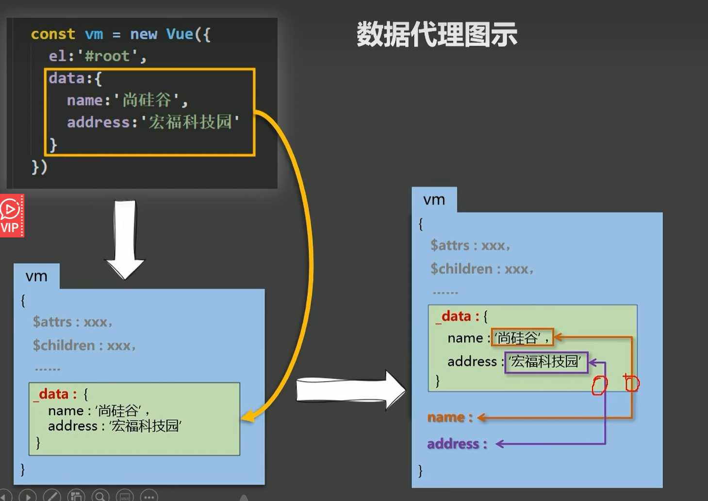

# 数据代理

<!-- ## 目录

- [基本介绍](#基本介绍)
- [底层原理](#底层原理)
- [问题解决](#问题解决)
- [会代理的配置项](#会代理的配置项)
  - [代理示例](#代理示例)
- [不会代理的配置项](#不会代理的配置项)
  - [非代理示例](#非代理示例) -->



## 基本介绍

> 📌**数据代理：通过一个对象代理对另一个对象中属性的操作（读/写）**

> 📌实际上，什么是数据代理：每个组件实例都有一个`data`选项，用于定义该组件的响应式状态。当创建一个新的Vue实例时，Vue会遍历`data`对象的所有属性，通过`Object.defineProperty`，并将其转换为getter和setter，添加到Vue实例对象身上，此时你只能看到下划线data。Vue 再将 `data` 中的属性直接代理到 Vue 实例上，使你可以通过 `this.property` 的方式访问和修改数据，而无需通过 `this.data.property`。这样做让代码更简洁、易读。到目前为止，你能访问和看到但是检测不到数据变化。

> 📌数据代理的核心在于，Vue将这些经过处理的响应式数据“代理”到Vue实例上。这意味着原本在`data`对象中的属性可以通过Vue实例直接访问，如：

```javascript
// Vue实例初始化
const app = new Vue({
  data: {
    message: 'Hello, World!'
  }
})

// 数据代理示例
app.message // 访问message属性
app.message = 'New Message' // 改变message属性
```

在上面的例子中，当我们通过`app.message`访问或修改`message`属性时，实际上是在与Vue实例上的代理进行交互。Vue通过代理，确保任何对这些属性的操作都能被观察和处理，从而驱动视图的更新。

> 📌更深入地讲，Vue会在其自身实例的\_\_proto\_\_链上创建一个代理对象（通常称为`vm._data`），这个代理对象公开了`data`对象的所有属性，但同时附加了getter和setter。因此，当你试图读取或写入实例上的某个属性时，实际执行的是Vue设置好的监听逻辑，而不是简单地直接读写原始数据。

这样做的好处是：

- 简化了数据访问和管理。
- 统一了数据更改的入口点，便于Vue跟踪变化并触发视图更新。
- 避免直接暴露内部数据结构，增强了代码组织性和安全性。

> 📌最基本的数据代理模型

```javascript
<body>
    <script type="text/javascript" >
      let obj = {x:100}
      let obj2 = {y:200}

      Object.defineProperty(obj2,'x',{
        get(){
          return obj.x
        },
        set(value){
          obj.x = value
        }
      })
    </script>
  </body>
</html>
```

```javascript
<!DOCTYPE html>
<html>
  <head>
    <meta charset="UTF-8" />
    <title>Vue中的数据代理</title>
    <!-- 引入Vue -->
    <script type="text/javascript" src="../js/vue.js"></script>
  </head>
  <body>
    <!-- 
         1.Vue中的数据代理：
              通过vm对象来代理data对象中属性的操作（读/写）
        2.Vue中数据代理的好处：
              更加方便的操作data中的数据
        3.基本原理：
              通过Object.defineProperty()把data对象中所有属性添加到vm上。
              为每一个添加到vm上的属性，都指定一个getter/setter。
              在getter/setter内部去操作（读/写）data中对应的属性。 
     -->
    <!-- 准备好一个容器-->
    <div id="root">
      <h2>学校名称：{{name}}</h2>
      <h2>学校地址：{{address}}</h2>
    </div>
  </body>
  <script type="text/javascript">
    Vue.config.productionTip = false //阻止 vue 在启动时生成生产提示。
    const vm = new Vue({
      el:'#root',
      data:{
        name:'赵新坤',
        address:'河南郑州'
      }
    })
  </script>
</html>
```

## 底层原理

> 📌`Object.defineProperty()` 是 JavaScript 中的一个内置方法，它允许你以一种更精细的方式定义或修改对象的属性。通过此方法可以控制一个属性的各种特性，如是否可枚举、可配置、可写入以及如何获取和设置属性值等。

其实这个API最强大的地方，就在于，我们修改数据，是可以被察觉到的，也是可以被更新的。例如：

```javascript
//定义一个person对象
Let number= 18;
Let person={
name:"zhaoxinkun",
sex:"男"
age:number
}
//我把 他的年龄整出去，这样就好了，但是number修改了，person不会修改age
//原因就是，你执行完，代码也就结束了，没有更新操作。但是这个API可以

```

语法结构如下：

```javascript
Object.defineProperty(obj, prop, descriptor)
```

- **`obj`: 这是要在其上定义或修改属性的对象。**
- **`prop`: 这是要定义或修改的属性的名称，作为字符串提供。**
- **`descriptor`: 这是一个描述符对象，用于描述该属性的行为。描述符对象可以有以下可选键值对：**
  - **`configurable`：一个布尔值，表示能否通过删除或再次使用****`Object.defineProperty()`**** 来更改或删除该属性。默认为 ****`false`****。**
  - **`enumerable`：一个布尔值，表示在枚举对象自身属性时（例如通过****`for...in`**** 循环或 ****`Object.keys()`**** 方法），该属性是否会出现在结果中。默认为 ****`false`****。**
  - **`value`：该属性对应的值，可以是任意类型。默认为****`undefined`****。**
  - **`writable`：一个布尔值，表示能否通过赋值操作符改变属性的值。默认为****`false`****。**
  - **`get`：一个函数，作为属性的getter，在访问属性时调用，返回当前属性的值。**
  - **`set`：一个函数，作为属性的setter，在尝试改变属性值时调用，通常接收一个新的值作为参数，并可以执行相应的逻辑来更新状态。**

示例：

> 使用这个方法进行对象属性的追加，和来自外部属性的更新

```html
<!DOCTYPE html>
<html>
  <head>
    <meta charset="UTF-8" />
    <title>回顾Object.defineproperty方法</title>
  </head>
  <body>
    <script type="text/javascript" >
      let number = 18
      let person = {
        name:'张三',
        sex:'男',
      }

      Object.defineProperty(person,'age',{
        // value:18,
        // enumerable:true, //控制属性是否可以枚举，默认值是false
        // writable:true, //控制属性是否可以被修改，默认值是false
        // configurable:true //控制属性是否可以被删除，默认值是false

        //当有人读取person的age属性时，get函数(getter)就会被调用，且返回值就是age的值
        get(){
          console.log('有人读取age属性了')
          return number
        },

        //当有人修改person的age属性时，set函数(setter)就会被调用，且会收到修改的具体值
        set(value){
          console.log('有人修改了age属性，且值是',value)
          number = value
        }

      })
      // console.log(Object.keys(person))
      console.log(person)
    </script>
  </body>
</html>
```

```javascript
let obj = {};

// 定义一个可读写的属性 'name'，并且它是可枚举和可配置的
Object.defineProperty(obj, 'name', {
  value: 'John Doe',
  writable: true,
  enumerable: true,
  configurable: true
});

// 定义一个只读属性 'age'，不可枚举也不可配置
Object.defineProperty(obj, 'age', {
  value: 30,
  writable: false,
  enumerable: false,
  configurable: false
});

// 定义一个具有 getter 和 setter 的复杂属性 'fullName'
Object.defineProperty(obj, 'fullName', {
  get() {
    return this.name + ' ' + this.lastName;
  },
  set(value) {
    let parts = value.split(' ');
    this.name = parts[0];
    this.lastName = parts[1];
  },
  enumerable: true,
  configurable: true
});
```

在这个例子中，我们分别定义了三个不同类型的属性，一个是基本的可读写属性，一个只读属性，还有一个具有自定义getter和setter的属性。这些高级特性使得我们可以更好地控制对象属性的行为和表现。

```javascript
var obj = {};

// 定义一个可枚举的属性
Object.defineProperty(obj, 'name', {
  value: 'John',
  writable: true,
  enumerable: true,
  configurable: true
});

console.log(obj.name); // 输出: John

// 修改属性值
obj.name = 'Jane';

console.log(obj.name); // 输出: Jane

// 定义一个不可枚举的属性
Object.defineProperty(obj, 'age', {
  value: 30,
  writable: false,
  enumerable: false,
  configurable: true
});

console.log(obj.age); // 输出: 30

// 尝试修改不可写属性会抛出错误
obj.age = 40; // 抛出 TypeError

// 删除属性
delete obj.age;

console.log(obj.age); // 输出: undefined

```

## 问题解决

在 Vue 2.x 中，使用 `Object.defineProperty` 实现响应式数据的方法存在一些缺点，主要包括以下几点：

1. **无法监听数组变化的元素增加或删除**：`Object.defineProperty` 只能劫持对象的属性访问，无法直接监听数组元素的变化，比如使用 `array[index] = value` 或者 `splice` 方法等。因此，对于数组的操作，Vue 2.x 需要通过一些 hack 的方式来实现响应式。例如，Vue 2.x 通过重写数组的原型方法，如 `push`、`pop`、`shift`、`unshift` 等，来实现对数组的监听。
2. **初始化时性能开销较大**：Vue 在初始化数据对象时需要遍历对象的所有属性并使用 `Object.defineProperty` 将它们转换为 getter/setter，这个过程会带来一定的性能开销，特别是对于大型对象来说，这个开销可能会比较显著。

为了解决这些问题，Vue 3.x 引入了 Proxy 对象作为响应式系统的底层实现，相比于 `Object.defineProperty`，Proxy 提供了更强大和灵活的功能：

- **可以监听数组的变化**：Proxy 可以直接监听数组的变化，包括元素的增加、删除和重新排序等操作，无需额外的 hack。
- **更好的性能**：由于 Proxy 可以直接监听对象的操作，不需要像 `Object.defineProperty` 那样遍历对象的属性，因此在初始化时性能开销更小。

通过引入 Proxy，Vue 3.x 提供了更优秀的响应式系统，使得 Vue 在性能和功能上都有了显著的提升。

## 会代理的配置项

这些配置项会被代理到 Vue 实例上，因此可以直接通过 `this.property` 的方式访问：

1. **`data`**：所有定义在 `data` 对象中的属性都会被代理到 Vue 实例上。这是 Vue 的响应式系统的核心部分。
   ```javascript
   new Vue({
     data() {
       return {
         message: 'Hello, Vue!'
       }
     },
     mounted() {
       console.log(this.message); // 'Hello, Vue!'
       this.message = 'Hello, World!';
     }
   });
   ```
2. **`props`**：从父组件传递来的属性（props）也会被代理到 Vue 实例上。
   ```javascript
   Vue.component('child', {
     props: ['msg'],
     mounted() {
       console.log(this.msg); // 访问 props
     }
   });
   ```
3. **`computed`**：计算属性会被代理到 Vue 实例上，可以像访问普通属性一样访问计算属性。
   ```javascript
   new Vue({
     data() {
       return {
         firstName: 'John',
         lastName: 'Doe'
       }
     },
     computed: {
       fullName() {
         return `${this.firstName} ${this.lastName}`;
       }
     },
     mounted() {
       console.log(this.fullName); // 'John Doe'
     }
   });
   ```
4. **`methods`**：方法也会被代理到 Vue 实例上，可以通过 `this.methodName` 调用。
   ```javascript
   new Vue({
     data() {
       return {
         counter: 0
       }
     },
     methods: {
       increment() {
         this.counter++;
       }
     },
     mounted() {
       this.increment();
       console.log(this.counter); // 1
     }
   });
   ```
5. **`watch`**：尽管 `watch` 本身不会被代理到 Vue 实例上，但它会监听被代理的属性变化。
   ```javascript
   new Vue({
     data() {
       return {
         counter: 0
       }
     },
     watch: {
       counter(newVal, oldVal) {
         console.log(`Counter changed from ${oldVal} to ${newVal}`);
       }
     },
     mounted() {
       this.counter = 1; // 触发 watch 回调
     }
   });
   ```
   ### 代理示例
   这些配置项的属性会被代理到 Vue 实例上，可以通过 `this.property` 的方式直接访问和修改。

   通过 `this.property` 或 `this.method` 的方式访问被代理的属性和方法。
   ```javascript
   new Vue({
     el: '#app',
     data() {
       return {
         message: 'Hello, Vue!'
       }
     },
     mounted() {
       console.log(this.message); // 直接访问被代理的属性
       this.message = 'Hello, World!'; // 修改被代理的属性
       console.log(this.message); // 输出 'Hello, World!'
     }
   });
   ```

## 不会代理的配置项

这些配置项不会被代理到 Vue 实例上，仅在实例对象上进行配置：

1. **`el`**：用于指定 Vue 实例挂载的 DOM 元素，不会被代理。
   ```javascript
   new Vue({
     el: '#app',
     data() {
       return {
         message: 'Hello, Vue!'
       }
     }
   });
   ```
2. **`template`**：用于提供模板字符串，不会被代理。
   ```javascript
   new Vue({
     el: '#app',
     template: '<p>{{ message }}</p>',
     data() {
       return {
         message: 'Hello, Vue!'
       }
     }
   });
   ```
3. **`render`**：用于提供渲染函数，不会被代理。
   ```javascript
   new Vue({
     el: '#app',
     render(h) {
       return h('p', this.message);
     },
     data() {
       return {
         message: 'Hello, Vue!'
       }
     }
   });
   ```
4. **`components`**：用于注册局部组件，不会被代理。
   ```javascript
   const Child = {
     template: '<div>Child component</div>'
   };

   new Vue({
     el: '#app',
     components: {
       Child
     },
     template: '<Child/>'
   });
   ```
5. **`directives`**：用于注册自定义指令，不会被代理。
   ```javascript
   Vue.directive('focus', {
     inserted(el) {
       el.focus();
     }
   });

   new Vue({
     el: '#app',
     template: '<input v-focus>'
   });
   ```
6. **`filters`**：用于注册全局或局部过滤器，不会被代理。
   ```javascript
   Vue.filter('capitalize', function(value) {
     if (!value) return '';
     value = value.toString();
     return value.charAt(0).toUpperCase() + value.slice(1);
   });

   new Vue({
     el: '#app',
     template: '<p>{{ message | capitalize }}</p>',
     data() {
       return {
         message: 'hello, vue!'
       }
     }
   });
   ```
7. **`mixins`**：用于混入对象的选项，不会被代理。
   ```javascript
   const myMixin = {
     created() {
       console.log('Mixin created');
     }
   };

   new Vue({
     el: '#app',
     mixins: [myMixin],
     data() {
       return {
         message: 'Hello, Vue!'
       }
     }
   });
   ```
   ### 非代理示例
   这些配置项仅在 Vue 实例对象上进行配置，不会被代理到 Vue 实例上。

   某些配置项（如 `el`、`template`、`render`、`components` 等）仅作为配置存在，不能通过 `this` 直接访问。
   ```javascript
   new Vue({
     el: '#app',
     template: '<p>{{ message }}</p>',
     data() {
       return {
         message: 'Hello, Vue!'
       }
     },
     render(h) {
       return h('p', this.message); // 访问被代理的属性
     },
     components: {
       Child: {
         template: '<div>Child component</div>'
       }
     }
   });
   ```
