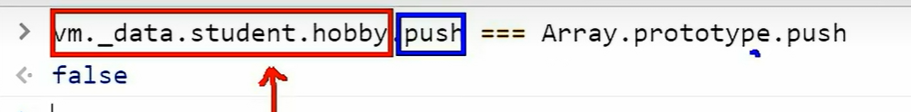

# 数据监测

<!-- ## 目录

- [问题引入](#问题引入)
- [监测原理](#监测原理)
- [模拟监测](#模拟监测)
- [对于对象](#对于对象)
- [Vue.Set](#VueSet)
- [对于数组](#对于数组)
- [响应式 property](#响应式-property)
- [异步更新队列](#异步更新队列) -->

> 📌vue会监视data中所有层次的数据。

> 📌`Object.defineProperty`方法为每一个添加的属性都制定了一个getter/setter，监听属性的 getter 和 setter 操作，当有人读取的时候，就会触发getter，当有人修改的时候就会触发setter，（setter的流程：你先在控制台进行修改，然后setter会修改模型中的数据，然后模型中的数据，又会被数据代理添加到vm模型上，从而导致视图的变化）你的data被数据代理之后，就会又下划线data，因为对你的data进行了升级，而这一监测的过程就是数据劫持。通过这种劫持，Vue 能够追踪数据的变化，实现了数据的响应式。当你访问或修改数据时，Vue 能够捕获这些操作，并触发相应的更新，以保持视图和数据的同步。

## 问题引入

> 📌说明一个问题哈，首先就是我们在列表渲染的时候有一个排序案例，但是我们当时不太理解Vue数据更新的原理，所以，当时测试，我们可以修改data中 **，数组对象数据中的变化，但是如果直接修改一整个数组中索引为零的对象数据，那么就会产生无法更新的问题。**

> 📌在早期版本的Vue中，由于Vue使用的是Object.defineProperty方法来实现数据的响应式，因此无法直接监测到数组的变化，因为一些数组的变化方法（例如push、pop、splice等）并不会触发属性的setter。后来，Vue提供了几种可以监测到数组变化的方法，这些方法一般都是直接改变原数组的方法。其中最常用的方法是使用Vue提供的变异方法（mutation methods），例如push、pop、shift、unshift、splice、sort和reverse。当你使用这些方法改变数组时，Vue能够捕捉到这些变化，并触发视图的更新。

> 📌除了变异方法外，Vue还提供了一些非变异方法（non-mutating methods），例如concat、slice和filter等。这些方法并不会直接改变原数组，而是返回一个新数组，因此Vue无法监测到这些方法的变化。如果你使用这些非变异方法修改数组，你需要手动通知Vue进行视图的更新，或者使用Vue提供的\$set方法来通知Vue进行响应式地更新。

```javascript
<!-- 准备好一个容器-->
    <div id="root">
      <h2>人员列表</h2>
      <button @click="updateMei">更新马冬梅的信息</button>
      <ul>
        <li v-for="(p,index) of persons" :key="p.id">
          {{p.name}}-{{p.age}}-{{p.sex}}
        </li>
      </ul>
    </div>

    <script type="text/javascript">
      Vue.config.productionTip = false
      
      const vm = new Vue({
        el:'#root',
        data:{
          persons:[
            {id:'001',name:'马冬梅',age:30,sex:'女'},
            {id:'002',name:'周冬雨',age:31,sex:'女'},
            {id:'003',name:'周杰伦',age:18,sex:'男'},
            {id:'004',name:'温兆伦',age:19,sex:'男'}
          ]
        },
        methods: {
           updateMei(){
            // this.persons[0].name = '马老师' //奏效
            // this.persons[0].age = 50 //奏效
            // this.persons[0].sex = '男' //奏效
            // this.persons[0] = {id:'001',name:'马老师',age:50,sex:'男'} //不奏效
            this.persons.splice(0,1,{id:'001',name:'马老师',age:50,sex:'男'})
          } 
        }
      }) 

    </script>

```

然后就引出，我们对于数据监测的改变原理（对象）

原因就是我们的对象中，所有的数据都被Vue进行了数据代理，有自己的get和set，无论你的层次有多深，都有，但是，我们本身代码中没有写的，后续在控制台中添加是不会有的，所有就有了Vue.set（）API，来进行添加。

> 📌在 Vue 的响应式系统中，`Object.defineProperty` 确实存在一些限制，导致在数组上的数据劫持较为复杂，而且在数组长度变化等场景下可能会遇到一些问题。Vue 对此进行了特殊处理，提供了一些能够触发更新的数组变异方法（mutation methods），比如 `push`、`pop`、`shift`、`unshift`、`splice`、`sort` 和 `reverse`。这些方法被称为数组的变异方法，它们会触发视图更新。

```javascript
new Vue({
  data: {
    myArray: [1, 2, 3]
  },
  methods: {
    addItem() {
      // 以下的操作会触发视图更新
      this.myArray.push(4);
    }
  }
});
```

> 📌对于对象，Vue 能够劫持对象属性的 getter 和 setter，从而实现对象的响应式。但是，当你直接通过索引或直接设置数组长度时，Vue 是无法检测到变化的，因此你需要使用提供的变异方法来进行操作。

虽然 Vue 在数组上提供了变异方法，但如果你直接通过索引修改数组元素，Vue 是无法监听到这种变化的。例如：

```javascript
new Vue({
  data: {
    myArray: [1, 2, 3]
  },
  methods: {
    modifyArray() {
      // 这种方式修改数组元素，Vue 无法检测到变化
      this.myArray[0] = 99;
    }
  }
});
```

> 📌为了解决这个问题，Vue 提供了 `$set` 方法，用于在数组或对象中添加新的属性并保证其响应性。

```javascript
this.$set(this.myArray, 0, 99);
```

总的来说，虽然在数组和对象上的数据劫持相对复杂，但 Vue 提供了一些特殊的机制来解决这些问题，以确保在使用数组和对象时依然能够实现响应式。

## 监测原理

> 📌在 Vue 中，数据劫持是通过 Vue 内部的响应式系统来实现的。具体来说，Vue 使用了 `Object.defineProperty` 方法来劫持对象的属性，从而实现对属性的 getter 和 setter 进行拦截，达到监听数据变化的目的。

在 Vue 的响应式系统中，每个组件实例都有一个与之相关联的响应式数据对象，这个对象包含了组件的数据，也就是你在 `data` 选项中定义的数据。这个响应式数据对象是由 Vue 内部创建和管理的。

以下是一个简化的例子，演示了数据劫持的基本原理：

```javascript
function defineReactive(obj, key, val) {
  Object.defineProperty(obj, key, {
    enumerable: true,
    configurable: true,
    get: function() {
      console.log(`访问了 ${key}`);
      return val;
    },
    set: function(newVal) {
      console.log(`设置了 ${key}，新值为 ${newVal}`);
      val = newVal;
    }
  });
}

const dataObj = {};
defineReactive(dataObj, 'message', 'Hello, Vue!');

console.log(dataObj.message); // 访问了 message
dataObj.message = 'New message'; // 设置了 message，新值为 New message
console.log(dataObj.message); // 访问了 message
```

在这个例子中，`defineReactive` 函数用于劫持数据对象的属性，通过 `Object.defineProperty` 设置 `get` 和 `set` 方法来监听属性的访问和修改操作。

在 Vue 中，这个过程是由 Vue 内部在组件实例化时进行的，你不需要手动编写这样的劫持代码。当你在 Vue 组件中使用 `data` 选项定义数据时，Vue 会自动为这些数据进行劫持，以实现数据的响应式。

要看到数据劫持的表现，你可以通过在访问或修改数据时加入 `console.log` 语句，观察控制台的输出。例如，在 Vue 组件中：

```javascript
new Vue({
  data: {
    message: 'Hello, Vue!'
  },
  created() {
    console.log(this.message); // 访问了 message
    this.message = 'New message'; // 设置了 message，新值为 New message
    console.log(this.message); // 访问了 message
  }
});
```

在上述代码中，`console.log` 语句将输出对数据的访问和修改，你可以通过这些输出来观察到数据劫持的效果。这是一个简化的例子，实际上 Vue 的响应式系统涉及更多的细节和优化。

## 模拟监测

这个只是一层的，所以没有Vue的好

```javascript
<!DOCTYPE html>
<html>
  <head>
    <meta charset="UTF-8" />
    <title>Document</title>
  </head>
  <body>
    <script type="text/javascript" >

      let data = {
        name:'赵新坤',
        address:'北京',
      }

      //创建一个监视的实例对象，用于监视data中属性的变化
      const obs = new Observer(data)    
      console.log(obs)  

      //准备一个vm实例对象
      let vm = {}
      vm._data = data = obs

      function Observer(obj){
        //汇总对象中所有的属性形成一个数组
        const keys = Object.keys(obj)
        //遍历
        keys.forEach((k)=>{
          Object.defineProperty(this,k,{
            get(){
              return obj[k]
            },
            set(val){
              console.log(`${k}被改了，我要去解析模板，生成虚拟DOM.....我要开始忙了`)
              obj[k] = val
            }
          })
        })
      }
    </script>
  </body>
</html>
```

## [对于对象](https://v2.cn.vuejs.org/v2/guide/reactivity.html#对于对象 "对于对象")

通过setter实现监视，且要在new Vue时就传入要监测的数据。

1. 对象中后追加的属性，Vue默认不做响应式处理
2. 如需给后添加的属性做响应式，请使用如下API：
   - Vue.set(target，propertyName/index，value)&#x20;
   - vm.\$set(target，propertyName/index，value)

Vue 无法检测 property 的添加或移除。由于 Vue 会在初始化实例时对 property 执行 getter/setter 转化，所以 property 必须在 `data` 对象上存在才能让 Vue 将它转换为响应式的。例如：

```vue
var vm = new Vue({
  data:{
    a:1
  }
})

// `vm.a` 是响应式的

vm.b = 2
// `vm.b` 是非响应式的
```

> 📌对于已经创建的实例，Vue 不允许动态添加根级别的响应式 property。但是，可以使用 `Vue.set(object, propertyName, value)` 方法向嵌套对象添加响应式 property。例如，对于：

```vue
Vue.set(vm.someObject, 'b', 2)
```

您还可以使用 `vm.$set` 实例方法，这也是全局 `Vue.set` 方法的别名：

```vue
this.$set(this.someObject,'b',2)
```

有时你可能需要为已有对象赋值多个新 property，比如使用 `Object.assign()` 或 `_.extend()`。但是，这样添加到对象上的新 property 不会触发更新。在这种情况下，你应该用原对象与要混合进去的对象的 property 一起创建一个新的对象。

```vue
// 代替 `Object.assign(this.someObject, { a: 1, b: 2 })`
this.someObject = Object.assign({}, this.someObject, { a: 1, b: 2 })
```

## Vue.Set

> 📌特别注意：Vue.set() 和 vm.\$set() 不能给vm 或 vm的根数据对象添加属性！！！只能给data中的对象添加响应式数据，不可以直接在data中添加。Vm实例上的属性，一开始有几个，就是几个，不可以使用Vue.set添加第四个，只能给属性中的对象中添加属性

```javascript
<!DOCTYPE html>
<html>
  <head>
    <meta charset="UTF-8" />
    <title>Vue监测数据改变的原理</title>
    <!-- 引入Vue -->
    <script type="text/javascript" src="../js/vue.js"></script>
  </head>
  <body>
    <!-- 准备好一个容器-->
    <div id="root">
      <h1>学校信息</h1>
      <h2>学校名称：{{school.name}}</h2>
      <h2>学校地址：{{school.address}}</h2>
      <h2>校长是：{{school.leader}}</h2>
      <hr/>
      <h1>学生信息</h1>
      <button @click="addSex">添加一个性别属性，默认值是男</button>
      <h2>姓名：{{student.name}}</h2>
      <h2 v-if="student.sex">性别：{{student.sex}}</h2>
      <h2>年龄：真实{{student.age.rAge}}，对外{{student.age.sAge}}</h2>
      <h2>朋友们</h2>
      <ul>
        <li v-for="(f,index) in student.friends" :key="index">
          {{f.name}}--{{f.age}}
        </li>
      </ul>
    </div>
  </body>

  <script type="text/javascript">
    Vue.config.productionTip = false //阻止 vue 在启动时生成生产提示。

    const vm = new Vue({
      el:'#root',
      data:{
        school:{
          name:'尚硅谷',
          address:'北京',
        },
        student:{
          name:'tom',
          age:{
            rAge:40,
            sAge:29,
          },
          friends:[
            {name:'jerry',age:35},
            {name:'tony',age:36}
          ]
        }
      },
      methods: {
        addSex(){
          // Vue.set(this.student,'sex','男')
          this.$set(this.student,'sex','男')
        }
      }
    })
  </script>
</html>
```

## [对于数组](https://v2.cn.vuejs.org/v2/guide/reactivity.html#对于数组 "对于数组")

> 📌Vue本身就没有为数组服务的getter和setter，改了也不认

Vue 不能检测以下数组的变动：

1. 当你利用索引直接设置一个数组项时，例如：`vm.items[indexOfItem] = newValue`
2. 当你修改数组的长度时，例如：`vm.items.length = newLength`
3. 在Vue修改数组中的某个元素一定要用如下方法：
   1. 使用这些API:push()、pop()、shift()、unshift()、splice()、sort()、reverse()
   2. Vue.set() 或 vm.\$set()
   3. 为什么只有这几个方法可以，因为Vue对这些方法进行了包装，也就是说，你再次调用的push等方法已经不是Array.prototype.push了
      
4. 如何监测数组中的数据？
   &#x20;  通过包裹数组更新元素的方法实现，本质就是做了两件事：
   &#x20;  (1).调用原生对应的方法对数组进行更新。
   &#x20;  (2).重新解析模板，进而更新页面。

举个例子：

```vue
var vm = new Vue({
  data: {
    items: ['a', 'b', 'c']
  }
})
vm.items[1] = 'x' // 不是响应性的
vm.items.length = 2 // 不是响应性的
```

为了解决第一类问题，以下两种方式都可以实现和 `vm.items[indexOfItem] = newValue` 相同的效果，同时也将在响应式系统内触发状态更新：

```vue
// Vue.set
Vue.set(vm.items, indexOfItem, newValue)
```

```vue
// Array.prototype.splice
vm.items.splice(indexOfItem, 1, newValue)
```

你也可以使用 [vm.\$set](https://v2.cn.vuejs.org/v2/api/#vm-set "vm.\$set") 实例方法，该方法是全局方法 `Vue.set` 的一个别名：

```vue
vm.$set(vm.items, indexOfItem, newValue)
```

为了解决第二类问题，你可以使用 `splice`：

```vue
vm.items.splice(newLength)
```

## 响应式 property

> 📌由于 Vue 不允许动态添加根级响应式 property，所以你必须在初始化实例前声明所有根级响应式 property，哪怕只是一个空值

```vue
var vm = new Vue({
  data: {
    // 声明 message 为一个空值字符串
    message: ''
  },
  template: '<div>{{ message }}</div>'
})
// 之后设置 `message`
vm.message = 'Hello!'
```

如果你未在 `data` 选项中声明 `message`，Vue 将警告你渲染函数正在试图访问不存在的 property。

这样的限制在背后是有其技术原因的，它消除了在依赖项跟踪系统中的一类边界情况，也使 Vue 实例能更好地配合类型检查系统工作。但与此同时在代码可维护性方面也有一点重要的考虑：`data` 对象就像组件状态的结构 (schema)。提前声明所有的响应式 property，可以让组件代码在未来修改或给其他开发人员阅读时更易于理解。

```html
<!DOCTYPE html>
<html>

<head>
  <meta charset="UTF-8" />
  <title>总结数据监视</title>
  <style>
    button {
      margin-top: 10px;
    }
  </style>
  <!-- 引入Vue -->
  <script type="text/javascript" src="../js/vue.js"></script>
</head>

<body>
  <!-- 准备好一个容器-->
  <div id="root">
    <h1>学生信息</h1>
    <button @click="student.age++">年龄+1岁</button> <br />
    <button @click="addSex">添加性别属性，默认值：男</button> <br />
    <button @click="student.sex = '未知' ">修改性别</button> <br />
    <button @click="addFriend">在列表首位添加一个朋友</button> <br />
    <button @click="updateFirstFriendName">修改第一个朋友的名字为：张三</button> <br />
    <button @click="addHobby">添加一个爱好</button> <br />
    <button @click="updateHobby">修改第一个爱好为：开车</button> <br />
    <button @click="removeSmoke">过滤掉爱好中的抽烟</button> <br />
    <h3>姓名：{{student.name}}</h3>
    <h3>年龄：{{student.age}}</h3>
    <h3 v-if="student.sex">性别：{{student.sex}}</h3>
    <h3>爱好：</h3>
    <ul>
      <li v-for="(h,index) in student.hobby" :key="index">
        {{h}}
      </li>
    </ul>
    <h3>朋友们：</h3>
    <ul>
      <li v-for="(f,index) in student.friends" :key="index">
        {{f.name}}--{{f.age}}
      </li>
    </ul>
  </div>
</body>

<script type="text/javascript">
  Vue.config.productionTip = false //阻止 vue 在启动时生成生产提示。

  const vm = new Vue({
    el: '#root',
    data: {
      student: {
        name: 'tom',
        age: 18,
        hobby: ['抽烟', '喝酒', '烫头'],
        friends: [
          { name: 'jerry', age: 35 },
          { name: 'tony', age: 36 }
        ]
      }
    },
    methods: {
      addSex() {
        // Vue.set(this.student,'sex','男')
        this.$set(this.student, 'sex', '男')
      },
      addFriend() {
        this.student.friends.unshift({ name: 'jack', age: 70 })
      },
      updateFirstFriendName() {
        this.student.friends[0].name = '张三'
      },
      addHobby() {
        this.student.hobby.push('学习')
      },
      updateHobby() {
        // this.student.hobby.splice(0,1,'开车')
        // Vue.set(this.student.hobby,0,'开车')
        this.$set(this.student.hobby, 0, '开车')
      },
      removeSmoke() {
        this.student.hobby = this.student.hobby.filter((h) => {
          return h !== '抽烟'
        })
      }
    }
  })
</script>

</html>
```

## [异步更新队列](https://v2.cn.vuejs.org/v2/guide/reactivity.html#异步更新队列 "异步更新队列")

可能你还没有注意到，Vue 在更新 DOM 时是**异步**执行的。只要侦听到数据变化，Vue 将开启一个队列，并缓冲在同一事件循环中发生的所有数据变更。如果同一个 watcher 被多次触发，只会被推入到队列中一次。这种在缓冲时去除重复数据对于避免不必要的计算和 DOM 操作是非常重要的。然后，在下一个的事件循环“tick”中，Vue 刷新队列并执行实际 (已去重的) 工作。Vue 在内部对异步队列尝试使用原生的 `Promise.then`、`MutationObserver` 和 `setImmediate`，如果执行环境不支持，则会采用 `setTimeout(fn, 0)` 代替。

例如，当你设置 `vm.someData = 'new value'`，该组件不会立即重新渲染。当刷新队列时，组件会在下一个事件循环“tick”中更新。多数情况我们不需要关心这个过程，但是如果你想基于更新后的 DOM 状态来做点什么，这就可能会有些棘手。虽然 Vue.js 通常鼓励开发人员使用“数据驱动”的方式思考，避免直接接触 DOM，但是有时我们必须要这么做。为了在数据变化之后等待 Vue 完成更新 DOM，可以在数据变化之后立即使用 `Vue.nextTick(callback)`。这样回调函数将在 DOM 更新完成后被调用。例如：

```vue
<div id="example">{{message}}</div>
```

```vue
var vm = new Vue({
  el: '#example',
  data: {
    message: '123'
  }
})
vm.message = 'new message' // 更改数据
vm.$el.textContent === 'new message' // false
Vue.nextTick(function () {
  vm.$el.textContent === 'new message' // true
})
```

在组件内使用 `vm.$nextTick()` 实例方法特别方便，因为它不需要全局 `Vue`，并且回调函数中的 `this` 将自动绑定到当前的 Vue 实例上：

```vue
Vue.component('example', {
  template: '<span>{{ message }}</span>',
  data: function () {
    return {
      message: '未更新'
    }
  },
  methods: {
    updateMessage: function () {
      this.message = '已更新'
      console.log(this.$el.textContent) // => '未更新'
      this.$nextTick(function () {
        console.log(this.$el.textContent) // => '已更新'
      })
    }
  }
})
```

因为 `$nextTick()` 返回一个 `Promise` 对象，所以你可以使用新的 [ES2017 async/await](https://developer.mozilla.org/zh-CN/docs/Web/JavaScript/Reference/Statements/async_function "ES2017 async/await") 语法完成相同的事情：

```vue
methods: {
  updateMessage: async function () {
    this.message = '已更新'
    console.log(this.$el.textContent) // => '未更新'
    await this.$nextTick()
    console.log(this.$el.textContent) // => '已更新'
  }
}
```
