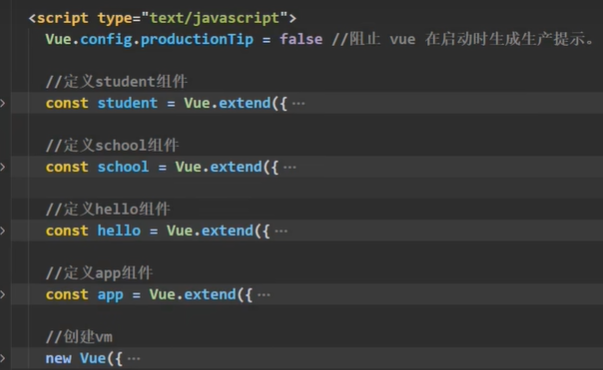

# 组件嵌套

> 📌组件嵌套是 Vue.js 中一种常见的开发模式，它指的是将一个组件嵌套在另一个组件内部。通过组件嵌套，你可以将复杂的 UI 结构分解成更小、更易管理的组件单元，提高代码的可读性、可维护性，并支持更好的组件复用。

1. 首先来说哈，我们定义组件就是直接`const `然后`Vue.extend（{}）`就可以了，然后去注册和双标签使用。
2. 组件的嵌套的话，一定要注意，子组件要写在父组件前面进行声明，不然就是报错。而且注册也要在父组件中的`components`中进行注册
3. 所有的组件都是在`App`中进行管理的，而且这是官方建议的。所有的组件都在`App`中进行注册
4. 在组件嵌套中，通常会有一个父组件包含一个或多个子组件。父组件可以向子组件传递数据（通过 `props`），子组件可以向父组件发送消息（通过自定义事件）。

> 📌我们最好是创建一个app组件，用来管理所有的组件



```javascript
<!DOCTYPE html>
<html>
  <head>
    <meta charset="UTF-8" />
    <title>组件的嵌套</title>
    <!-- 引入Vue -->
    <script type="text/javascript" src="../js/vue.js"></script>
  </head>
  <body>
    <!-- 准备好一个容器-->
    <div id="root">
      
    </div>
  </body>

  <script type="text/javascript">
    Vue.config.productionTip = false //阻止 vue 在启动时生成生产提示。

     //定义student组件
    const student = Vue.extend({
      name:'student',
      template:`
        <div>
          <h2>学生姓名：{{name}}</h2>  
          <h2>学生年龄：{{age}}</h2>  
        </div>
      `,
      data(){
        return {
          name:'akun',
          age:18
        }
      }
    }) 
    
     //定义school组件
    const school = Vue.extend({
      name:'school',
      template:`
        <div>
          <h2>学校名称：{{name}}</h2>  
          <h2>学校地址：{{address}}</h2>  
          <student></student>
        </div>
      `,
      data(){
        return {
          name:'清华大学',
          address:'北京'
        }
      }, 
       //注册组件（局部）
      components:{
        student
      } 
    })

    //定义hello组件
    const hello = Vue.extend({
      template:`<h1>{{msg}}</h1>`,
      data(){
        return {
          msg:'欢迎来到清华大学学习！'
        }
      }
    })
    
     //定义app组件
    const app = Vue.extend({
      template:`
        <div>  
          <hello></hello>
          <school></school>
        </div>
      `,
      components:{
        school,
        hello
      }
    }) 

    //创建vm
    new Vue({
       template:'<app></app>', 
      el:'#root',
      //注册组件（局部）
      components:{app}
    })
  </script>
</html>
```
