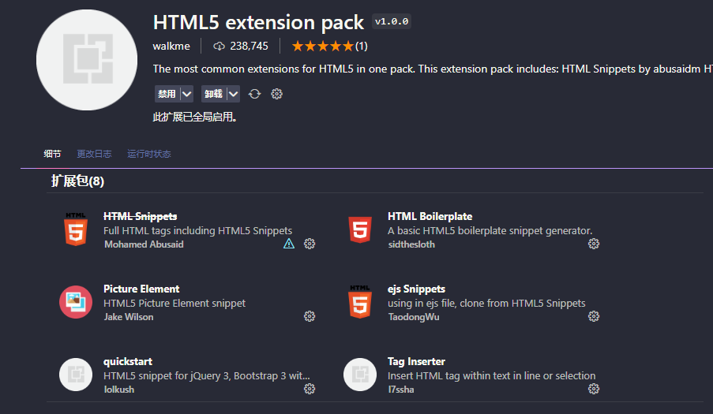
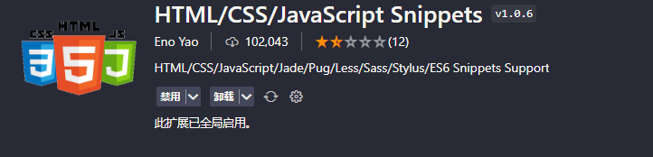

<!--
 * @Author: zxk zhaoxinkun1124@gmail.com
 * @Date: 2024-05-07 11:19:18
 * @LastEditors: zxk zhaoxinkun1124@gmail.com
 * @LastEditTime: 2024-05-07 14:12:56
 * @FilePath: \VitePress\Docs\编程软件\VScode\HTML.md
 * @Description: 
 * 
 * Copyright (c) 2024 by ${git_name_email}, All Rights Reserved. 
-->
# HTML

> 📌HTML VScode插件

## 所有依赖包

## HTML CSS Support

> 用于对HTML代码进行提醒

## HTML-Comment

> 可以对代码进行两次注释

## Nested Comments

> 可以对代码进行两次注释，支持的语言更多，不仅限于HTML

## HTML/CSS/JavaScript Snippets

> 输入某特定的代码，可以出一整个代码片段

## Picture Element

> 使用最新的Picture元素，更好的进行适配

## Live Preview

> HTML效果的预览

## HTML Boilerplate

> 快速生成HTML骨架

